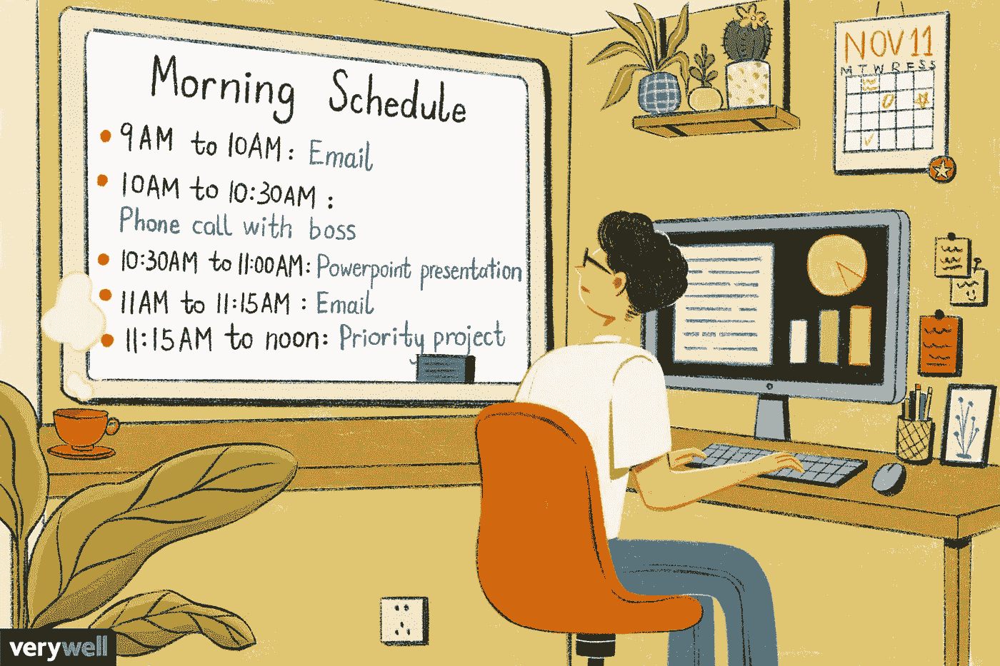

# 如何为你的工作周制定时间管理计划

> 原文：<https://medium.com/geekculture/how-to-make-a-time-management-plan-for-your-workweek-379ac180f91c?source=collection_archive---------10----------------------->

How to Make a Time Management Plan for Your Workweek

[**来源**](https://www.google.com/url?sa=i&url=https%3A%2F%2Fwww.verywellmind.com%2Fhow-to-use-time-blocking-to-manage-your-day-4797509&psig=AOvVaw2FJx3DPfmx1mMZvVZnvjEP&ust=1641011620134000&source=images&cd=vfe&ved=0CAwQjhxqFwoTCODU3p-cjfUCFQAAAAAdAAAAABAD)

***“花在组织上的每一分钟，都是一小时的收获。”——本杰明富兰克林*** 。

时间管理就是充分利用你的工作日。通过为你的一周制定一个有效的时间管理计划，你可以用更少的时间完成更多的事情。管理你的日常任务，设定优先事项，并进入适合你的日常生活。

你知道当你在每封邮件和小活动后一心多用并重新集中注意力时，浪费了多少宝贵的时间吗？根据研究，分心后可能需要 30 分钟才能重新专注于一项工作。现在，考虑一下如果你每天被打扰五次——一年下来就浪费了几百个小时。

尽管多年来待办事项清单一直是最受欢迎的，但现在越来越多的人开始使用更有条理的周计划，而不是清单。原因是什么？解释各不相同。

然而，许多人认为典型的待办事项清单不再有效，因为:

●他们觉得自己在进步，但没有减少清单上的数量。

●当他们考虑所有必须做的事情时，他们变得不知所措。

●他们没有一个好的系统来决定哪些项目应该优先。

另一方面，周计划的优势在于它对工作的展望和管理。每周留出大约半小时并不过分，但投资回报是巨大的。因此，这是用一份体面的每周工作计划取代你的待办事项清单的绝佳时机。

# 什么是工作计划，你为什么需要它？

**What is a work plan, and Why do you need it?**

[**来源**](https://www.google.com/url?sa=i&url=https%3A%2F%2Fproposalsforngos.com%2Fwhat-is-a-work-plan%2F&psig=AOvVaw1-Hx4BCfHVgyN1zq0Wc9OS&ust=1641012168075000&source=images&cd=vfe&ved=0CAwQjhxqFwoTCPDp0f2cjfUCFQAAAAAdAAAAABAD)

一个简单的答案——它为你的生活提供了更多的结构。因为你有一个很棒的每周策略，你可以花更少的时间从岔道中恢复过来。一次想象你一周的时间也有助于你分散注意力，专注于任务，让你做更多的事情。在所有领域——周计划让你完成更多。

计划你的工作周最重要的原因是它会节省你的时间。任何与拖延症作斗争的人都知道，当你偏离计划时，试图回到正轨会浪费多少时间。是真的。对于一些人来说，它比其他人来得更自然，但所有的任务都可以从计划中受益，周计划也不例外。

计划周密的工作周也是你最有效率的时间之一。你确切地知道你的盘子里有什么，所以很少时间被浪费在疯狂地寻找项目的下一步，却发现它甚至要到下周才到期，如果有的话。

# 如何创建工作计划？

现在你已经完成了提高效率之旅的第一步，你准备好节省数百个小时和消耗更少的能量了吗？

遵循这六个步骤来创建你自己的周工作计划。我们已经尽力让它尽可能简单有效。自然地，一旦你掌握了计划，你可能会有改变事情的冲动。

## 1.选择您的计划工具

**Select your planning tool**

[**来源**](https://www.google.com/url?sa=i&url=https%3A%2F%2Fwww.rowshare.com%2Fmake-a-plan%2Fhow-to-choose-a-planning-tool%2F&psig=AOvVaw3Az_H8Fwn0xTCOaPK8hRDP&ust=1641012299738000&source=images&cd=vfe&ved=0CAwQjhxqFwoTCLDugaydjfUCFQAAAAAdAAAAABAD)

谈到办公室的组织，每个人都有自己的风格。有些人喜欢把事情写在纸上，但越来越多的人转向数字解决方案，让他们可以从任何地方访问他们的工作。

有多种选择，从简单的规划工具到全面的一体化解决方案，让每个人都能找到最适合自己工作的工具。因此，留出一些时间进行试验，看看什么最适合你。

## 2.定期计划你的工作

**Regularly plan your work**

[**来源**](https://www.google.com/url?sa=i&url=https%3A%2F%2Fmedium.com%2Fhygger-io%2Fhow-to-create-an-impressive-work-plan-34411b824298&psig=AOvVaw0UfGfFmnHEBb6DongNOso7&ust=1641012375599000&source=images&cd=vfe&ved=0CAwQjhxqFwoTCND6s9WdjfUCFQAAAAAdAAAAABAO)

一年一次甚至一个月一次做你的周计划不会有什么不同。它被称为每周是有原因的，你需要建立一个习惯来使它成功。

选择一天，在这一天你将首先创建你的每周工作计划。周五下午适合这样做——你可以回顾一下每周的成就，为下周做准备。

## 3.规划你的目标

**Plan your objectives**

[**来源**](https://www.google.com/url?sa=i&url=https%3A%2F%2Fwrytin.com%2Fayushithakur%2Fplan-your-future-to-achieve-goals-jw3qhkw1&psig=AOvVaw2LMKSKb7J2OG-KoC-__4kU&ust=1641012466300000&source=images&cd=vfe&ved=0CAwQjhxqFwoTCODAvpiejfUCFQAAAAAdAAAAABAO)

首先列出你的总体目标。然后，想想你需要在接下来的一周完成什么来实现这些目标。请记住，你的周计划中列出的任何活动都应该限于那些有助于你接近主要目标的活动——其他任何活动都是浪费时间。

开始做**工作计划**时，至少留出 40 分钟的时间。需要一段时间来适应。最终，你每周只需要花十分钟。

## 4.安排你的任务

**Schedule your tasks**

[**来源**](https://www.google.com/url?sa=i&url=https%3A%2F%2Fwww.wikihow.com%2FSchedule-Your-Day&psig=AOvVaw0y19bzqNzRR8VOf-wgzQn0&ust=1641012600432000&source=images&cd=vfe&ved=0CAwQjhxqFwoTCMDjvLuejfUCFQAAAAAdAAAAABAD)

决定下周你想完成什么，然后安排必要的时间来完成这些事情。为了确保你计划了一周的实际工作量——甚至可能计划过多——把它添加到你的日历上，看看是否有足够的空间做每件事。如果你的日历看起来很拥挤，看看你能否在下周分配一些不太重要的任务。

重要的是安排时间来完成一项任务，而不是一个项目——例如，更新网站是一个项目，而不是两个小时的工作。确保你把项目分解成更小的任务，比如“写内容”和“找新图片”，然后为每一项安排时间。

**提示:**需要的时候休息一下，不要相信手机能让你保持在正轨上。小心不要把你的日程排得太满；在你的日历上至少留出 12%的时间来参加不可预见的会议和活动，以及放松和思考的时间。计划的休息时间也可以作为任务之间的缓冲区，所以如果你超负荷工作几分钟也没关系。你甚至可以试试 [**员工排班 app**](https://www.workstatus.io/best-employee-task-scheduling-software?utm_source=medium&utm_medium=guestpost-rn&utm_campaign=RN) 来管理你的员工的排班。

你在找**最好的员工排班软件**？ [**报名**](https://app.workstatus.io/auth/register/?utm_source=medium&utm_medium=guestpost-rn&utm_campaign=RN) 这里——

## 5.永远坚持计划

**Always stick to the plan**

[**来源**](https://www.google.com/url?sa=i&url=https%3A%2F%2Fclarabelle.org%2F2016%2F08%2F23%2Fstick-to-the-plan%2F&psig=AOvVaw2y6TdJc2daMxi82wJLZQlZ&ust=1641012642933000&source=images&cd=vfe&ved=0CAwQjhxqFwoTCKDi9s6ejfUCFQAAAAAdAAAAABAJ)

如果你不遵循你的计划，所有这些计划都是徒劳的——所以必须避免分心，并遵循计划。当然，即使是最精心制定的计划也可能出错，这就是每日计划派上用场的地方。

在你的办公桌前安顿下来之前，回顾一下你的日常计划，并做出必要的修改——如果会议被取消或者前一天的任务没有完成。通过这种方式，你会对你的关键目标有一个清晰的认识。

**提示:**为了确保没有重要的事情被忽略，重新安排那些没有马上完成的活动。如果你意识到同样的任务周复一周的重复，把它们交给别人。

## 6.回顾你的周计划

**Review your weekly plans**

[**来源**](https://www.google.com/url?sa=i&url=https%3A%2F%2Fmedium.com%2Fswlh%2Fthe-best-day-for-your-weekly-review-836894682dd0&psig=AOvVaw1E926Lfztr-umsLNOZdsYl&ust=1641012697844000&source=images&cd=vfe&ved=0CAwQjhxqFwoTCLi5sOmejfUCFQAAAAAdAAAAABAJ)

在每个周末好好看看你的周计划。当看到任务前面的所有复选框时，感到自豪。

有多少任务尚未完成或会议已经取消？检查为什么会发生这种情况，以发现是否你低估了一项任务需要的时间，或者是否发生了意想不到的事情。有了这些考虑，为接下来的几周做计划就更简单了。

# 最后的想法

每周计划你的工作是一个持续的学习过程。你做的时间越长，你就越能更好地预测你的能量水平，坚持生产力建议和计划。在这个过程中，你还将学会如何放弃不必要的活动和项目。

养成习惯后，每周的工作计划就成了你享受和期待的事情。当你有规律地计划你的一周时，你会发现自己有更多的动力、方向和富有成效的时间。

我们也建议你在一个合理的日期安排你的任务，这样它们就不会被忘记或者太模糊。最后，始终坚持按照上面列出的每一步制定的工作计划！

您可以使用 [**WorkStatus**](https://www.workstatus.io/?utm_source=medium&utm_medium=guestpost-rn&utm_campaign=RN) 来计划时间管理，这是一种易于使用的在线软件解决方案，专为必须同时兼顾多个项目的项目管理专业人员设计。它快速简单，但功能强大，适用于任何尺寸。

您是否也想为您的远程员工制定一个工作周计划？

在此申请一个 [**免费演示**](https://www.workstatus.io/demo?utm_source=medium&utm_medium=guestpost-rn&utm_campaign=RN) 远程员工监控软件，有效管理时间-