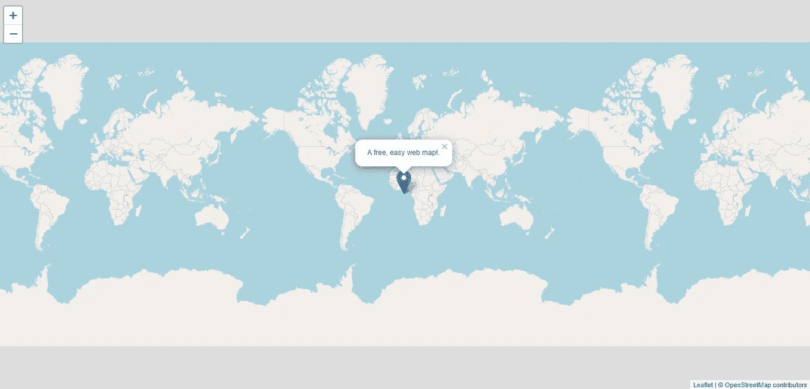

# 如何用 Python 的烧瓶和传单制作网络地图

> 原文：<https://medium.com/geekculture/how-to-make-a-web-map-with-pythons-flask-and-leaflet-9318c73c67c3?source=collection_archive---------2----------------------->

本教程向您展示了如何使用 Python 的 Flask 和传单构建 web 地图，Flask 和传单是一个用于移动友好的交互式地图的开源 JavaScript 库。



Image by author.

**经历**:初学者

# 要求:

**python、html、javascript 的基础知识。**

**一个 python 解释器比如** [**VSCode**](https://code.visualstudio.com/) **或者**[**Spyder**](https://www.anaconda.com/products/individual)**。这些解释器让你很容易编辑你的代码。**

**本教程基于基本的** [**Google App 引擎示例**](/geekculture/how-to-make-a-website-for-free-with-pythons-flask-and-google-app-engine-5278a6041762)**(github****上有** [**)。**](https://github.com/spmcneal/Medium-Flask/tree/main/Flask-AppEngine)

在前一篇教程中，我们构建了一个基本的 flask 应用程序，并仅使用 4 个文件将其部署到 Google App Engine:一个 **HTML 页面**，一个 **Python 文件**作为“控制器】，一个**需求**文件，以及一个告诉 App Engine 做什么的文件，称为**一个. yaml** 文件。

基于这些文件，我们只需要另外两个文件来创建一个网络地图:

一个 CSS 文件和一个 JavaScript 文件。Flask 知道在名为“static”的子目录中查找这些文件。在与 main.py 相同的位置创建目录。对于 organization，在这个目录中创建两个额外的目录，一个用于 javascript 文件，另一个用于 css 文件。最后，在各自的文件夹中创建这两个空文件。结构应该是这样的:

```
static/css/universal.css
static/css/universal.js
```

我们要一个全屏地图，所以我们要删除所有的填充和空白，并设置地图的高度和宽度为 100%。

将以下代码粘贴到 universal.css 文件中:

```
body {padding: 0;margin: 0;}html, body, #map {height: 100%;width: 100vw;}
```

接下来，我们将添加一个带有 openstreet 切片图层的标准传单地图。

将以下内容粘贴到 universal.js 中:

```
var map = L.map('map').fitWorld();L.tileLayer('https://{s}.tile.openstreetmap.org/{z}/{x}/{y}.png', {attribution: '&copy; <a href="https://www.openstreetmap.org/copyright">OpenStreetMap</a> contributors'}).addTo(map);
```

本教程有趣的部分是利用“jinja”模板将变量从 python 转换成 javascript。为此，我们需要给页面一些变量。在 main.py 中，我们将添加一个参数，将“标记”作为 jsons 列表输入页面。

```
from flask import Flask, render_templateapp=Flask(__name__)@app.route('/')def root(): markers=[ { 'lat':0, 'lon':0, 'popup':'This is the middle of the map.' } ]
   return render_template('index.html',markers=markers )if __name__ == '__main__': app.run(host="localhost", port=8080, debug=True)
```

最后，在 index.html 页面中，我们添加了标准的 javascript 和 css 来呈现传单地图，以及静态目录中的 css 和 javascript 文件。通过使用 jinja“for 循环”遍历标记 jsons 列表，并将标记变量添加到页面内脚本中，我们可以将变量从 python 传递到 javascript。这允许我们使用 python 的代码和逻辑来利用所有传单的特性。

```
<!doctype html><html lang="en"><head><title>Flask Leaflet Website</title><meta charset="utf-8"><meta name="viewport" content="width=device-width, initial-scale=1"><link rel="stylesheet" href="{{ url_for('static', filename='css/universal.css') }}" /><link rel="stylesheet" href="https://unpkg.com/leaflet@1.7.1/dist/leaflet.css"integrity="sha512-xodZBNTC5n17Xt2atTPuE1HxjVMSvLVW9ocqUKLsCC5CXdbqCmblAshOMAS6/keqq/sMZMZ19scR4PsZChSR7A=="crossorigin=""/><script src="https://unpkg.com/leaflet@1.7.1/dist/leaflet.js"integrity="sha512-XQoYMqMTK8LvdxXYG3nZ448hOEQiglfqkJs1NOQV44cWnUrBc8PkAOcXy20w0vlaXaVUearIOBhiXZ5V3ynxwA=="crossorigin=""></script></head><body><div id="map"></div><script src="{{ url_for('static', filename='js/universal.js') }}" /></script><script>L.marker([{{ marker['lat'] }}, {{ marker['lon'] }}]).addTo(map).bindPopup("{{ marker['popup'] }}").openPopup();</script></body></html>
```

瞧啊。只有 6 个文件的免费网络地图。在 [github](https://github.com/spmcneal/Medium-Flask/tree/main/Flask-Leaflet) 上查看存储库。