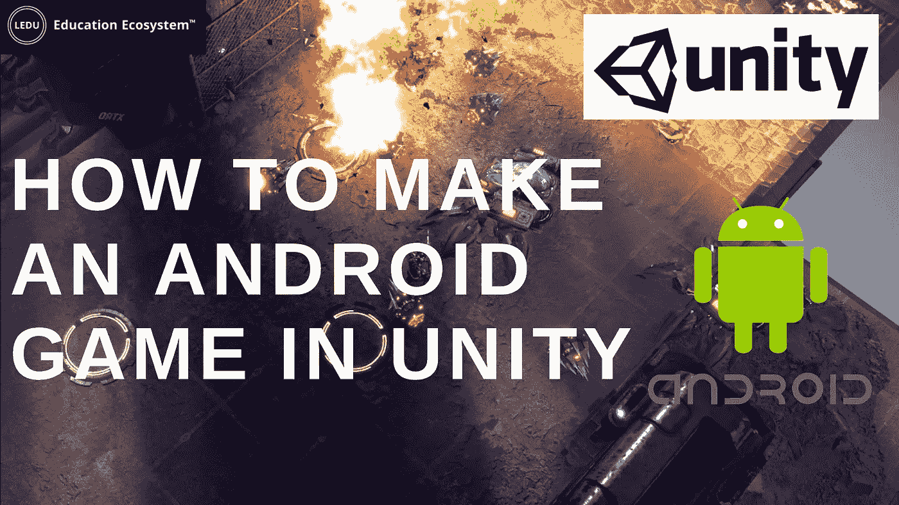

# 如何在 Unity 中制作一款安卓游戏

> 原文：<https://medium.com/geekculture/how-to-make-an-android-game-in-unity-b5ff1104c94f?source=collection_archive---------11----------------------->

**简介**

说到创建 android 游戏，你能找到的最好的工具就是 Unity。你可以在 Android Studio 中制作一个游戏，但如果你对 Java 和 Android SDK 没有经验，这将是一项艰巨的任务。你需要理解类是做什么的。您需要使用自定义视图。您将依赖于一些额外的库。这样的例子不胜枚举。

另一方面，Unity 将为您完成大部分工作。Unity 是一个[游戏引擎](https://educationecosystem.com/dzim/RJXjP-how-to-make-a-login-system-for-your-game-in-unity)，这意味着你可能想要使用的所有物理和功能都已经被处理好了。它是跨平台的，旨在方便爱好者和独立开发者入门。

Unity 是一款高度专业的开发工具，支持 Play Store 上大多数畅销游戏。没有限制，也没有好的理由让自己的生活更艰难。也是免费的！本文将介绍 Unity 中的 android 游戏开发，从开发到在 Play Store 上提交。这篇文章摘自这个实际项目:

**在 Unity 中制作一个安卓游戏需要什么工具？**

要在 Unity 中开始 android 游戏开发，您必须确保您拥有最新版本，因为它包含错误修复和改进。如果你有旧版本的 Unity，你可能会遇到错误。这些错误可以通过更新来修复。为任何移动平台开发都需要在您的计算机上为 Android 安装相应的 SDK。你需要 Android Studio。

**设置 APK 生成器**

***设置 Unity 工作空间***

首先，我们将浏览 Unity 商店，并为个人选择 Unity 个人许可证下的“开始”按钮。

接下来，在“首次用户”部分，选择“从这里开始”按钮。

查看提供的条款，然后选择“同意并下载”按钮。

这将开始下载 UnityHubSetup 应用程序。

下载完成后，运行 UnityHubSetup 应用程序。选择“安装”按钮，使用 UnityHub 安装最新版本的 Unity。

接下来，我们将创建一个 Unity ID，并在 UnityHub 中登录您的 Unity ID。同时，最新版本的 Unity 正在安装。在您登录后，选择继续并等待 Unity 完成安装。

Unity 安装完成后，选择“启动 Unity”按钮。

这将为 Unity 编辑器加载一个[样本项目](https://educationecosystem.com/brokenbunnystudios/l5De2-steampunk-puzzle-adventure-unity3d-c)。

***安装 Android SDK***

请注意，您可以从另一台安装了相同操作系统的计算机上复制 SDK。

对于 Windows 启动 Android Studio，它将在首次启动时运行“设置”向导。

*   选择“不要导入以前的设置”并等待。
*   在“欢迎”中，选择“下一步”。
*   在“安装类型”中，选择“标准”(默认)。
*   在“选择 UI 主题”中，选择您喜欢的主题(或默认主题)。
*   在“验证设置”中，记下 SDK 目录
*   在“许可协议”中，接受所有项目完成等待。

使用“文件资源管理器”检查 SDK 安装目录。请注意，“AppData”是一个隐藏目录。您必须选择“查看”取消选中“隐藏项目”才能看到此目录。

您还可以使用“Android Studio”来检查安装的 SDK 包，方法是选择“更多操作”(或在旧版本中选择“配置”，或选择“工具”)“SDK 管理器”“Android SDK”:

*   在“SDK 平台”选项卡下:

Android API 32

*   在“SDK 工具”选项卡下:

Android SDK 构建工具 33-rc1

Android 模拟器

Android SDK 平台-工具(33.0.0)

英特尔 x86 模拟器加速器(HAXM 安装程序)

**将游戏资产导入您的 android unity 游戏**

有几种方法可以在 Unity 项目中安装资源:

*   ***通过 Unity 引擎***

通过 [Unity 引擎](https://blog.educationecosystem.com/game-on-a-mac-with-xbox-cloud-gaming/)从资产商店下载资产后，下载按钮变为导入按钮。

*   ***通过网站***

单击资产商店网站上的登录按钮，登录您的 Unity 帐户。搜索您想要下载的资产。添加到“我的资产”按钮，并将资产保存到您的帐户。请务必通读与资产相关的条款。如果您同意这些条款，请接受。

单击“在 Unity 中打开”按钮，在 Unity 引擎版本的资产存储中显示该资产。点按“导入”按钮，将您的资产导入您的 Unity Android 项目。

*   ***其他方式***

将资产导入 Unity 项目的另一种方法是在 Unity 引擎中打开您的项目，点按“导入新资产”,或者转到“资产”>“导入-包”>“自定义包”,然后在您的电脑上找到您的资产。

**总结**

你现在有了一个可以改进的全功能应用程序。如果你不确定任何编程功能(无效更新，无效启动，公共无效，等等。)，然后和 unity c#一起搜索该函数，查看官方 [Unity 文档](https://educationecosystem.com/redironlabs/lznVY-create-a-multiplayer-space-game-unity-c)。