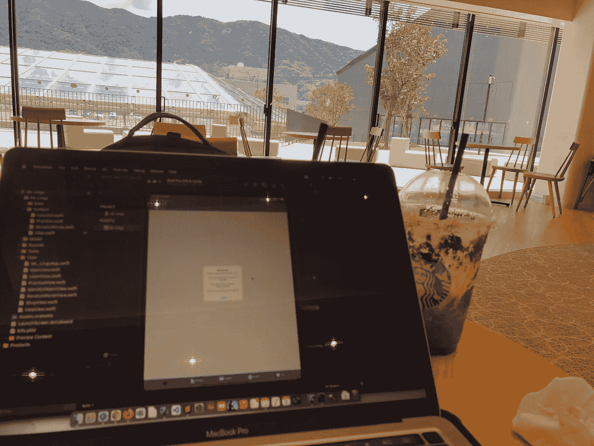

# 如何做一个 app

> 原文：<https://medium.com/geekculture/how-to-make-an-app-dc802730efd3?source=collection_archive---------40----------------------->

## 如果我不得不重新开始学习

Coding over coffee shop in Kainan, Wakayama, Japan. Photo by: Arc Sosangyo

那是 2017 年，我不知道我当时想到了什么，因为我买了一台 mac 而不是一台游戏 PC，并决定利用我的空闲时间编写代码，直到这一天。

好吧，我承认，当时我最初的动机不是因为我想编码，而是因为我有一个想法，希望有一天它能让我成为技术百万富翁…