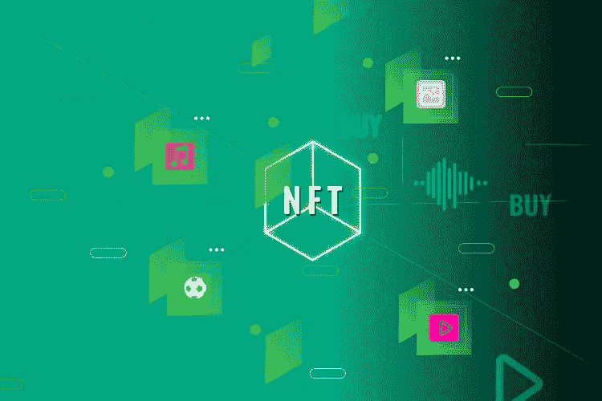

# 如何打造 NFT 市场？开发 NFT 市场

> 原文：<https://medium.com/geekculture/how-to-make-an-nft-marketplace-develop-nft-marketplace-de860b231b42?source=collection_archive---------14----------------------->

现在是 2022 年，距离这些虚拟代币支持产品的市场迅速崛起的 NFT 浪潮仅一年。尽管这一年对主流加密交易者来说并不友好，但不可替代的令牌仍然以其无穷的潜力不断创造新的高度。人们说 NFTs 突然流行的原因是名人、品牌和鼓舞人心的项目的参与。然而，NFT 市场在促进数以千计的交易中的作用在很大程度上没有得到认可。多年来，有几个市场平台获得了认可。

 [## 如何建立一个 NFT 市场？-完整的 NFT 市场解决方案

### 如何创建自己的 NFT 市场？NFTs 市场是创建和交易 NFT 的平台…

bit.ly](https://bit.ly/3czwaS9) 

下面的段落解释了制作 NFT 市场的过程。

该流程从规划平台开始。所有对市场有贡献的因素都会被考虑和分析。重要的元素包括商业可行性、目标市场、竞争对手、愿景、使命和技术要求。收集并记录想法，以便在以后的阶段引用。项目的简装纸也可以在这个阶段装裱。

现在，为平台创建具有业务所需的所有功能的模型用户终端屏幕，这将由专家进行测试。根据获得的建议，使用必要的框架设计 NFT 市场的前端。

然后，是时候使用基础设施栈将所有前端元素链接在一起，开发平台的后端了。在这个阶段，重要的是将平台集成到所需的区块链中，并为将控制市场门户的智能合同编写代码。如果需要，可以创建本地令牌，这对于具有与去中心化金融(DeFi)和去中心化自治组织(Dao)相关的功能的市场是有益的。

 [## NFT 市场开发|不可替代代币市场|白标 NFT 市场|…

### NFT 市场的发展正在塑造即将到来的创业公司的未来，以在竞争中胜出。构建您自己的…

bit.ly](https://bit.ly/3IW4P8H) 

之后，测试 NFT 市场平台的缺陷，如果发现，立即解决。有必要重复使用多个测试用例(手动的和自动的)来使平台免于错误。

如果一个人选择使用基于 NFT 市场模型的预制白标解决方案，所有这些步骤中涉及的漫长过程可能会在一定程度上降低，这种解决方案可以修改以适应个人的风险需求。

现在是时候推广这个平台，以获得由创作者、卖家和买家组成的初始社区。采用成熟的 Web3 营销策略，精心打造量身定制的促销活动，确保大规模接触和用户注册。如果 NFT 市场有本地代币，有必要将它们在领先的加密交易所上市，以提供流动性，这甚至可以作为一种间接的营销策略。

最后，开放 NFT 市场进行公开交易。有必要收集用户反馈，并在未来的更新中实施建设性的建议。升级平台是保持业务与趋势和用户流量相关的必要条件。

如果你是一个希望利用这个秘密季节进入 NFT 空间的创业爱好者， [***打造一个 NFT 市场***](https://bit.ly/3czwaS9) 可能是一个可行的选择。要获得技术支持，可以考虑与率先以经济的价格快速开发这些平台的公司合作。