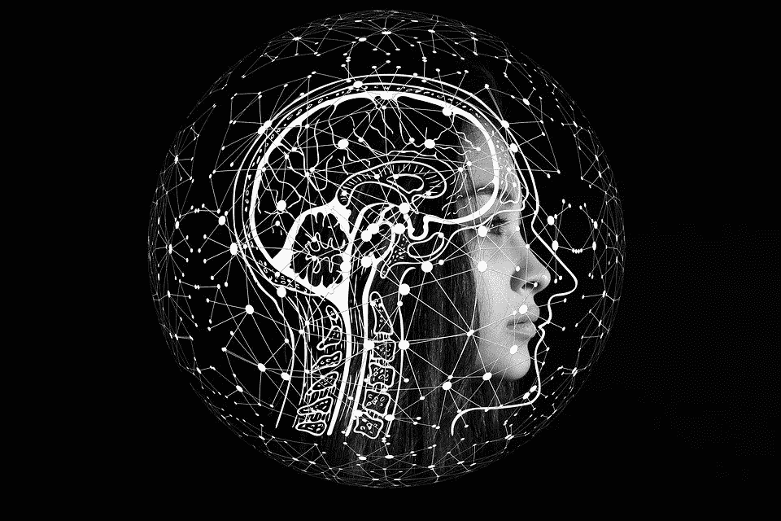

# 如何让人工智能真正智能化

> 原文：<https://medium.com/geekculture/how-to-make-artificial-intelligence-truly-intelligent-d996b71b7f71?source=collection_archive---------4----------------------->

自从计算机出现的早期，人们就渴望构建能够像人类一样观察和理解世界的智能程序。

为了实现这一点，计算机科学家试图手工编写复杂的算法，这非常繁琐。此外，对每一步进行编码的过程都会产生错误的结果。