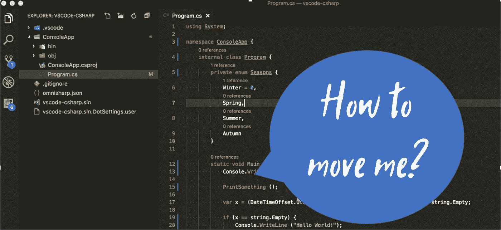

# 如何让代码在(Azure)服务之间移动

> 原文：<https://medium.com/geekculture/how-to-make-code-movable-between-azure-services-1b58188693e1?source=collection_archive---------56----------------------->



本文描述了如何创建(net core)代码，可以在不同的 Azure 服务之间轻松移动，如 Azure 函数、Azure 服务结构或 Azure 容器实例。一个好的副作用是代码马上变得可维护、可测试和可增强。

# 实际问题是什么？

假设实现了业务逻辑。已经与建筑师/团队讨论了基础设施并达成一致。DevOps 的人已经把一切都自动化了。所有作品。太好了。


然后是(Azure)服务

*   没有像预期的那样扩展
*   在您的代码部署中有问题，您在发现问题时会失去理智(如果存在)
*   不像预期的那样支持你
*   比预期的要贵得多


> 当选择了错误的部署选项时，通常意味着大量的工作

代码在那里。你需要转移到别的地方。更符合您需求的服务。让我们看看可以托管代码的 Azure 服务。这绝不是一个全面的清单。

*   [Azure Kubernetes 服务(AKS)](https://azure.microsoft.com/en-au/services/kubernetes-service/) :简化 Kubernetes 的部署、管理和运营
*   [应用服务](https://azure.microsoft.com/en-au/services/app-service/):快速创建强大的网络和移动云应用
*   [容器实例](https://azure.microsoft.com/en-au/services/container-instances/):在 Azure 上轻松运行容器，无需管理服务器
*   [批处理](https://azure.microsoft.com/en-au/services/batch/):云规模的作业调度和计算管理
*   [服务结构](https://azure.microsoft.com/en-au/services/service-fabric/):在 Windows 或 Linux 上开发微服务和编排容器
*   [Azure 功能](https://azure.microsoft.com/en-us/services/functions/):用抽象的基础设施开发微服务

第一次运行时使用了一个 Azure 容器实例。当它第一次部署时，对性能的短期展望。放大它。从另一个角度看成本。上帝啊。

扩展意味着重新托管整个服务。不仅仅是第二个容器实例。事实上，我过去也遇到过这种情况。有时候 [RTFM](https://en.wikipedia.org/wiki/RTFM) 不跟自己打。反正我看了但是不明白后果。我想这叫做学习曲线。

让我们假设，更好的选择是 Azure 函数。这就是我在那个项目中所追求的。

总之。在 Docker 容器中编写了一段可执行代码后，需要考虑多个组件/功能。移动一段代码取决于:

*   原则:创建可测试、可维护和可增强代码的一些有效原则。我遵循 SOLID 并应用依赖注入。比方说，这完成了一半的工作。
*   注册:依赖注入服务是如何以及在哪里组织的？他们是如何注册的？
*   启动:组件的引导是如何组织的？

> 是的，还有更多领域。向下滚动到文章末尾查看它们。

回答这些问题将有助于重新组织。让我们放一些例子，并假设，代码遵循固体。如果没有，无论如何，如果没有大量的改变，移动代码将是很难甚至不可能的。

# 组织服务注册


你知道 AutoFac 吗？我猜你听说了。在 Autofac 中，可以像这样注册服务:

```
builder.RegisterAssemblyTypes(AppDomain.CurrentDomain.GetAssemblies())
       .Where(t => t.Name.EndsWith("YourPostFix"))
       .AsImplementedInterfaces()
       .InstancePerRequest();
```

这在许多依赖注入框架中都是非常常见的实践，不仅仅是 [Autofac](https://autofac.org/) 。当然，这很方便。所有的东西都将被扫描，瞧，注册是小而有效的。

在我看来，这有很多问题:

*   当我有多个程序集时，我如何知道什么在哪里？
*   谁负责注册服务，谁知道如何正确操作？
*   只收集我需要和想要的东西的常用方法是什么？不过，注册起来应该还是很容易的。

对我来说，在[模块](https://autofac.readthedocs.io/en/latest/configuration/modules.html) / [安装程序](https://github.com/castleproject/Windsor/blob/master/docs/installers.md)中捕获服务的方法最合适。安装程序看起来像这样，实现一个接口:

```
using CodingSoul.Contracts.Ioc;
using CodingSoul.Data.Messages;
using CodingSoul.Reader.Services.MessageHandlers;
using Microsoft.Extensions.DependencyInjection;namespace CodingSoul.Reader.Services.Installers
{
    public class ReaderInstaller : IInstaller
    {
        public void Install(IServiceCollection services)
        {
       Services.AddSingleton<IMessageHandler<ReadFromDataSourceMessage>, ReadFromDataSourceMessageHandler>();
         services.AddSingleton<MessageCreator>();
         services.AddSingleton<ApplicationUnhandledExceptionHandler>();
        }
    }
}
```

IInstaller 接口几乎只有安装方法。利用微软。需要使用 extensions . dependency injection IServiceCollection。是的，显然代码是用。网芯。

那能解决什么？安装程序是第一步。

> 有了一个清晰的策略，如何从一个程序集/库中公开服务，就能清楚地知道从它那里能得到什么

当然，这是一个庞大而复杂的计划。很多零件需要粘在一起。怎么做呢？让我们假设，有多个安装程序可用。可能比我的程序需要的要多得多。注册工作可以像这样简单透明地进行:

```
using System;
using CodingSoul.Cloud.Common.ServiceBus.Services.Installers;
using CodingSoul.Common.Services.Installers;
using CodingSoul.Iot.Contracts.Ioc;
using CodingSoul.Reader.Services.Installers;
using Microsoft.Extensions.DependencyInjection;namespace CodingSoul.Reader.Bootstrap
{
    public class Bootstrapper
    {
        public IServiceProvider Initialize(IServiceCollection services = new ServiceCollection())
        {
            var installers = new IInstaller[]
            {
                new ReaderInstaller(),
                new CloudCommonServiceBusCoreInstaller(),
                new CloudCommonServiceBusQueuesInstaller(),
                new CommonInstaller(),
                new CommonLoggingInstaller(), 
            }; foreach (var installer in installers)
            {
                installer.Install(services);
            }
            return services.BuildServiceProvider();
        }
    }
}
```

运行这段代码后，依赖注入框架注册了所有的服务。

> 将 Azure 服务主机上的替换为另一个时，不应更改此过程。

现在呢？让我们在不同的环境中进行一些启动。

# 实现应用程序的引导/启动


我们有三个要求中的两个。

*   一个正确的程序如何实现实际的代码(实体，依赖注入)。
*   结果服务的注册

缺少的部分是将代码应用到某个 Azure 环境中。让我们比较一下 Azure 容器实例和 Azure 函数。

【Azure 容器实例引导程序的 Docker 容器:

```
namespace CodingSoul.Reader.Bootstrap
{
    class Program
    {
        static void Main(string[] args)
        {
            try
            {
                var applicationInitializer = new Bootstrapper();
                var serviceProvider = applicationInitializer.Initialize(); //....further code here... }
            catch (Exception ex)
            {
                Console.WriteLine(ex);
                throw;
            }
        }
    }
}
```

服务的实际启动可以在尝试之后直接完成。实际上，唯一改变的是服务的周边必需品。docker 容器需要一种可以独立运行的可执行文件。这对于 Azure 函数来说是不一样的。

**Azure 函数引导程序:**

如果 Azure 函数应该使用依赖注入，那么有必要使用“FunctionsStartup”注释。

```
[assembly: FunctionsStartup(typeof(ReaderFunctionsStartup))]namespace CodingSoul.Reader.Bootstrap
{
    public class ReaderFunctionsStartup : FunctionsStartup
    {
        public override void Configure(IFunctionsHostBuilder builder)
        {
            var applicationInitializer = new Bootstrapper();
            var serviceProvider = applicationInitializer.Initialize(builder.Services);
        }
    }
}
```

这看起来很容易，是吗？

# 所以我们没碰代码？

确实如此。只有启动必需品被改变了。对于某些项目/产品，这也许是可能的。但是..

> 这是关于移动代码容易，而不是没有任何互动移动代码

# 结论

将代码从一个服务转移到另一个服务时，实际上需要考虑三个方面:

*   **Bootstrap:** 当在 [docker 容器](https://docs.docker.com/get-started/)中有一个可执行文件时，Bootstrap 看起来与让它在[Azure Classic Cloud Services](https://docs.microsoft.com/en-us/azure/cloud-services/)或 [Azure Service Fabric](https://docs.microsoft.com/en-us/azure/service-fabric/service-fabric-get-started) 中运行完全不同。只需向上滚动即可查看详情。
*   **配置文件: [Azure 功能](https://docs.microsoft.com/en-us/azure/azure-functions/functions-get-started?pivots=programming-language-csharp)、 [Azure 经典云服务](https://docs.microsoft.com/en-us/azure/cloud-services/)、 [Azure 服务架构](https://docs.microsoft.com/en-us/azure/service-fabric/service-fabric-get-started)中的**配置文件。net 框架或者。网芯就不一样了。为了遵循单一责任并使我的生活更容易，选择了一些适配器，使得从云服务向代码提供配置信息变得容易，而根本不需要改变代码。
*   **日志记录:**对于日志记录来说，这几乎是一样的。我本可以选择 [Azure Functions](https://docs.microsoft.com/en-us/azure/azure-functions/functions-get-started?pivots=programming-language-csharp) 或 [Azure Service Fabric](https://docs.microsoft.com/en-us/azure/service-fabric/service-fabric-get-started) 的集成日志机制，或者其他的，但是我希望有一种方法可以在整个系统中使用。它不应该依赖云服务。事实上，我花了一些时间在这上面，因为有时这比预期的要难。

配置文件和日志可以用通用的方法来处理。我实际上(再次)使用了通用的微软库。即使大部分代码和可用的托管选项都来自微软，实现也有很大的不同。

采用这种方法有助于减少工作量，只关注那些绝对不可避免的变化。