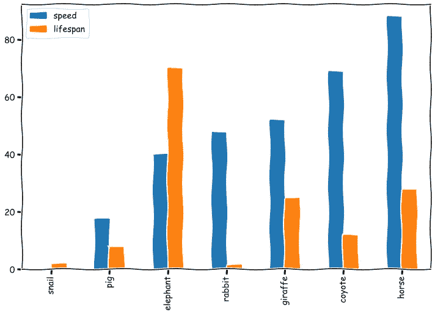

# 如何用 Python 制作手绘风格图

> 原文：<https://medium.com/geekculture/how-to-make-hand-drawn-style-plots-in-python-709693f6877b?source=collection_archive---------0----------------------->

## 一个如何用 Python 制作 xkcd 图表的例子

最初由[预测黑客](https://predictivehacks.com/how-to-make-hand-drawn-style-plots-in-python/)发布

Image by [Predictive Hacks](https://predictivehacks.com/wp-content/uploads/2020/08/area_plot_1.png)