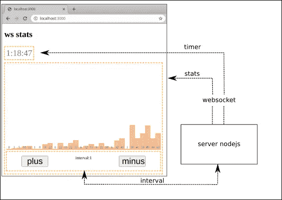
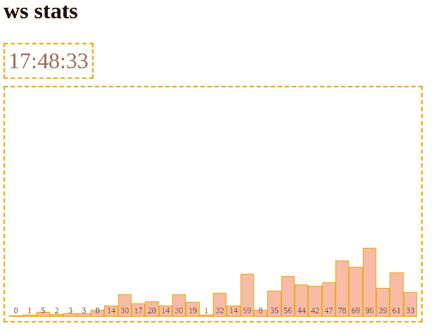
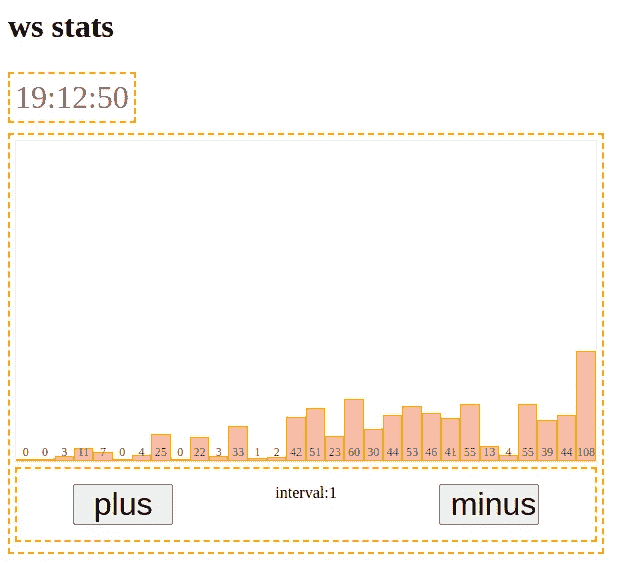

# 如何在 WebSockets 上做一个模块化的 App

> 原文：<https://medium.com/geekculture/how-to-make-modular-app-on-websockets-c2535655dbe0?source=collection_archive---------25----------------------->


Photo by [Christopher Gower](https://unsplash.com/@cgower?utm_source=medium&utm_medium=referral) on [Unsplash](https://unsplash.com?utm_source=medium&utm_medium=referral)

在我们的一个项目中，我们在套接字上使用了 IPC(进程间通信)。一个相当大的项目，一个交易机器人，其中有许多模块相互作用。随着复杂性的增加，监控微服务中发生的事情也变得越来越重要。我们决定创建自己的应用程序来跟踪两个库上的数据流 [React](https://github.com/facebook/react) 和[redor](https://github.com/rubender/redoor)。我想与您分享我们的方法。

微服务用两个字段交换 JSON 对象:名称和数据。名称是对象打算用于哪个服务的标识符和数据-有效载荷字段。示例:

```
{ name:'ticket_delete', data:{id:1} }
```

因为服务是非常原始的，协议每周都在改变，所以监控应该尽可能简单和模块化。因此，在应用程序中，每个模块都应该显示针对它的数据，因此通过添加或删除数据，我们应该获得一组独立的模块来监控微服务中的流程。

让我们开始吧。例如，让我们制作一个简单的应用程序和一个 web 服务器。该应用程序将由三个模块组成。在图中，它们用虚线表示。计时器、统计和统计控制按钮。



让我们创建一个简单的 WebSocket 服务器。

```
/** src/ws_server/echo_server.js */

const WebSocket = require('ws');
const wss = new WebSocket.Server({ port: 8888 });

function sendToAll( data) {
  let str = JSON.stringify(data);
  wss.clients.forEach(function each(client) {
    client.send(str);
  });
}

// Sending data every second
setInterval(e=>{
  let d = new Date();
  let H = d.getHours();
  let m = ('0'+d.getMinutes()).substr(-2);
  let s = ('0'+d.getSeconds()).substr(-2);
  let time_str = `${H}:${m}:${s}`;
  sendToAll({name:'timer', data:{time_str}});
},1000);
```

服务器每秒生成一个日期字符串，并将其发送给所有连接的客户端。打开控制台并启动服务器:

```
# node src/ws_server/echo_server.js
```

现在让我们转到应用程序项目。对于构建和调试，我们将使用下面的汇总配置。

```
import serve from 'rollup-plugin-serve';
import babel from '@rollup/plugin-babel';
import { nodeResolve } from '@rollup/plugin-node-resolve';
import commonjs from '@rollup/plugin-commonjs';
import hmr from 'rollup-plugin-hot'
import postcss from 'rollup-plugin-postcss';
import autoprefixer from 'autoprefixer'
import replace from '@rollup/plugin-replace';

const browsers = [  "last 2 years",  "> 0.1%",  "not dead"]

let is_production = process.env.BUILD === 'production';

const replace_cfg = {
  'process.env.NODE_ENV': JSON.stringify( is_production ? 'production' : 'development' ),
  preventAssignment:false,
}

const babel_cfg = {
    babelrc: false,
    presets: [
      [
        "@babel/preset-env",
        {
          targets: {
            browsers: browsers
          },
        }
      ],
      "@babel/preset-react"
    ],
    exclude: 'node_modules/**',
    plugins: [
      "@babel/plugin-proposal-class-properties",
      ["@babel/plugin-transform-runtime", {
         "regenerator": true
      }],
      [ "transform-react-jsx" ]
    ],
    babelHelpers: 'runtime'
}

const cfg = {
  input: [
    'src/main.js',
  ],
  output: {
    dir:'dist',
    format: 'iife',
    sourcemap: true,
    exports: 'named',
  },
  inlineDynamicImports: true,
  plugins: [
    replace(replace_cfg),
    babel(babel_cfg),
    postcss({
      plugins: [
        autoprefixer({
          overrideBrowserslist: browsers
        }),
      ]
    }),
    commonjs({
        sourceMap: true,
    }),
    nodeResolve({
        browser: true,
        jsnext: true,
        module: false,
    }),
    serve({
      open: false,
      host: 'localhost',
      port: 3000,
    }),
  ],
} ;

export default cfg;
```

我们项目的入口点是 main.js，让我们创建它。

```
/** src/main.js */
import React, { createElement, Component, createContext } from 'react';
import ReactDOM from 'react-dom';
import {Connect, Provider} from './store'
import Timer from './Timer/Timer'

const Main = () => (
  <Provider>
    <h1>ws stats</h1>
    <Timer/>
  </Provider>
);
const root = document.body.appendChild(document.createElement("DIV"));
ReactDOM.render(<Main />, root);
```

现在让我们为我们的项目创建一个 redoor 商店

```
/** src/store.js */
import React, { createElement, Component, createContext } from 'react';
import createStoreFactory from 'redoor';
import * as actionsWS from './actionsWS'
import * as actionsTimer from './Timer/actionsTimer'

const createStore = createStoreFactory({Component, createContext, createElement});
const { Provider, Connect } = createStore(
  [
    actionsWS,     // websocket actions
    actionsTimer,  // Timer actions
  ]
);
export { Provider, Connect };
```

在创建计时器模块之前，我们需要从服务器获取数据。让我们创建一个操作文件来使用套接字。

```
/** src/actionsWS.js */
export const  __module_name = 'actionsWS'
let __emit;
// getting emit function from redoor
export const bindStateMethods = (getState, setState, emit) => {
  __emit = emit
};
// connect to server
let wss = new WebSocket('ws://localhost:8888')
// we receive all messages from the server and send them to the redoor stream
wss.onmessage = (msg) => {
  let d = JSON.parse(msg.data);
  __emit(d.name, d.data);
}
```

这里有必要更详细地说明一下。我们的服务以带有字段的对象形式发送数据:名称和数据。在 redoor 库中，您还可以创建事件流，我们只需向其传递数据和名称。它看起来像这样:

```
+------+    
| emit | --- events --+------------+----- ... --------+----->
+------+              |            |                  |
                      v            v                  v
                 +----------+   +----------+     +----------+
                 | actions1 |   | actions2 | ... | actionsN |
                 +----------+   +----------+     +----------+
```

因此，每个模块都有能力“监听”自己的事件，如果有必要，还可以监听其他动作事件。

现在让我们创建定时器模块本身。在“Timer”文件夹中，创建两个文件“Timer.js”和“actionsTimer.js”

```
/** src/Timer/Timer.js */

import React from 'react';
import {Connect} from '../store'
import s from './Timer.module.css'

const Timer = ({timer_str}) => <div className={s.root}>
  {timer_str}
</div>

export default Connect(Timer);
```

这里一切都很简单，计时器从全局状态“timer_str”中获取，该状态在“actionsTimer.js”中更新。“连接”功能将模块连接到 redoor。

```
/** src/Timer/actionsTimer.js */
export const  __module_name = 'actionsTimer'
let __setState;

// getting a method for setState
export const bindStateMethods = (getState, setState) => {
  __setState = setState;
};

// initialize the timer variable
export const initState = {
  timer_str:''
}

// "listen" stream for "timer" event
export const listen = (name,data) =>{
  name === 'timer' && updateTimer(data);
}
// обновляем стейт 
function updateTimer(data) {
  __setState({timer_str:data.time_str})
}
```

在 actions 文件中，我们“监听”计时器的“timer”事件(函数“listen”)，一旦收到，我们就更新状态并输出一个包含数据的字符串。

了解更多有关 redoor 功能的信息:

“_ _ module _ name”——调试时需要一个保留变量，它告诉我们动作包含在哪个模块中。

“bindStateMethods”是一个获取 setState 的函数，因为数据是异步的，所以我们需要在局部变量中获取状态更新函数。

“initState”——用于初始化模块数据的函数或对象，在我们的例子中，这是 timer_str

“listen”——接收 redoor 生成的所有事件的函数。

完成了。运行编译并在“ [http://localhost:3000](http://localhost:3000) 打开浏览器

```
# npx rollup -c rollup.config.js --watch
```

应该会出现一个时钟。让我们转到一个更复杂的问题。与计时器类似，我们将添加另一个统计模块。首先，向“echo_server.js”添加一个新的数据生成器

```
/** src/ws_server/echo_server.js */

...
let g_interval = 1;
// Stats data
setInterval(e=>{
  let stats_array = [];
  for(let i=0;i<30;i++) {
    stats_array.push((Math.random()*(i*g_interval))|0);
  }
  let data  = {
    stats_array
  }
  sendToAll({name:'stats', data});
},500);

...
```

并将该模块添加到项目中。为此，创建一个“Stats”文件夹，我们在其中创建“Stats.js”和“actionsStats.js”

```
/** src/Stats/Stats.js */
import React from 'react';
import {Connect} from '../store'
import s from './Stats.module.css'

const Bar = ({h})=><div className={s.bar} style={{height:`${h}`px}}>
  {h}
</div>

const Stats = ({stats_array})=><div className={s.root}>
  <div className={s.bars}>
    {stats_array.map((it,v)=><Bar key={v} h={it} />)}
  </div>
</div>

export default Connect(Stats);
```

和

```
/** src/Stats/actionsStats.js */
export const  __module_name = 'actionsStats'
let __setState = null;

export const bindStateMethods = (getState, setState, emit) => {
  __setState = setState;
}

export const initState = {
  stats_array:[],
}

export const listen = (name,data) =>{
  name === 'stats' && updateStats(data);
}

function updateStats(data) {
  __setState({
    stats_array:data.stats_array,
  })
}
```

将新模块连接到 redoor 存储

```
/** src/store.js */
...
import * as actionsStats from './Stats/actionsStats'

const { Provider, Connect } = createStore(
  [
    actionsWS,
    actionsTimer,
    actionsStats //<-- module Stats
  ]
);
...
```

我们应该得到这个:



如您所见，Stats 模块与 Timer 模块没有本质上的区别，只是显示的不是字符串，而是数据数组。如果我们不仅要接收数据，还要将数据发送到服务器，该怎么办？添加统计管理。

在我们的例子中，变量 g_interval 是随机变量归一化的角斜率。让我们尝试从我们的应用程序管理它。

让我们给 stats 模块添加几个按钮。正值会增加区间值，负值会减少。

```
/** src/Stats/Stats.js */
...
import Buttons from './Buttons' 
...
const Stats = ({cxRun, stats_array})=><div className={s.root}>
  <div className={s.bars}>
    {stats_array.map((it,v)=><Bar key={v} h={it} />)}
  </div>
  <Buttons/> {/* <- new module */}
</div>
...
```

和带有按钮的模块本身

```
/** src/Stats/Buttons.js */
import React from 'react';
import {Connect} from '../store'
import s from './Stats.module.css'

const DATA_INTERVAL_PLUS = {
  name:'change_interval',
  interval:1
}
const DATA_INTERVAL_MINUS = {
  name:'change_interval',
  interval:-1
}

const Buttons = ({cxEmit, interval})=><div className={s.root}>
  <div className={s.btns}>
      <button onClick={e=>cxEmit('ws_send',DATA_INTERVAL_PLUS)}>
        plus
      </button>

      <div className={s.len}>interval:{interval}</div>

      <button onClick={e=>cxEmit('ws_send',DATA_INTERVAL_MINUS)}>
        minus
      </button>
  </div>
</div>

export default Connect(Buttons);
```

我们有一个带按钮的面板:



并修改它 actionsWS.js

```
/** src/actionsWS.js */
...

let wss = new WebSocket('ws://localhost:8888')

wss.onmessage = (msg) => {
  let d = JSON.parse(msg.data);
  __emit(d.name, d.data);
}

// "listening" to the event send data to the server
export const listen = (name,data) => {
  name === 'ws_send' && sendMsg(data);
}
// отправляем данные
function sendMsg(msg) {
  wss.send(JSON.stringify(msg))
}
```

这里我们在 Buttons.js 模块中利用了在 redoor 库中创建事件的内置函数(cxEmit)。模块“actionsWS.js”“监听”事件 ws_send。数据有效负载是两个对象:“DATA_INTERVAL_PLUS”和“DATA_INTERVAL_MINUS”。对于该实例，如果您单击加号按钮，应用程序将向服务器发送对象:

{名称:'更改时间间隔'，时间间隔:1 }

在服务器上，我们添加

```
/** src/ws_server/echo_server.js */
...

wss.on('connection', function onConnect(ws) {
  // "listening" to the app for the "change_interval" event"
  // from Buttons.js
  ws.on('message', function incoming(data) {
    let d = JSON.parse(data);
    d.name === 'change_interval' && change_interval(d);
  });
});

let g_interval = 1;
// change interval
function change_interval(data) {
  g_interval += data.interval;
  // send new event interval_changed
  sendToAll({name:'interval_changed', data:{interval:g_interval}});
}

...
```

而最后的触动就是在“Buttons.js”模块中反映音程的变化。为此，请转到“actionsStats.js”让我们开始监听“interval_changed”事件，并更新 interval 变量

```
/** src/Stats/actionsStats.js */
...

export const initState = {
  stats_array:[],
  interval:1 // add new var interval
}

export const listen = (name,data) =>{
  name === 'stats' && updateStats(data);

  // "listening" for the interval update event
  name === 'interval_changed' && updateInterval(data);
}
// update the interval
function updateInterval(data) {
  __setState({
    interval:data.interval,
  })
}

function updateStats(data) {
  __setState({
    stats_array:data.stats_array,
  })
}
```

因此，我们有三个独立的模块，其中每个模块只监视自己的事件并只显示它。当结构和协议在原型阶段还不完全清楚时，这是非常方便的。我们只需要补充一点，因为所有的事件都有一个交叉的结构，所以我们必须明确遵循创建事件的模板。我们给自己选了这个:(莫德伦·AME)_(函数名)_(变量名)。

我希望它有帮助。和往常一样，该项目的源代码在 [GitHub](https://github.com/rubender/react_redoor_ws_example) 上。

*更多内容尽在*[*plain English . io*](http://plainenglish.io/)