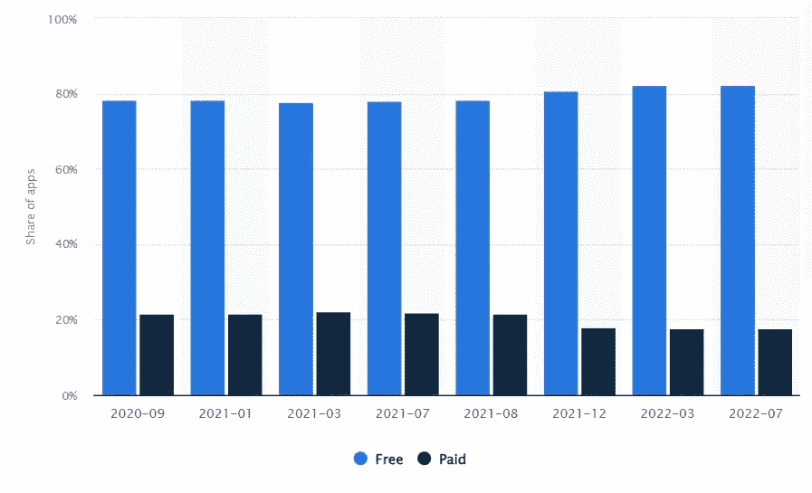
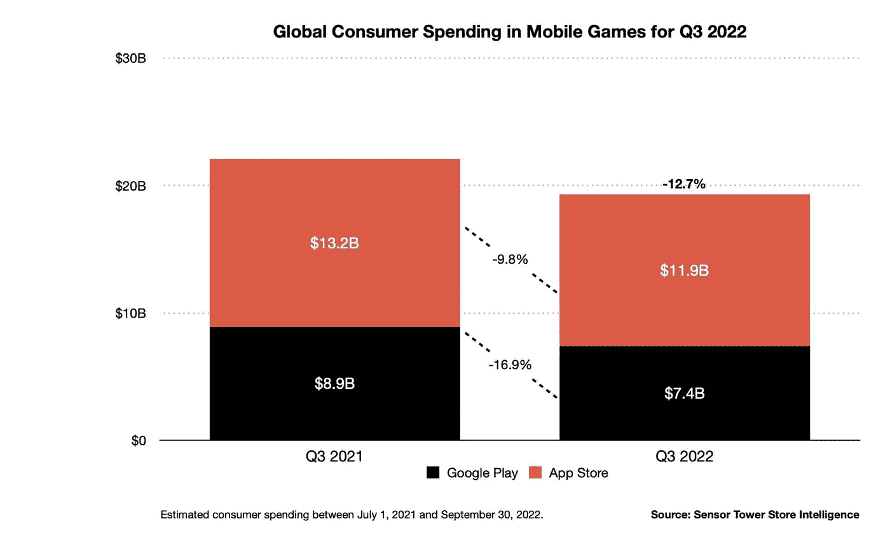
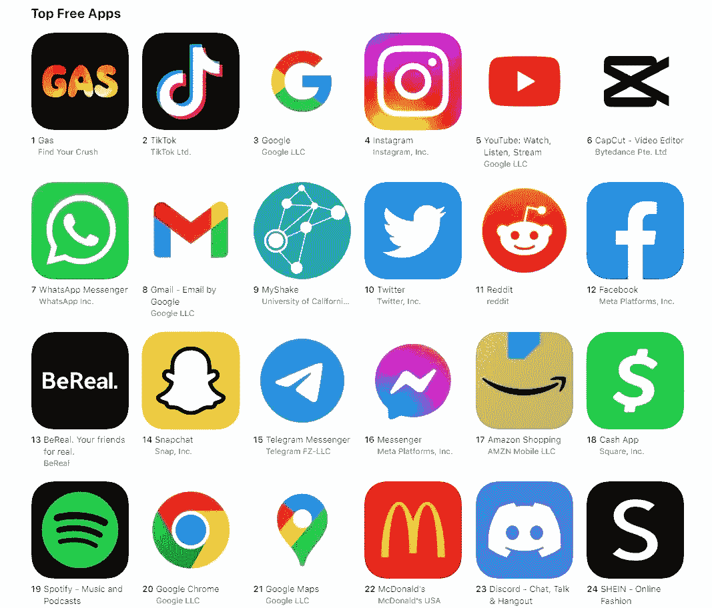
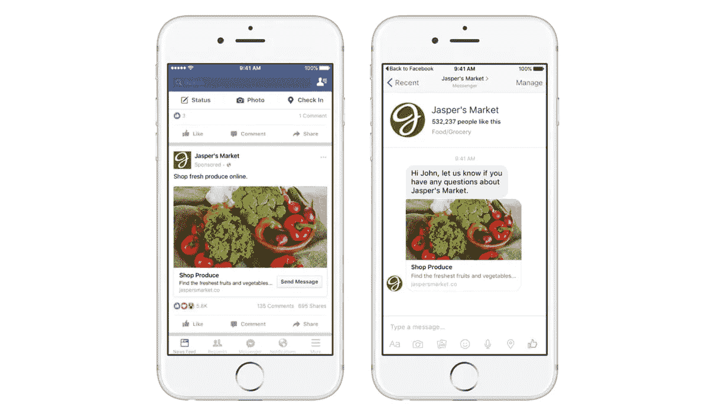
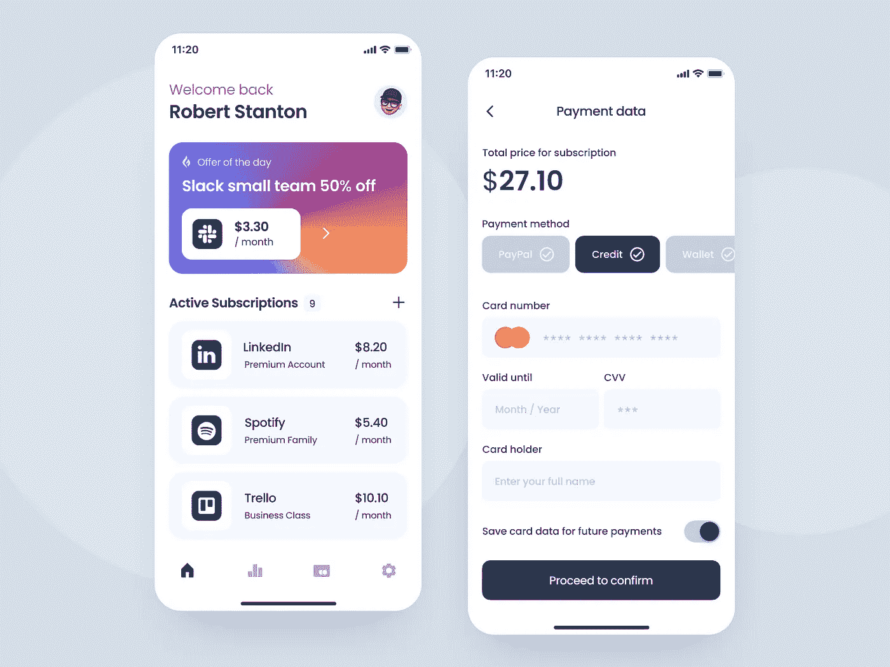
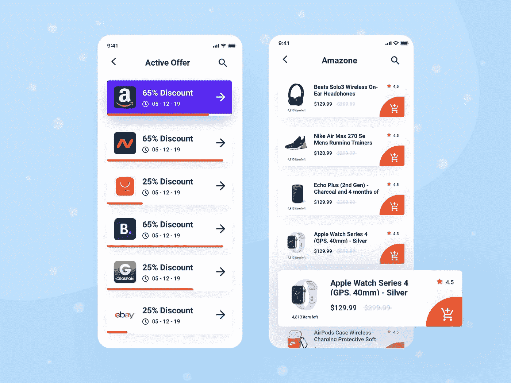
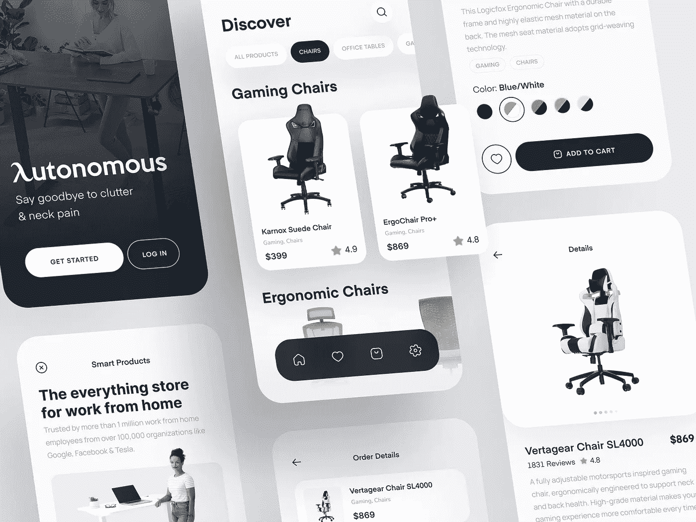
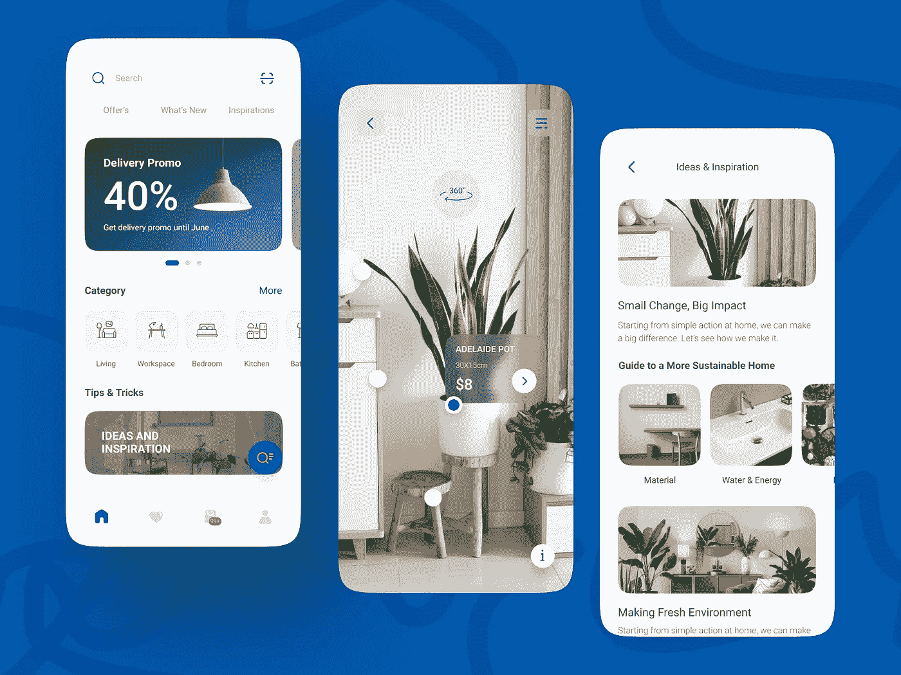
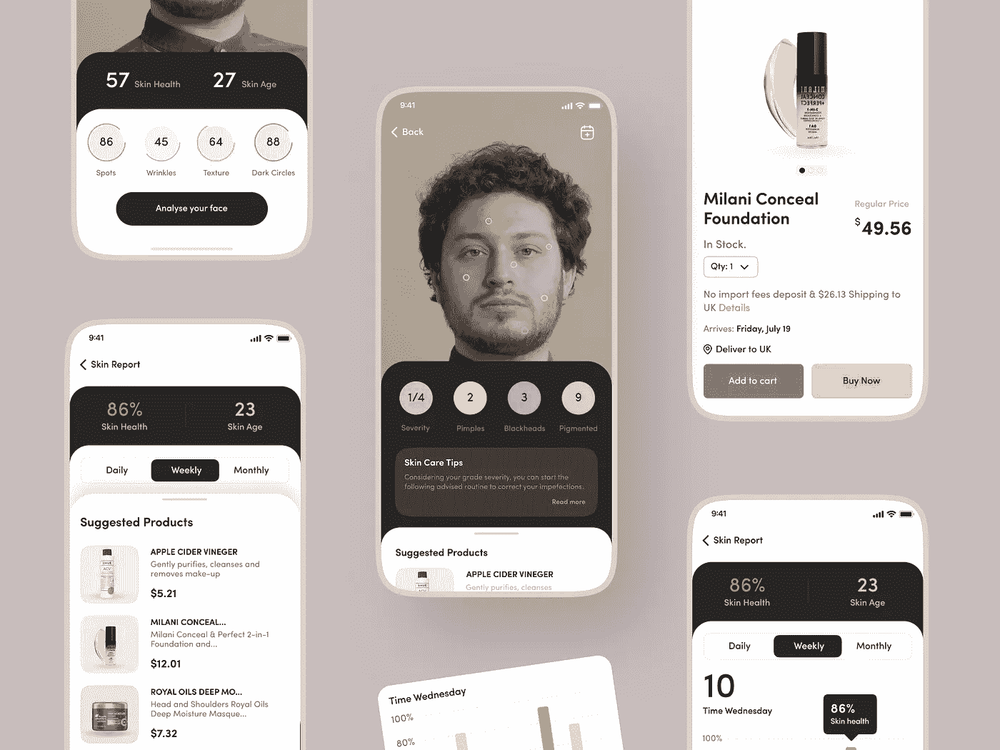

# 如何从免费应用中赚钱:最佳策略和技巧

> 原文：<https://medium.com/geekculture/how-to-make-money-from-free-apps-best-strategies-tips-6d1ad4f7920a?source=collection_archive---------8----------------------->

*作者玛丽·摩尔，**文案*

**

*Illustration by by Kseniia Gorshkova*

*这世上没有免费的东西。总有一个陷阱或利润。移动应用程序也是如此。即使是免费的应用程序也能为它们的创造者赚钱。它们可能不要求人们预先付费，而是使用不同的策略来吸引更多的潜在用户，并通过提供订阅、奖金、成就等在未来带来收入。这就是为什么免费应用程序比付费应用程序更受欢迎并不奇怪。*

*2022 年，谷歌 Play 商店大约有 96.8%的安卓应用程序可以免费使用。所以这是大多数产品的关键特性之一，人们在打开一个应用程序时就期望它。让我们来看看这些统计数据，它显示了亚马逊应用商店中免费和付费移动应用的数量:*

**

*Free and paid Android apps in Amazon Appstore in July 2022*

*与此同时，App Store 中的付费应用数量有所下降。近年来，他们的收入也在逐渐下降。以下是来自 [SensorTower](https://sensortower.com/blog/app-revenue-and-downloads-q3-2022) 的统计数据，显示了消费者在手机游戏上的支出:*

**

*在大多数情况下，人们不习惯为他们想要的应用付费。从心理上来说，此时此地获得免费的东西，以后再处理付款问题，或者根本不去想这个问题，会更容易些。*

*让我们看看如何将你的免费应用货币化，以及最流行的应用货币化模式和趋势是什么。您还将发现开发技巧和常见错误。*

# *现在的 TANSTAAFL*

*这个朗朗上口的短语，据说源于 20 世纪 70 年代的一个电视广告，类似于著名的 TANSTAAFL 格言——“天下没有免费的午餐。”*

*也就是说，你不可能不劳而获。你应该总是有所回报。金钱、机会、恩惠等。*

*移动应用程序开发也是如此——成本很高，在现实世界中，不可能免费。人们可以通过免费和付费应用赚钱。只是后者更明显。消费者进行一次性购买并开始使用该产品。就免费应用而言，事情要复杂得多，各种形式和伪装的货币化方法层出不穷。*

# *将你的商业策略建立在竞争对手的基础上*

*任何项目成功的关键是对市场和潜在竞争对手的深入分析。通过这种方式，您将紧跟功能趋势、需求和设计的潮流。更重要的是，在 play store 中发现免费应用时，您可以找到一些实施不佳的酷功能或一些可以进行一些调整的好想法。所以，在你的产品中改进它们是一个明智的想法。*

*首先，为你的产品选择一个类别。选择时，根据目标区域进行选择。这个领域还应该适合你的开发人员的团队技能、预算、营销策略等。应用程序带来的效用越多，它受欢迎的机会就越大。*

*以下是目前美国最受欢迎的免费 iPhone 应用程序:*

**

*如你所见，它们都提供了很高的效用:聊天、听音乐、购物、送餐、视频剪辑等。*

*在竞争对手调查过程中，提出以下问题:*

*   *他们的应用程序价格是多少？*
*   *他们是如何盈利的？*
*   *他们每天下载多少次？*
*   *竞争应用程序提供什么功能？*
*   *有真实用户的正面评价吗？*
*   *[UI/UX 设计](https://shakuro.com/ui-ux)很棒吗？*
*   *它们出现在什么平台上(iOS 或 Android)？*

*根据这些数据，你就会明白你的目标受众是什么，他们的需求是什么。因此，你的产品将只提供有用的选择，并能在市场的阳光下赢得一席之地。*

# *最佳移动应用盈利策略*

*有几种策略和混合方法可以让你发现如何从免费应用中赚钱。我们将详细讨论经过时间考验的方法。*

# *应用内广告*

*那么，你如何维持一个用户不为你的服务付费的商业模式呢？让你的应用赚钱的最直接最简单的方法就是出售广告空间。它是如何工作的？*

*当你使用一个免费的应用程序时，比如一个手机游戏，你经常可以看到一个横幅弹出来。它可以很小或全屏显示，并建议采取一些行动，如下载其他游戏或查看销售。每当用户点击这个横幅，所有者就会得到一些钱。这种广告被称为应用内广告，通常通过第三方服务完成。通常，这样的广告是在人们的推荐下产生的。如果你经常在谷歌上搜索猫，你可能会得到关于宠物护理的广告。*

*为了从免费应用中赚钱，你可以添加不同种类的应用内广告:*

*   ***插播广告**:在特定时间显示的全屏窗口。由于它覆盖了整个屏幕，这种类型可能会令人恼火。然而，人们可以通过点击角落的十字图标来关闭它。*
*   ***横幅广告**:显示在屏幕顶部或底部的广告条。它们很小，没有干扰性，但是用户经常无法关闭它们。*
*   *视频广告:它们经常被用来换取应用内的奖励。用户可以观看这样的短视频(5-10 秒)并获得几个硬币来解锁新的游戏关卡。*
*   ***原生广告**:看起来像应用程序的自然元素，例如，脸书提要中的一个小横幅。然而，它们谨慎的外表也有不好的一面——人们根本不会去碰它们。*

*最好坚持一两种应用内广告方式。不然人家就太烦了。老实说，没有人真的喜欢广告:它们可能相当恼人，而且它们很少无缝集成到一个应用程序中。他们往往在最不合适的时候出现。但事实上，应用内广告正在成为主流。在过去的几年里，它将应用内购买从最受欢迎的应用货币化方法中挤出了领先地位。*

*2022 年，全球移动广告支出预计将达到[3271 亿美元](https://www.statista.com/statistics/303817/mobile-internet-advertising-revenue-worldwide/)。与去年相比，增长了 17.2%。到 2024 年，支出将达到近 3996 亿美元。因此，不管你对应用内广告的态度如何，你都不能否认它们正在蓬勃发展并带来巨大的收入。*

**

*In-app ads in the Facebook feed*

***优点:***

*   *通过 CTR 获得额外收入*
*   *更多接触目标受众的机会*
*   *测试用户交互*

***缺点:***

*   *用户数量少时无效*
*   *干扰用户流量*
*   *一些广告可能与应用程序的意图无关*

# *应用内购买和免费增值模式*

*免费 app 如何用这种方法赚钱？内部购买的应用程序包括所有免费分发的应用程序，但在使用产品时会提供额外购买。*

*所有者在产品内部提供附加服务。最佳实践是创建一个免费使用的应用程序，通过微支付系统提供额外的好处。*

*这可能是一个游戏币或约会应用程序的额外尝试——每天发送无限数量信息的机会，等等。换句话说，它应该是当下有价值的东西，刺激自发购买，增加整体效用。通过正确定义目标受众及其动机，你可以从这类应用中获得比付费应用高出几十倍的收入。*

**

*Dating app concept with account upgrading by Alisa Yuldybaeva*

*至于免费增值模式，这类移动应用都是免费使用的。但是，一些高级功能需要用真金白银购买。这种策略可以让你聚集大量新用户并留住他们。如果他们喜欢这个产品，他们可以花钱购买额外的功能。*

*并不是所有的用户都准备好了为使用一个应用程序付钱。同时，拥有庞大的活跃用户群，可以从这种类型的货币化中获得稳定的收入。几乎 48%的免费移动应用收入来自应用内购买。因此，这个选项允许企业保持应用程序的良好病毒式传播，并向用户群推广其他应用程序。*

***优点:***

*   *没有恼人的广告*
*   *非常适合游戏化和移动游戏应用*
*   *允许在应用程序中提供更高级的服务*
*   *刺激使用该应用程序，因为一个人花了一些钱*

***缺点:***

*   *由于用户支付细节，需要高安全性措施*
*   *人们将期待使用付费功能带来更大的影响*

# *捐款*

*免费应用的另一种赚钱方式是通过付费订阅。它们可以是每月或每年。这个想法是提供某种有限(或没有)选择的试用期。一般是七天左右。当时间结束时，用户可以购买订阅并继续使用该应用程序。*

**

*Subscriptions App Design by Kate Bubnova*

*通常，有几个级别的订阅:基本，专业等。它们提供不同的功能，以迎合特定部分的目标受众。这种盈利模式在 Spotify 或网飞等音乐和视频流媒体服务中很受欢迎。*

***优点**:*

*   *它非常适合音乐或电影流媒体服务*
*   *通过高级功能吸引专业级观众*
*   *刺激人们更长时间地使用应用程序*

***缺点**:*

*   *你需要提供值得购买的功能*
*   *需要不断更新和改进*

# *联盟营销*

*联盟营销模式推广第三方产品以换取收入。它基于点击或安装的数量。*

*例如，一款手机游戏提供了额外的水晶，用于安装或播放赞助商的应用程序。在这种情况下，联盟合作伙伴获得额外的广告机会和增加的销售额，而应用程序所有者从赞助商那里获得奖励。这里唯一的缺点是，不是每个人都会安装其他产品，花时间磨奖励。*

**

*Affiliate offer listing design by appscred*

***优点**:*

*   *长期忠诚的客户*
*   *推广应用的绝佳方式*

***缺点**:*

*   *耗时的活动*
*   *需要额外的努力来创建一个联盟计划*

# *电子商务*

*如果你有一个商店或网站，那么这就是你在免费应用上赚钱的方式。移动应用将是销售你的实物商品或服务的一个很好的手段，比如衣服、手机壳、玩具等等。此外，移动应用可以与产品本身相关联。例如，您可以使用具有该功能的应用程序，而不是使用电视遥控器。这种应用程序不会产生收入，但应用程序本身不会带来收入，但会作为产品奖金，支持品牌的整体吸引力。*

***优点**:*

*   *在线销售提供了更大的拓展空间*
*   *灵活的模式，可能的品牌合作关系*

***缺点**:*

*   *需要复杂的电子商务解决方案*
*   *需要出色的用户界面/UX 来获得流畅的购物体验*

**

*Autonomous E-Commerce Store App by Conceptzilla*

# *赞助*

*如果你是一家初创公司，与同行业的人合作是一个明智的想法。合作伙伴应该有相似的目标受众。此外，他们还需要为你的用户提供一些有用的东西。这就是为什么最好创建一个可能从开发免费移动应用程序中受益的品牌列表。*

*这种合作关系的一个很好的例子是 Runkeeper 和 Google Fit。他们在一个地方收集和存储用户的数据。当你用第一个跑步时，Google Fit 会追踪你的步数。此外，信息在两个应用程序中同时更新。*

***优点**:*

*   *独家内容和特别优惠*
*   *强大的品牌形象*

***缺点**:*

*   *很难找到一个值得信赖的合作品牌*

# *几种方法的结合*

*通常，为了获得最好的结果，企业主使用多种货币化方法。例如，与应用内购买配对的视频广告横幅。或者在屏幕顶部的小条，因为钱而关闭。另一个很好的组合是订阅和应用内广告。*

*为了从一个应用程序中获取最大利润，你需要结合几种盈利方法。重要的是理解它们是如何组合在一起的。测试各种方式，并始终监控所有表明你的业务健康程度的分析数据。*

# *免费应用的常见应用盈利错误*

*首先也是最重要的，这包括过度攻击性的广告，在大量情况下，这种广告会让用户反感，而不是吸引注意力。但是还有其他不太明显的错误需要考虑:*

*   ***在最后时刻选择策略。在应用程序发布时选择课程限制了选项的数量。开发商被迫在那些产生收入的方法中进行选择，这些方法可以根据现有产品进行调整。提前想好货币化方法。稍微修改一下移动应用程序，让它成为一个更方便的创收工具要容易得多。***
*   ***认购错误定价**。试着设身处地为用户着想，问问自己是否准备好为这款应用支付那么多钱。评估您的解决方案的优势，并分析竞争对手的价格。它会给你一个清晰的视角来设定成本。*
*   ***无效广告**。这种错误包括没有考虑用户数据的广告演示、过多的广告、不及时的显示等。为了避免这些和其他类似的错误，试着从用户的角度来看广告，并且理解什么时候和什么数量的广告会受到欢迎。*
*   ***赚钱灯塔**。收入不应该是你工作的唯一动力。专注于创建对目标受众有用的应用程序。*

**

*Re-design IKEA App Concept by Adin Yanuar*

# *免费应用的盈利趋势*

*趋势每天都在变化，货币化策略也是如此。这就是为什么紧跟最新趋势并及时实施它们是至关重要的。然而，不要试图一次将它们全部内置:仔细浏览，选择最适合你的趋势。*

*在不久的将来，如何通过上述免费应用赚钱的主要方式仍将存在，视频广告将继续征服新的领域。地平线上还出现了哪些其他方式？*

# *游戏*

*一个主要的资产是创造力。尝试在视频格式中实现可玩的游戏广告，并在结尾添加激励信息。它们通常非常简单:匹配 3、拖放和其他逻辑类型。这样的广告有趣又吸引人，越来越受欢迎。因此，越来越多的应用程序所有者将它们作为吸引新消费者的主要方式。*

*按照与您自己的应用程序类似的意图，将它们放在适当的时间。*

# *人工智能和机器学习*

*人工智能正在进入[移动应用开发](https://shakuro.com/native-mobile-development/)的所有领域。关于应用货币化，人工智能可以在几分钟内分析大量数据。它可以提出最佳的算法、方法和途径来促进业务增长。人工智能可以帮助开发者和发行商确定应用价格，找到参与度最高和最低的用户，并微调广告显示流程。*

*由于机器学习，AI 在处理用户数据时不断学习，因此它预测他们的行动和欲望。更重要的是，AI 可以充当公正的仲裁者，运行 A/B 测试，并通常使 UX 更简单，更清晰，对人们更有用。*

*考虑到普通智能手机用户的手机上大约有 80 个移动应用程序，改善用户体验尤为重要。超过 62%的应用程序甚至一个月都没有打开过。如果一个应用不能满足他们的需求，人们会毫不犹豫地删除它，然后继续下一个应用。*

# *GDPR 鼓励使用失踪人员委员会平台*

*通用数据保护条例(GDPR)的通过对许多移动应用程序开发者来说是一个审判日。这个问题的解决方案可以通过使用 CMP(同意管理平台)来确保，CMP 可以积累用户数据并自行请求他们的同意。*

*CMP 平台不是今天的发明，只是在加强了个人数据使用规则之后才引起了特别的关注。*

# *5G 移动互联网*

*5G 已经在这里，越来越多的人使用它。Statista 说，到 2026 年，将有 48 亿客户使用这种新型互联网连接。这就是为什么企业主需要提供具有即时加载时间的沉浸式应用内广告。这种格式将更具吸引力，并提高点击率，因为它们允许开发者集成高清视频广告。这种趋势对于手机游戏和其他引人入胜的应用程序尤其有用。*

# *增强现实*

*AR 在我们的生活中越来越常见。它允许企业通过基于电子商务的免费应用赚钱，例如，虚拟试衣应用和化妆工作室。但是，AR 也可以实施到货币化中，以获得更好的收入。著名的 Pokemon Go 为用户提供了特殊硬币的应用内购买，这些硬币可以在玩游戏时赚取。IKEA Place 是一款免费的移动应用程序，人们可以在其中查看宜家产品在家中的外观。*

**

*DIOR AR (Makeup) by Nasir Uddin*

# *学会平衡*

*选择正确的盈利策略只是未来成功的一部分。为了确保稳定的收入增长，你需要跟随最新的趋势，避免常见的错误。请记住，你的产品可以免费使用，并仍然提供收入。*

*在这种情况下，找到免费和付费选项之间的平衡至关重要。进行 UX 测试，花时间分析和观察竞争对手，并不断改进应用盈利战略。这种方法将帮助你从免费应用中赚钱，而不是赶走用户。*

**原载于*【https://shakuro.com】*