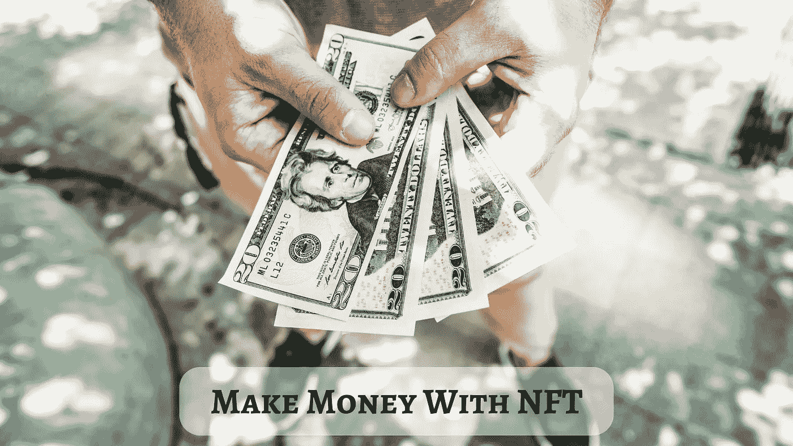

# 如何利用给未来机会的代币赚钱？

> 原文：<https://medium.com/geekculture/how-to-make-money-using-a-token-that-gives-future-opportunities-87e96cc46a98?source=collection_archive---------14----------------------->

Money with NFT

NFT 是随着时间的推移而增长的基于密码的业务的唯一组成部分。底层技术把他们带成了这样，获得了更多的观众支持。这个世界已经充满了与加密/NFT 相关的内容，以在更大程度上抓住观众。通过这种方式，这些进步变得稳定，而最新的，如**元宇宙和 Web3** ，正在获得他们的曲线。Web3 正在建立一个更好的地方来改变世界。这是一件值得骄傲的事情，因为没有中央政府从中分一杯羹，提供完全独立的经营方式。所以，让我们进入文章；你会看到你 [**通过 NFTs**](https://www.blockchainappfactory.com/nft-development-services?utm_source=srinivasan&utm_medium=medium&utm_campaign=20oct2022) 赚钱的不同方式。

**是什么赋予了 NFT 价值？**

你可能听说过 NFT，它是利用数十亿人的工作的标志。那么，NFT 是如何获得其价值的呢？

NFT 的价值是由消费者的兴趣驱动的，就像我们虚构的艺术收藏品一样。与交易卡类似，它们的价值受到其稀有程度和潜在买家数量的显著影响。

没有任何限制阻止复制或共享图像，即使您可以将其转换为 NFT。然而，NFTs 的所有权不能伪造**，因为区块链存储并识别谁拥有资产**。某物价值的主要因素之一是拥有独家所有权的兴奋感。转售是人们如何赚钱和增加他们的 NFT 的价值。

**如何用 NFT 赚钱？**

**1。出租**

在不放弃所有权的情况下，从 NFTs 中赚钱的一个有效方法是出租房产。NFT 不能以同样的真实性复制，但可以租借。它的工作原理类似于用一些钱租用土地一段时间。在这里，可以通过将 NFT 租借给某人一段预定的时间来换取现金。

**2。版税**

像 NFT 这样短暂的东西有可能获得版税吗？

你确实可以。即使将数字资产出售给第三方，数字资产的创作者仍然可以获得被动的终身版税。但是，创作者必须施加一定的条件，如果有人购买了你开发的资产，他们将终生获得版税。

对于艺术家来说，版税是一个巨大的被动收入来源。尽管最初可能会引起混乱，但从非功能性翻译赚钱时考虑版税是很重要的。

**3。贸易 NFTs**

除了出售 NFT，你还可以交易 NFT。一些企业主和投资者像买卖股票一样买卖 NFT 来赚钱。如果你不再需要它们，你可以很容易地交易你收集的 NFT，就像你自己做的一样。

你可以通过买卖的方式把你的钱投资到 NFTs 上。有记录显示，一位迈阿密的艺术收藏家以高于原价 1000 倍的价格交易了他的皮普尔艺术品。并非所有的 NFT 都是相等的。他们中的一些人价值数百万，但其他人则不然。只有当你知道了卖出的正确时机，看到了利润，才有意义。

**4。NFT 博彩**

如果你已经进入 NFTs 有一段时间了，你会知道 NFT 游戏是一个赚钱的前景。如今，基于区块链的游戏允许你赚取和交易游戏中的资产。这些游戏中使用的 NFT 有助于提高游戏的可玩性。它们也是用来交易的。

一些极其昂贵和难以找到的游戏收藏品已经在市场上可以买到，就像在游戏 [**CryptoKitties**](https://www.cryptokitties.co/) 中找到的那些。它的价格已经涨到了 30 万美元。然而，在最近的游戏 NFTs 中，通过正确的信息从 NFTs 中赚钱是完全可能的。

**5。锁定 NFTs**

NFTs 和去中心化金融(DeFi)协议的联合的一个好处是它们能够使用不可替换的令牌。据说，赌注是将数字资产存放或“锁定”到 [**DeFi 协议智能合约**](https://www.blockchainappfactory.com/defi-lending-and-borrowing-platform-development?utm_source=srinivasan&utm_medium=medium&utm_campaign=20oct2022) 中以产生收益的过程。

虽然一些平台允许任何 NFT，但其他平台要求您购买本机 NFT 以获得赌注令牌奖励(通常在平台的本机实用工具令牌中定价)。

然而，由于 NFTs 和 DeFi 基础设施的持续整合，目前可以通过贡献流动性和接受 NFTs 来建立特定流动性池的头寸。赌注通常是从非金融交易中赚钱的一种相当可靠的方式。

你可以通过出售这些 NFT 来快速清算你在流动性池中的股份。

**6。采用 NFT 动力高产农业**

用户现在可以种植 NFT 驱动的 AMMs，因为 NFT 正迅速成为 AMMs 的重要组成部分。通过结合各种 DeFi 协议，您可以从您的数字资产中获得最高收益。“回归农业”就是这个术语。

从 NFTs 中赚钱的最好和最简单的方法是通过农业。你可以把它想成是一种在产生收益的过程之上获得收益的方法。这种潜力使得实施多层次的创收战略成为高产农民的理想选择。

**7。投资 NFT 初创公司**

投资 NFT 公司是一个从非上市公司获得收入的好方法。你可以通过投资 NFT 公司来间接利用 NFTs 赚钱。如果不可替代的代币证明了什么，那就是它们不是加密货币行业的一个短暂趋势。它们可以改变世界，因为它们可以应用于不同的领域。

加密货币市场是许多优秀的 NFT 创业公司的家园。当他们朝着革命性的未来迈出第一步时，你可以支持他们。 [**NFT 的创业公司是一个很好的赚钱方式**](https://www.blockchainappfactory.com/nft-development-services?utm_source=srinivasan&utm_medium=medium&utm_campaign=20oct2022) 有了 NFT 就不用直接面对飘忽不定的市场。

**结论**

NFT 增长很多，没有红灯阻挡，或者说不只是过眼云烟。通过这篇文章，你将会明白使用 NFTs 赚钱的方法。所以这可能是你数字时代的开始。从最适合你的投资开始，进入 NFT 竞技场。