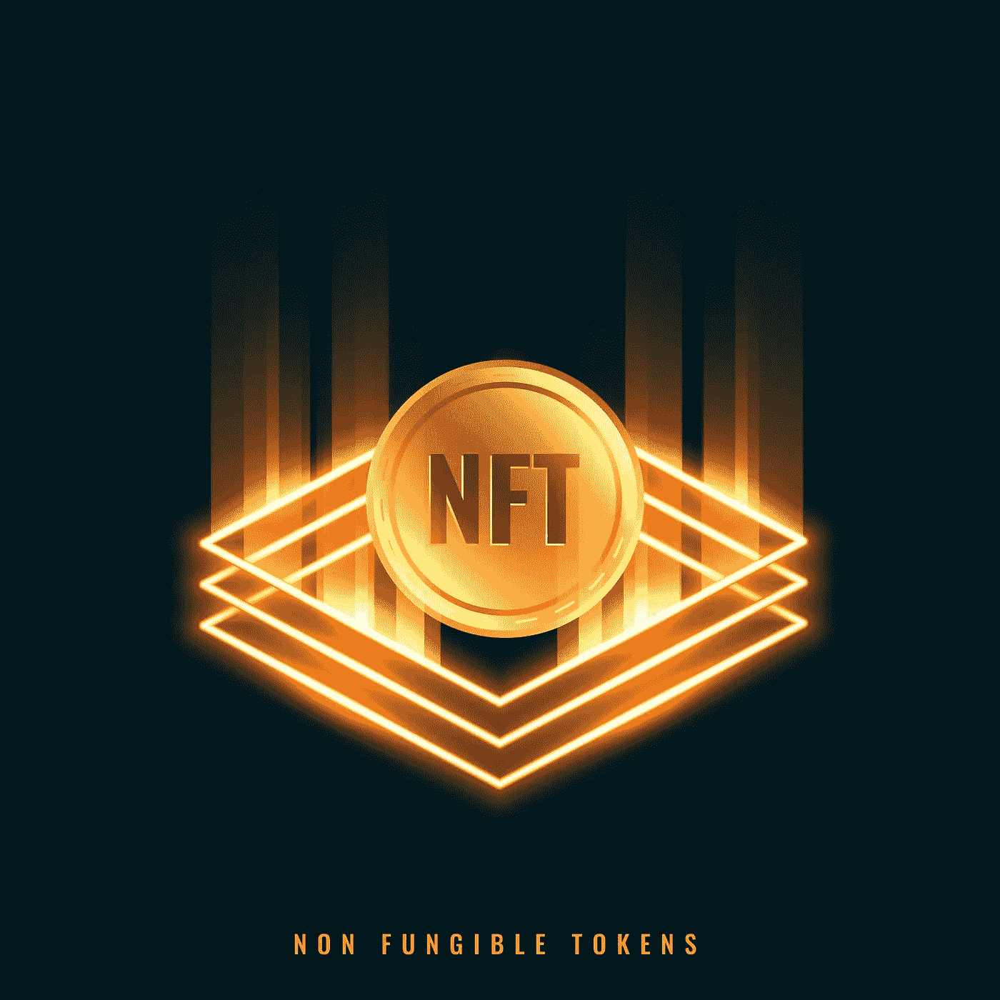

# “如何用 NFTs 赚钱？”对任何人！

> 原文：<https://medium.com/geekculture/how-to-make-money-with-nfts-for-anyone-c9aa80e4d2a1?source=collection_archive---------17----------------------->

Make money with NFT

eb3，或称分散式互联网，正在通过为当前 Web2 生态系统的不足创建和执行解决方案来取得进展。Web3 走到今天这个位置的过程本身就是一次冒险，值得在另一篇博客中讨论。一切从 [**加密货币**](https://www.blockchainappfactory.com/cryptocurrency-development?utm_source=medium&utm_medium=20%2F08%2F22) 开始，现在作为 **Web3 world 的**招标，之后相关应用陆续推出。

Web3 的翅膀在其上张开，导致了具有改变世界潜力的新应用程序的诞生，其中许多已经展示了它们的未来。在这篇博客中，我们将关注 Web3 的一个关键部分。

# 不可替换令牌(NFT):解释

不可替代令牌(NFT)是在**区块链**上注册的数字令牌，作为所有权和真实性的证明。显而易见，那些不懂技术的人可能不太理解这一点；下面的解释可能对 **NFTs** 有所启发。

假设我们拿一张 1 美元的钞票和一件独一无二的艺术品。如果我们想把 1 美元的钞票换成另一张，那是超级容易的，剩余的总价值将是 1 美元，即使你换成 4 个 25 美分的硬币或 2 个 50 美分的硬币。

但是，艺术品就不是这样了，因为它是一件艺术品，用另一件艺术品来代替它是没有意义的(尽管从金钱的角度来看是有意义的)。但是，艺术收藏家在购买艺术品时并不看重金钱，而是看重艺术品对他们的审美和整体价值。

这样，独特的绘画可以说是 NFTs 的一个用例，它们在定义当前的 NFT 世界中发挥了巨大作用。

# NFT 如何帮助赚钱？

现在我们已经看到了描述性的细节，是时候继续讨论“ [**如何用 NFT**](https://www.blockchainappfactory.com/nft-development-services?utm_source=medium&utm_medium=20%2F08%2F22)**赚钱的问题了。**“NFTs 的一般工作流程是，用户创建他们的钱包账户，**为他们的资产创建/铸造 NFTs** ，上市出售(有或没有版税)，然后赚钱。

如果启用版税，他们可以从每笔二次销售中获得一定比例的被动收入。可以为任何种类的**资产创建 NFT，包括音乐、视频、艺术、收藏品、游戏中的道具和元宇宙房地产等等**。一个人也可以通过在 [**分散金融(DeFi)**](https://www.blockchainappfactory.com/defi-lending-and-borrowing-platform-development) 世界中可用的一些金融操作来赚钱。

# NFTs 101 的赚钱课程

对于初学者来说，通过批判性思维和分析，用 NFTs 赚钱是很简单的。任何初学者都可以从在 **NFT 市场**上创建一个账户并链接他们的**加密钱包**开始。

他们应该在你的价格范围内，从你最喜欢的利基市场的流行收藏品中寻找 NFT。如果他们找到一个，瞧，他们就有得吃了。毫不犹豫的买下来，马上挂牌转卖。如果他们找到了买家，就这样了——他们已经卖出了第一批 NFT，并获得了一些利润。

> 在这种情况下，他们得到的不是一个流行的 NFT，而是一个不太知名或有前景的收藏，是时候买下来放一段时间了。如果 NFT 收藏品的价值增加，他们可以很容易地以更高的价格出售 NFT。这就是所谓的投机交易，作为一种赚钱的武器，它一直受到 NFT 爱好者的欢迎。

# 作为一名 NFT 艺术家如何赚钱？

正如我们之前看到的，NFT 在**艺术收藏家**群体中很受欢迎，给了艺术家获得认可和金钱的机会。不像传统的艺术品销售有一长串的中介和随机的拒绝政策，利用 NFTs 为艺术家群体提供了一个巨大的推动力。

艺术家应该首先在 NFT 市场创建一个帐户，并链接他们的加密钱包。然后，他们应该通过输入必要的细节，包括图像、描述、价格、销售模式和版税，将他们的作品打造成 NFT。**在此步骤**将产生区块链交易费。

在这之后，他们应该列出他们出售，这将由管理员批准。买家可以提供提到的价格(固定价格)或出价(拍卖)并获得他们的 NFT。如果启用版税，原创艺术家可以从他们的艺术作品的二次销售中获得一部分作为被动收入。

# 如何用 NFT 游戏赚钱？

NFT 游戏在当今时代很受欢迎，数百万美元流入和流出游戏生态系统。对于一个狂热的游戏玩家来说，用 NFT 游戏赚钱可能看起来很有吸引力。为此，他们必须在自己选择的游戏中创建帐户，并链接他们的加密钱包。

然后，他们应该购买必要的 NFT 资产， [**玩游戏赚取奖励**](https://www.blockchainappfactory.com/play-to-earn-nft-games-development?utm_source=medium&utm_medium=20%2F08%2F22) ，并提升他们的非战斗技能。获得的奖励可以兑现，如果需要，升级后的 NFT 可以二次出售。

# 总结想法

“如何用 NFTs 赚钱？、“作为艺人如何用 NFTs 赚钱？”“作为初学者如何用 NFTs 赚钱？、“如何用 NFT 游戏赚钱？”围绕 Web3 空间有一些引人注目的问题。Reddit 是一个平台，在这个平台上，带有这种标语的帖子有成千上万的回复，这使它在 NFT 爱好者中赢得了声誉。很快，即使是创意制作的 Reddit 线程也可能像 NFT 一样赚钱，就像今天的 Tweets 一样。想了解更多关于用 NFT 的商业理念赚钱的咨询，可以考虑接触一个有经验的 [**NFT 咨询机构**](https://www.blockchainappfactory.com/nft-development-services) 来获得见解。