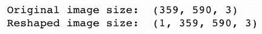
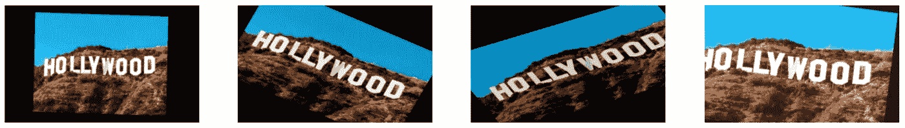

# 如何制造更多的数据

> 原文：<https://medium.com/geekculture/how-to-make-more-data-c4e5c10a9199?source=collection_archive---------24----------------------->

## 使用数据扩充为图像分类问题创建更多数据


Photo by [Andrew Seaman](https://unsplash.com/@amseaman?utm_source=medium&utm_medium=referral) on [Unsplash](https://unsplash.com?utm_source=medium&utm_medium=referral)

在一个数据丰富的世界里，总有一天你会觉得不够用。

不用慌！

数据扩充可用于多种不同的数据类型，包括用同义词替换单词和短语的文本，以及使用 SMOTE( [合成少数过采样技术](https://machinelearningmastery.com/smote-oversampling-for-imbalanced-classification/))等技术的数字数据。

如果您正在进行影像分类项目，并且发现您的结果并不令人兴奋，那么看看数据扩充是否有所帮助可能是值得的。

数据扩充通过拍摄图像并以某种特定方式改变图像来创建更多数据。这不仅可以产生更多的数据，还可以通过使模式变得不明显来减少过度拟合。

让我们以标志性的好莱坞标志为例。当我们调整照片时，这张图片将使我们很容易看到到底发生了什么。

首先，让我们加载图片和我们的库。


Image we are going to be augmenting

接下来，我们将需要把图片变成一个数组，并重塑它。接下来的两个步骤是在不出错的情况下转换图像所必需的。



我们重塑的图像形状遵循格式[批次，高度，宽度，通道]。我们在新形状的开头放置了一个“1 ”,因为这个“批次”只有一张图片。

接下来，我们可以使用一个计算数据的函数。fit)，生成增强数据(。流)，将数组改回图像(。imshow)并在一行中绘制四幅增强的图像。

难的部分完成了！现在我们可以看到当我们改变数据时会发生什么。为了一步到位，我们可以使用 Keras ImageDataGenerator。生成器在将图像传递到模型中时随机放大图像，并返回一个更改后的数组。

ImageDataGenerator 最常见的用途可能是重缩放功能，但也可用于其他移动。查看可用的不同转换:

## **旋转**


我们旋转了 90 度。这告诉生成器，我们可以接受图像在 90 度内任意旋转。

## 水平翻转


水平翻转告诉发生器我们希望镜像图像穿过水平轴。由于发生器随机工作，图像可能不会总是翻转。

## 垂直翻转


垂直翻转类似于水平翻转，但使用垂直轴使图像镜像并上下颠倒。

## 剪(羊毛)


剪切会沿着 x 轴或 y 轴扭曲图像。一个轴将保持不变，而另一个将被加长。这将导致图像看起来被拉伸，而不是简单的旋转。

## 宽度移动


使用宽度移动，您可以看到图像在指定的像素范围内沿水平轴移动。您可以看到像素是如何被绘制到图像的末尾，而不是留下一个空白区域。

## 高度移动


使用高度移动，您可以在垂直轴上上下移动图像，同样使用一些像素作为移动范围。

## 一款云视频会议软件


通过使值小于 1，缩放可以拉近。当缩放范围的值大于 1 时，图像将像该行中的第二个图像一样缩小。

## 频道转换


说到图像，通道指的是颜色。这里，通道范围从 0 到 255，其中 0=黑色，255=白色。我们上面的陈述表明，图像可以变暗为全黑或变亮为几乎全白。

## 所有人现在在一起！



我们不仅把你以前见过的一些增强放在一起，我还添加了一个新的。默认的“填充模式”被称为最接近的*，并导致最后一个像素被画出，但也有其他选项。我选择使用“常量”并用黑色填充空白空间(cval= 0 ),这样就可以很容易地识别转换。*

将多个增强放在一起可以通过使每个图像不同来减少模型的过度拟合。你可以看到这些图像有相似之处，但它们并不完全相同。

在这一点上，也许你在想，“好吧，但是我在这里制造了多少新数据？”注意两件事很重要:

首先，为训练模型而生成的新数据是临时的。它是在训练过程中随机创建的，不会存储在您的内存中。每个时期都会有一批新的转换数据输入到模型中，从而通过限制原始数据的显示次数来减少过度拟合。

第二，增加的数据量取决于原始数据的批量大小和数量。确定模型看到多少新数据的最简单方法是将数据集的大小除以批处理大小。将数据中的样本数除以批次大小称为每个时期的步数。

当你运行你的神经网络时，你可能已经注意到每个时期的步骤。


上面的模型贯穿所有 40 个时期，每个时期的步长为 156。这个特定的数据集有 4656 个图像，批量大小为 30。

```
steps_per_epoch = len(data) / batch_size
156 = 4656 / 30
```

虽然它可能感觉好像模型在“制造新数据”，但它只是将现有数据修改成它以前没有见过的东西。您的纪元和批次大小将保持不变。

> 当所有这些都聚集在一起时，它看起来像什么？

对于下面的例子，我使用胸片来预测是否存在肺炎。注意 ImageDataGenerator 是如何被使用两次的。第一次是确保所有图像的大小相同。发生器被用来永久改变图像。然后创建一个不同的生成器来临时调整发送到模型中用于训练的每个图像。

如果你想看模特表现如何(给你个提示:是赢家！)，请查看我的 GitHub。您将发现数据扩充以及其他有趣的图像分类项目技巧。

[](https://github.com/cassnutt/Detecting_pneumonia) [## 卡斯纳特/检测 _ 肺炎

### 该项目旨在将胸片分为“正常”或“肺炎”两类。使用…

github.com](https://github.com/cassnutt/Detecting_pneumonia) 

如果你想知道好莱坞标志演示使用的代码，请[访问此链接](https://github.com/cassnutt/data_aug_blog)。