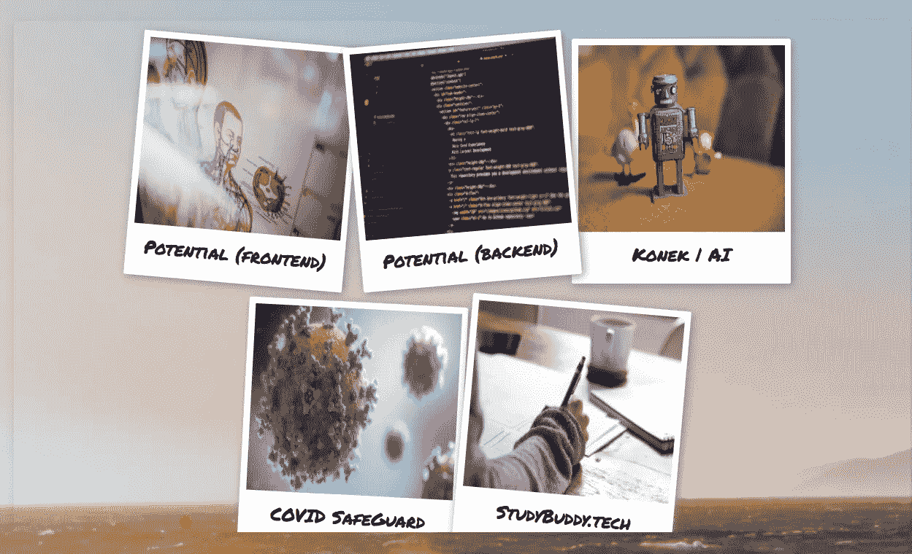

# 如何在 CSS 中制作宝丽来卡片

> 原文：<https://medium.com/geekculture/how-to-make-polaroid-cards-in-css-92777ada0838?source=collection_archive---------44----------------------->

这周我在制作我的作品集。我想了解如何使我的项目显示在宝丽来卡布局。



polaroid card layout with hover toggle

# 宝丽来效应

```
<div className="projectLayout">          
     {projects.map((x) => (            
        <div className="item" onClick={() => handleModal(x)}>  
        }
</div>
```

在你的 Js 或者 JSX 文件中，给你的 div 一个类名。我给我的类命名为“item”。“projects.map”部分来自另一个文件，它是我的项目的数组。“projectLayout”的类名也很重要。确保您的父 div 也有一个类名。

```
const projects = [  {    name: "Potential (frontend)",    description:      "Anatomical systems are hard enough to understand! Potential takes away the difficulty of study anatomical systems by allowing the user to create stacks and to store specific body parts.",    image: potential,    technologies: [      {        JavaScript: "JavaScript",        HTML: " HTML",        CSS: " CSS",        MaterialUI: " MaterialUI",        Github: "Github",        React: "React",      },    ],    dateCreated: "03-02-2021",    links: [      {        git: "https://github.com/noelanimanini/potential_project_frontend",        video:          "https://www.youtube.com/watch?v=AvIr5lI6rSE&t=22s&ab_channel=crystalvillanueva",      },    ],  },  {    name: "Potential (backend)",    description:      "This service features the backend. This allows us to query and save data from the frontend in Active Record. The backend houses information about the users, body parts, card stacks, study groups, etc.",    image: potentialback,    technologies: [{ Ruby: "Ruby", RubyonRails: "Ruby on Rails" }],    dateCreated: "03-02-2021",    links: [      {        git: "https://github.com/noelanimanini/potential_project_backend",        video:          "https://www.youtube.com/watch?v=AvIr5lI6rSE&t=22s&ab_channel=crystalvillanueva",      },    ],  }...]
```

在您的 css 文件中，您希望分别为 projectLayout、item 和 item image 执行此操作:

```
.projectLayout {  
     max-width: 90%;  
     justify-content: center;  
     align-items: center;  
     -moz-column-count: 4;  
     -webkit-column-gap: 1.5em;  
     -moz-column-gap: 1.5em;  
     column-gap: 1.5em;  
     margin: 1em;  
     padding: 1;  
     -moz-column-gap: 1em;  
     -webkit-column-gap: 1em;  
     column-gap: 1em;  
     font-size: 0.85em;  
     transform: translate(40px, 50px);
}.item {  
     display: inline-block;  
     background: #fff;  
     padding: 0.5em;  
     margin: 0 0 1.5em;  
     max-width: 17rem;  
     max-height: 50vh;  
     -webkit-transition: 0.5s;  
     box-sizing: border-box;  
     -moz-box-sizing: border-box;  
     -webkit-box-sizing: border-box;  
     box-shadow: 2px 2px 10px rgb(140, 134, 134);  
     border-radius: 2px 2px 2px 2px;  
     flex-wrap: wrap;
}.item img {  
     max-width: 100%;  
     max-height: 20vh;
}
```

要使牌改变方向，您需要使用第 n 个类型选择器来选择您有多少张牌:

```
.item:nth-of-type(4n + 1) {  
       transform: rotate(5deg);  
       transition: all 0.35s;}.item:nth-of-type(4n + 2) {  
       transform: rotate(-5deg);  
       transition: all 0.35s;} .item:nth-of-type(4n + 3) {  
       transform: rotate(3deg);  
       transition: all 0.35s;}.item:nth-of-type(4n + 4) {  
       transform: rotate(-3deg);  
       transition: all 0.35s;} .item:nth-of-type(4n + 5) {  
       transform: rotate(3deg);  
       transition: all 0.35s;
}
```

“过渡:全 0.35 秒”对于悬停效果很重要。当牌被悬停时，它们会移动。过渡允许平滑的界面。

最后，你需要的是悬停效果:

```
.item:hover {  transform: rotate(15deg);}
```

“item:hover”用于 item 的所有子项。因此，所有的卡将移动时，悬停。

以下是整个文件:

```
.item {  
     display: inline-block;  
     background: #fff;  
     padding: 0.5em;  
     margin: 0 0 1.5em;  
     max-width: 17rem;  
     max-height: 50vh;  
     -webkit-transition: 0.5s;  
     box-sizing: border-box;  
     -moz-box-sizing: border-box;  
     -webkit-box-sizing: border-box;  
     box-shadow: 2px 2px 10px rgb(140, 134, 134);  
     border-radius: 2px 2px 2px 2px;  
     flex-wrap: wrap;
}.item img {  
     max-width: 100%;  
     max-height: 20vh;
}.item:nth-of-type(4n + 1) {  
       transform: rotate(5deg);  
       transition: all 0.35s;}.item:nth-of-type(4n + 2) {  
       transform: rotate(-5deg);  
       transition: all 0.35s;}.item:nth-of-type(4n + 3) {  
       transform: rotate(3deg);  
       transition: all 0.35s;}.item:nth-of-type(4n + 4) {  
       transform: rotate(-3deg);  
       transition: all 0.35s;}.item:nth-of-type(4n + 5) {  
       transform: rotate(3deg);  
       transition: all 0.35s;
}.item:hover {  transform: rotate(15deg);}
```

黑客快乐！

-水晶