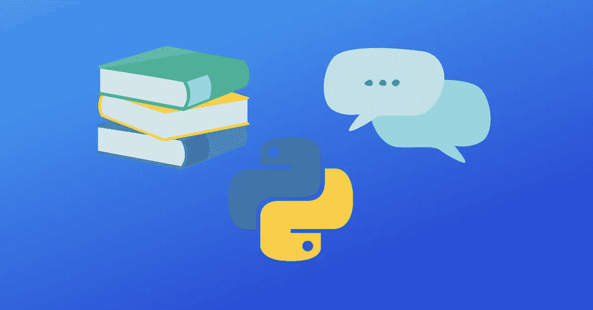

# 如何让 Python 说话:一个有趣的实验——code father

> 原文：<https://medium.com/geekculture/how-to-make-python-speak-an-interesting-experiment-codefather-17d2b4416705?source=collection_archive---------2----------------------->

在这篇文章中，你将学习如何让 Python 说英语和其他语言，我们将创建一个 Python 程序，将我们提供的任何文本转换成语音😀

这是一个有趣的实验，旨在发现可以用 Python 创建什么，并向您展示 Python 及其模块的强大功能。