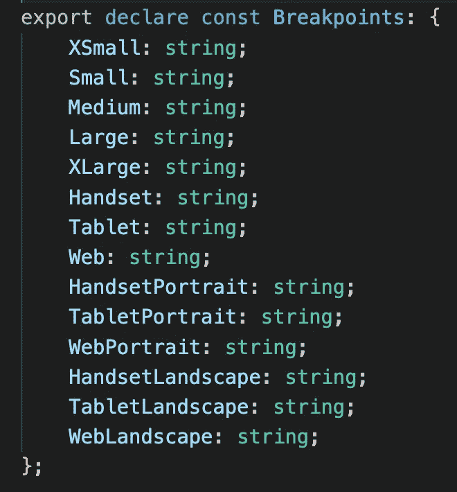
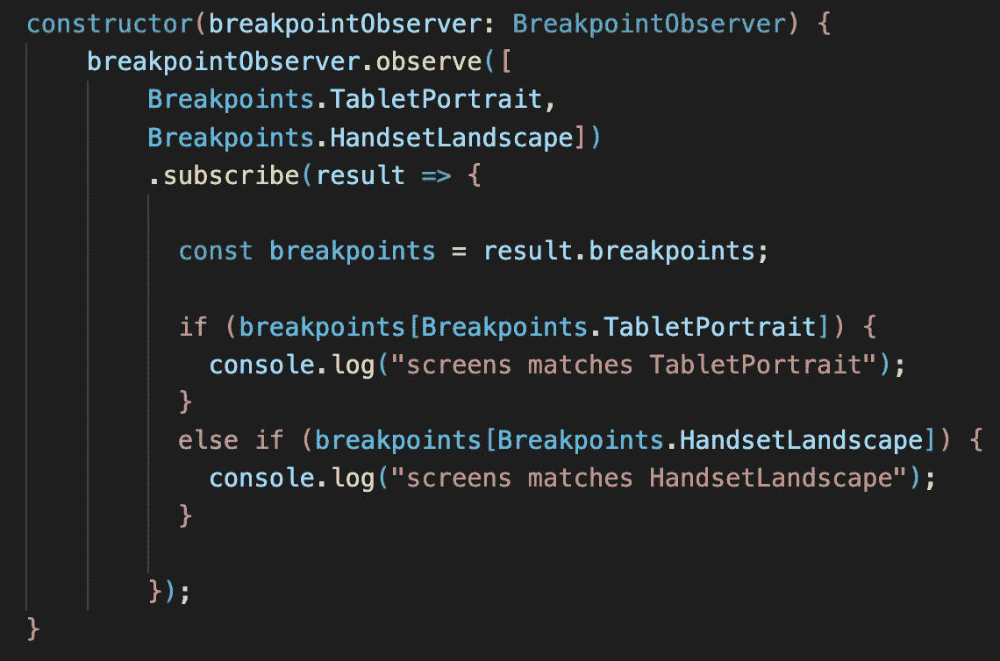
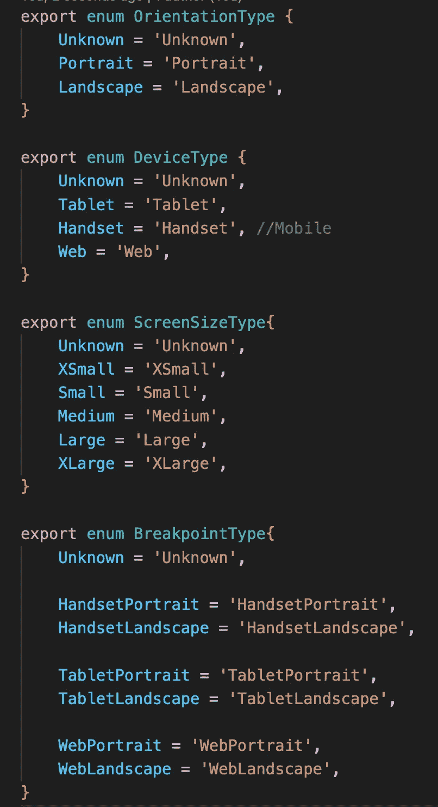
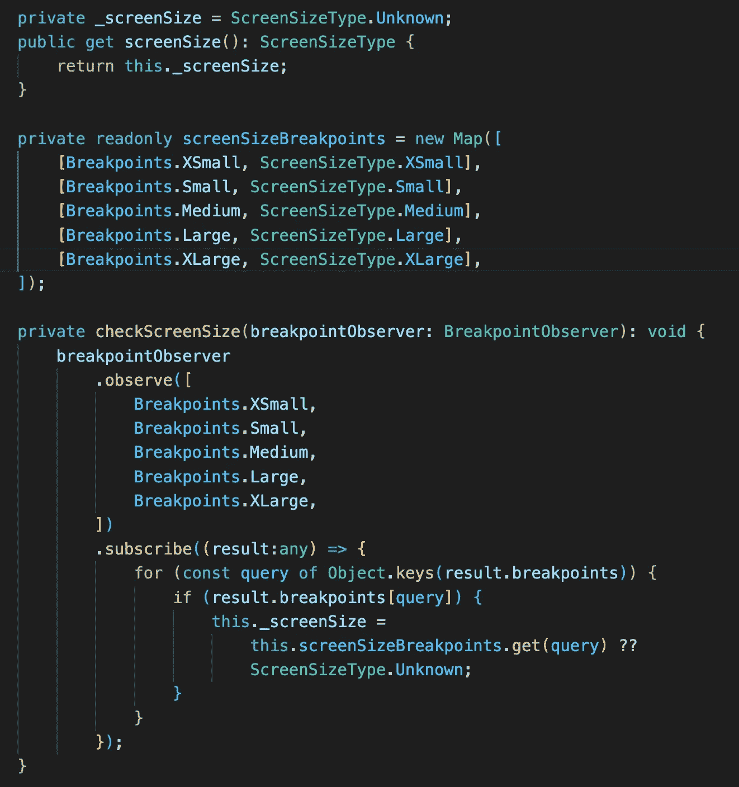
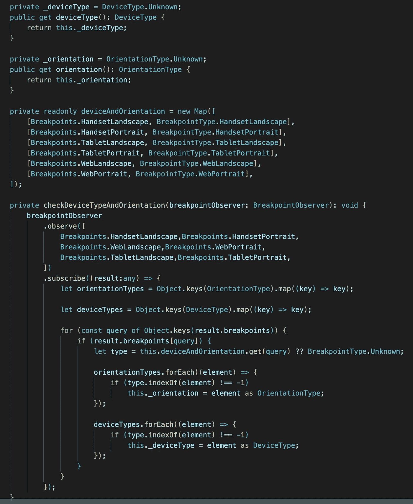
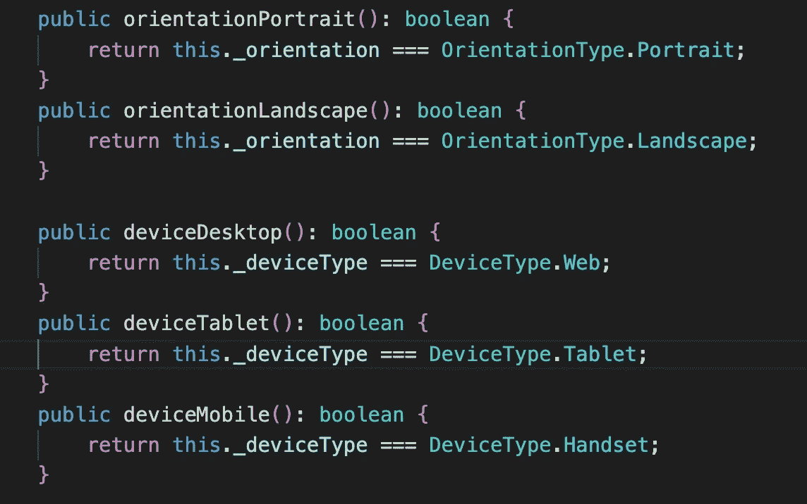
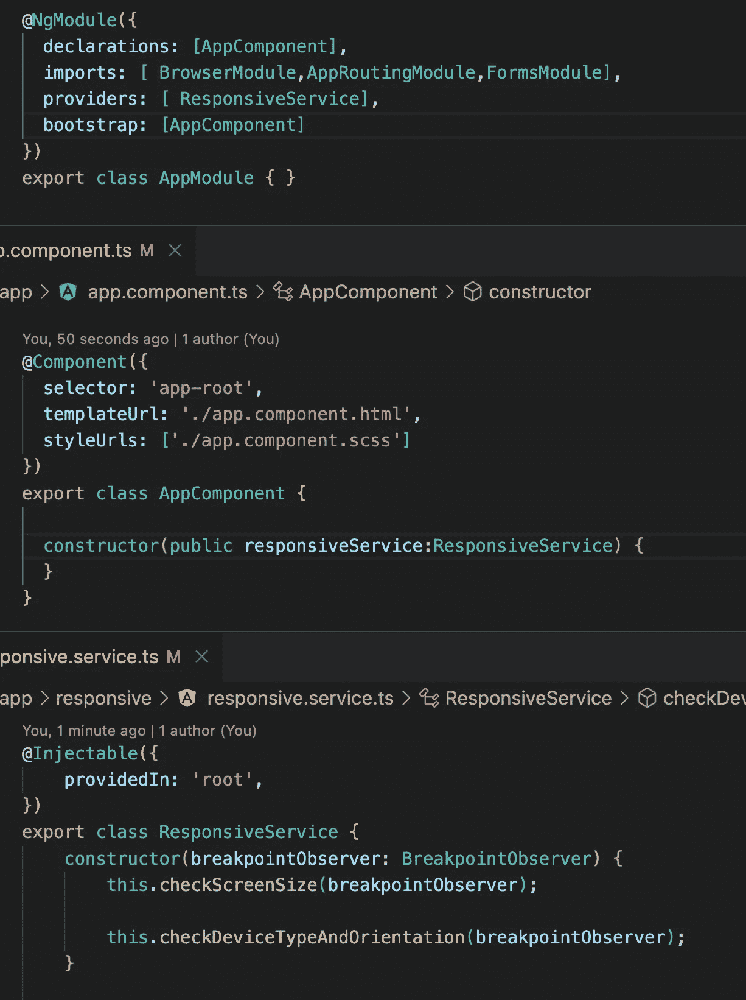
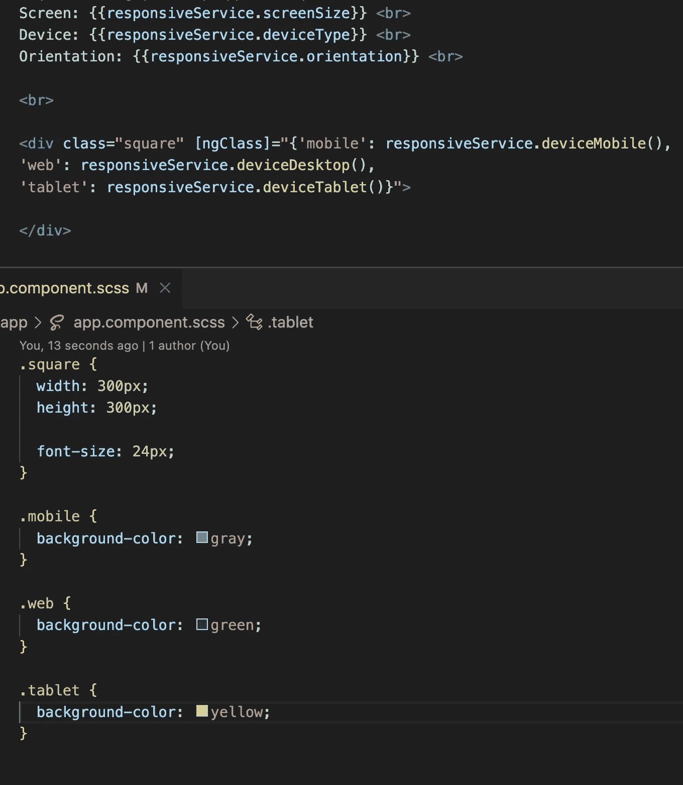
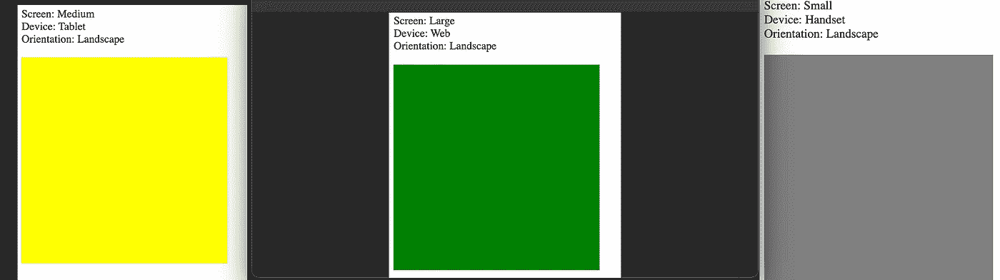

# 如何在 Angular 中做出响应式设计？

> 原文：<https://medium.com/geekculture/how-to-make-responsive-design-in-angular-1ad9d936dc16?source=collection_archive---------1----------------------->

我们怎样才能让我们的应用程序变得更加友好？我们都知道媒体的询问。媒体查询允许我们调整不同屏幕的样式。这意味着我们需要定义我们想要支持的屏幕大小，并在我们需要的任何地方编写这些媒体查询。

如果你使用媒体查询，你知道他们不像我们想要的那么方便。可能正因为如此，我们可以找到许多使用媒体查询的框架，并使它们对开发者更友好。

Angular 也有一个让 web 应用程序响应迅速的解决方案。在引擎盖下，它还使用媒体查询。

**断点观察服务**

[断点观察器](https://material.angular.io/cdk/layout/api)服务让我们有机会检测屏幕大小、设备类型，甚至方向。我们可以订阅一个特殊的断点值。当这个特定值出现时，该服务将通知我们，我们可以在样式上进行更改。

所有这些断点都有一个特定的媒体查询值。

网页(最小宽度:840 像素)和(方向:纵向)，(最小宽度:1280 像素)和(方向:横向)
网页横向(最小宽度:1280 像素)和(方向:横向)
网页纵向(最小宽度:840 像素)和(方向:纵向)
平板电脑(最小宽度:600 像素)和(最大宽度:839.98 像素)和(方向:纵向)，(最小宽度:960 像素) (最大宽度:959.98 像素)和(方向:横向)
HandsetLandscape(最大宽度:959.98 像素)和(方向:横向)
HandsetPortrait(最大宽度:599.98 像素)和(方向:纵向)
XSmall(最大宽度:599.98 像素)
Small(最小宽度:600 像素)和(最大宽度:959.98 像素)

断点列表包含了我们需要的所有内容，从现在开始，我们不需要在 CSS 文件中编写那些媒体查询。

下面是一个我们如何使用 breakpointObserver 服务的例子。

**响应式服务**

使用断点服务，我们可以创建满足我们所有需求的服务。让我们考虑一下我们的服务应该做什么。当然，我们需要知道屏幕大小、设备类型和方向。

首先，我们需要创建几个 enums 来帮助我们。

要定义屏幕尺寸，我们需要为所有断点屏幕尺寸进行预订并与之匹配。

我们需要对设备和方向做同样的事情。当我们知道断点类型时，唯一的区别是我们解析断点枚举来定义设备和方向。

我认为有几个布尔函数也不错，比如——当前设备是移动的吗？

**行动中的响应服务**

如何使用我们的服务？我们需要将它放在 provider 部分，并将其注入到我们想要使用它的地方。因为我们的服务在构造函数中进行了订阅，这意味着它已经可以使用了。

在 HTML 中，我们可以根据设备、方向或屏幕大小来设置正确的类。

现在，我们有了一项服务，可以帮助我们进行响应式设计。

如果你需要仔细看看这个项目[，这里是链接](https://github.com/8Tesla8/angular-responsive-design)。

*原载于 2022 年 10 月 14 日***。**