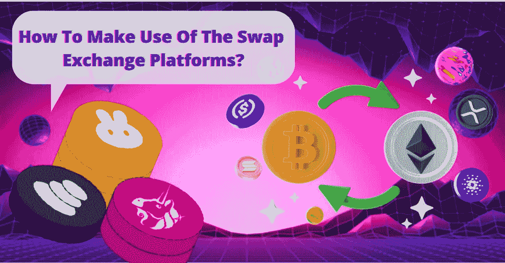

# 如何利用掉期交易平台？

> 原文：<https://medium.com/geekculture/how-to-make-use-of-the-swap-exchange-platforms-6630696b98a1?source=collection_archive---------13----------------------->

Swap Exchange platform

交换曾经是人们生活的一部分，因为他们交换他们所拥有的东西来获得他们谋生所需的东西。即使是现在，有些东西可以等价交换，这就是交换永久存在的地方。到处都有互换，现在在现代化的世界里，你可以用货币交换相同的价值元素。现在，有平台让这些互换发生，这就是技术发展的地方。

此外，还为一个将硬币兑换成等值数字资产的平台开发了[白标交换开发](https://bit.ly/3QORm5D)。Sushiswap、Pancakeswap、Uniswap、Bakerieswap 等平台极大地改变了加密货币行业，将其提升到了一个新的水平，并吸引了大量观众关注区块链技术。Pancakeswap，Uniswap，& Sushiswap 现在是密码爱好者有效管理业务同时避免市场不稳定的最佳平台。

然而，你知道为什么你需要建立这样的交易所来保持领先吗？这是:

# **设立掉期交易所的原因**

✅加密货币行业提供的众多优势吸引了投资者和企业主，激励他们在运营中创建处理加密货币的解决方案。

✅由于比特币的广泛使用，许多分散的交易平台已经发展起来，以满足企业主和初创公司创收的要求。

✅分散式金融体系因其新颖的金融控制方法而越来越受欢迎。

✅考虑到它为企业主提供的好处，Pancakeswap、Sushiswap、Curve、Bancor 和 Uniswap 等知名互换交易所已经影响了加密社区，促使他们考虑开发自己的互换交易平台。

这里也有一些他们提供的好处，让我列出一些你想知道的事情，成为一个掉期交易平台的骄傲拥有者。然而，在了解掉期交易平台之前，让我们先看看一些掉期交易，如煎饼、寿司和 uniswaps。

# **顶级掉期交易平台:**

⭐ [**煎饼互换**](https://bit.ly/3CvDRUk)

Pancakeswap

这是一个基于币安智能链的分散式加密货币交易平台。通过利用其核心功能，该平台消除了对订单簿的需求，并纳入了 AMM 机制。用户可以使用这种方法向其他 LP 成员下购买/出售订单。

⭐ **Sushiswap**

这是一个全新的分散式掉期交易所，建立在以太坊区块链网络上，与 Uniswap 和 Pancakeswap 共享关键功能。尽管它与竞争对手有一些共同的特征，但它也有一些优势，包括产量农业，为流动性池提供有用的有限合伙人，以及为代币持有者提供升级。

⭐ **Uniswap**

它的独特之处在于，它使用一种被称为“恒定产品做市商”的技术，根据资产数量的可用性来固定预先确定的价格与 Sushiswap 类似，它建立在以太坊区块链上，允许用户与自动做市商和其他掉期交易所的其他功能进行加密货币交易。

既然你知道可用的掉期交易，你可以联系掉期交易开发公司建立一个掉期交易所，就像上述任何一个行业的潮流引领者一样。哦，等等！你知道它们的好处吗？没有。这就是我们前进的方向:

## **掉期交易开发平台的好处**

以下是它们仍然很高的原因:

✅ **跟踪交易**

知名公司的掉期交易软件使您能够实时监控和检查交易，这有助于市场分析。

✅ **高效交换**

流动性池使您可以轻松地将加密货币兑换成等值的货币。

✅ **打桩**

参与赌注系统，这将有助于用户在未来赚取更多的钱，在您的帐户中赚取可观的奖励。

✅ **安全钱包**

为了给用户提供一个轻松的钱包交易环境，swap exchange 开发平台是高度安全的。

✅ **弹性工资**

他们为客户提供了灵活的支付网关，以确保无缝交易流程。

## **结论**

掉期交易平台有一个获取利益的通用名称。然而，有了白标互换交易，你可以将任何东西融入其中，比如煎饼、寿司或 uniswap，并从中获得最佳的交易平台。如今，交换在用硬币交换同等价值的其他东西方面发挥了重要作用。