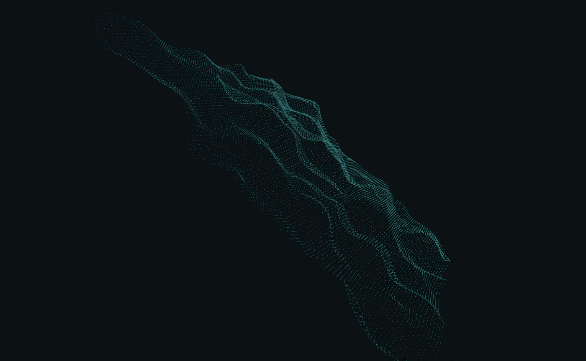
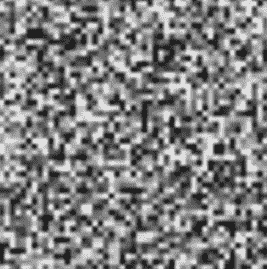

# 如何在 Three.js 中兴风作浪

> 原文：<https://medium.com/geekculture/how-to-make-waves-in-three-js-d8a45437c7ca?source=collection_archive---------5----------------------->



玩 Three.js 的乐趣之一就是扮演上帝😇；在电脑中再造自然。这一次，我们将看看如何使用点值噪声来模拟波浪。

# 回购和现场演示

回购在[https://github.com/franky-adl/waves-value-noise](https://github.com/franky-adl/waves-value-noise)进行。

下面是一个现场 codesandbox 演示:

# 价值噪声入门

噪波是在我们的纹理或动画中引入随机性的好方法。有各种类型的噪声，如“值噪声”、“梯度噪声”和“单形噪声”。如果你已经使用 3D 图形有一段时间了，“柏林噪音”对你来说肯定不会是一个陌生的术语。在我的演示中，我将使用“价值噪音”。

那么价值噪音是如何工作的呢？假设我们想在 2D 网格上使用值噪声产生一个黑白噪声图案。首先，我们在网格上的每个顶点生成随机值(在 0-1 之间)。值 1 表示白色，0 表示黑色。然后，我们通过对像素周围的四个顶点进行双线性插值来计算每个像素的颜色值；见下图。


The blue point is a pixel that will have an interpolated color value of the surrounding 4 red points(vertexes)

结果是类似这样的块状噪声模式:



a blocky noise pattern

如果你想了解更多关于值噪声的知识，或者了解源代码，我强烈推荐你观看这个视频:

# 兴风作浪！

我们之前的噪声模式似乎与我们想要创建的平滑波相差甚远🤔，但是忍着点，其实挺简单的！

使用的几何图形只是一个简单的`THREE.PlaneGeometry(4, 4, 128, 128)`。分段数越高，波浪看起来就越精细。对于材质，是一个`THREE.ShaderMaterial`因为我想自定义顶点位置和颜色。

这是正在使用的完整顶点着色器代码:

我无耻的借用了 [thebookofshaders](https://thebookofshaders.com/11/) 的`random`和`noise`函数。`noise`函数是一个 2D 值噪声的实现。它接受一个 2D 向量作为输入，并给出介于 0 到 1 之间的插值。将整个网格上的点输入到噪声函数中，这样你就有了整个平面几何体的连续噪声模式。

如果我们关注`main`函数，事情会变得简单得多。通常情况下，计算顶点着色器中几何图形的最终`gl_Position`的默认方式是:

```
gl_Position = projectionMatrix * modelViewMatrix * vec4(position, 1.0); 
```

基本上，这个等式从模型坐标`vec4(position, 1.0)`开始，通过应用`moddelViewMatrix`将它们转换为世界坐标，然后转换为相机坐标，最后通过应用`projectionMatrix`，每个顶点在渲染输出中得到正确的位置。阅读[本文档](http://www.opengl-tutorial.org/beginners-tutorials/tutorial-3-matrices/#the-model-view-and-projection-matrices)以了解完整的机制。

我在我的顶点着色器中所做的，仅仅是改变原始的模型坐标。通过将噪波值添加到平面几何体上顶点的`z`属性，我实际上是根据每个点的噪波值来改变每个顶点的“高度”位移。

但是正如你看到的，我实际上使用了两次噪声函数。这种分层技术非常有用，可以让你的噪波模式看起来更加有机。试着评论一下`pos.z += noise...`的第二行，看看会发生什么。你应该会看到一个相当静态的波模式朝一个方向移动，这几乎不是你在现实生活中看到的混乱和随机的波。因此，通过添加与第一波方向相反的第二个不同的噪声波型，可以获得更加有机的结果。如果你懂一点物理的话，这实际上是波在现实生活中的工作方式😉。这个模拟和真实生活的区别在于，我只是叠加了两个波浪，你通常看到的海浪可能是由成千上万甚至数百万个波浪在任何给定时间相互叠加而成的！

统一变量从应用程序传递到着色器。`u_time`记录从动画开始时起经过的时间。其他变量控制，如使用的两个波的频率，振幅和速度，可以在右上角的 gui 控制框中调整。`gl_PointSize`是一个控制点大小的着色器变量；使用`THREE.Points`时由 Three.js 提供。

至于片段着色器，它只是将屏幕上的 x，y 坐标转换为蓝色和绿色；x 值越高越绿，y 值越高越蓝。

将来我可能会尝试用更像水的表面或材料来模拟波浪，而不仅仅是点。对于初学者来说，圆点显然更容易玩🤣！觉得这个有意思就点几个赞吧！直到下一次✌🏼。