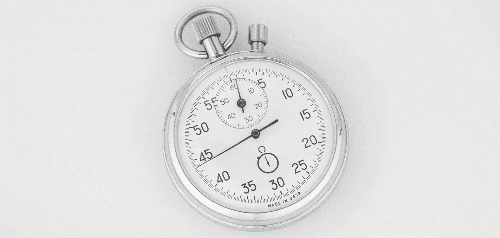

# 如何用美汤 5X 更快的进行网页抓取

> 原文：<https://medium.com/geekculture/how-to-make-webscraping-with-beautiful-soup-5x-faster-d3dcf0427837?source=collection_archive---------2----------------------->

## 美味的汤

## 使用这三个简单的技巧，使用美丽的汤来加速你的网络抓取

Image courtesy : Photo by [Stanislav Remnev](https://unsplash.com/@stan_remnev?utm_source=unsplash&utm_medium=referral&utm_content=creditCopyText) on [Unsplash](https://unsplash.com/s/photos/stopwatch?utm_source=unsplash&utm_medium=referral&utm_content=creditCopyText)

## 为什么这是有用的和重要的？

大多数时候，当你为你的数据科学项目抓取公共数据时，你最终会…