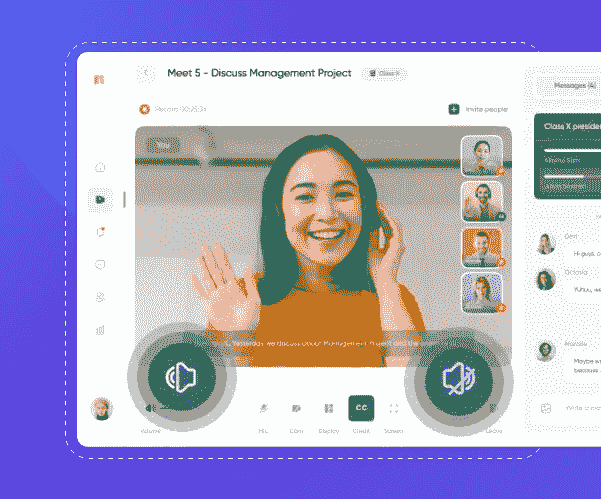

# 如何打造自己的视频聊天平台——详细指南

> 原文：<https://medium.com/geekculture/how-to-make-your-own-video-chat-platforms-a-detailed-guide-e851f0d80024?source=collection_archive---------3----------------------->

# **了解视频聊天平台开发的一切**

Video Chat App Software

在当今这个社交距离遥远的时代，虚拟互动，尤其是一对一视频聊天，已经非常流行。全球大多数公司已经将视频通信整合到他们的业务系统中，以即时与客户联系并进行团队协作。您是否也计划利用视频会议的力量？嗯，太好了！在本文中，我们将围绕为您的企业开发最佳视频聊天应用程序的各个方面展开讨论。和我们一起继续读下去吧！

# **视频会议市场有多受欢迎？—了解统计数据**

根据统计学家[的研究](https://www.statista.com/statistics/1293045/video-conferencing-market-value-worldwide/)，全球视频会议市场价值 146 亿美元。事实上，据预测，到 2026 年，这一数字将翻一番，达到 273 亿美元。鉴于技术的加速发展，视频通话市场将永远存在！

如果你一直在考虑构建你的[视频聊天应用](https://www.mirrorfly.com/build-video-chat-app.php)，市场上有一套现代技术可供选择。但是，在开发应用程序之前，您需要注意以下几点:

*   进行研究，了解你的目标受众
*   用粉笔写出你想在应用程序中包含的功能
*   决定您的技术偏好
*   根据您的业务需求设定预算

# **4 款占据重要市场份额的顶级视频聊天软件**

某些视频聊天应用目前在观众和不同的企业中很流行，用于进行日常通信。让我们逐一仔细观察它们:

## **1。Skype——始终支持无障碍会议**

Skype 由瑞典的尼可拉斯·曾斯特罗姆和丹麦的杰纳斯·弗里斯于 2003 年创立。这是一款超高效的实时群组视频聊天应用，为数亿人提供了对话便利。Skype 兼容不同类型的设备，如电话、台式机、平板电脑、Alexa、Xbox 和网络。它允许您同时与多达 100 人进行视频通话，并提供多种新功能，如屏幕共享、通话录音、实时字幕等。

## **2。Viber —寻找无限的沟通选项**

有了 Viber，你可以在任何地方与任何人进行免费安全的通话和发送信息。它使您能够在群聊中喜欢和回复消息，或者立即开始群组视频或语音通话。它既适用于移动设备，也适用于台式机。您可以轻松地在设备之间转移呼叫，并在视频通话中从桌面共享屏幕。难怪 Viber 是一个顶级功能的视频聊天网络应用。

## **3。WhatsApp——最受观众喜爱的聊天应用**

WhatsApp 是一款顶级的免费消息应用，有助于全球范围内顺畅可靠的通信。它快速、简单，还为您提供了端到端的加密。它与移动设备和网络浏览器兼容。此外，WhatsApp 还为你提供安全的文件共享，并鼓励轻松的业务合作。

## **4。zoom——现代企业对专业互动的喜爱**

Zoom 是给你的。它帮助你联系、交流和表达你的想法，这样你们可以一起做更多的事情。Zoom 受到数百万企业、小型企业和个人的信任，就像您一样。你知道 Zoom 在顾客评论中排名第一吗？不可否认，Zoom 将视频会议带到了一个新的高度。难怪它是团体和商业团队的最佳视频聊天应用程序。

# **不同种类的视频聊天软件**

每个企业都有独特的沟通要求。因此，在开发你的应用之前，你必须了解市场上各种各样的视频聊天应用。在这一节中，我们将讨论同样的问题。

## **→群组视频消息应用**

[群组视频通话](https://blog.mirrorfly.com/best-group-video-call-apps/)或视频会议允许两人或两人以上进行对话。所有参与者都可以通过视频会议安全地共享文件。由于先进的技术，视频会议现在普遍用于远程学习。

## **→新时代视频通话 app**

今天的现代[实时视频通话应用](https://www.mirrorfly.com/video-call-solution.php)具有不同的现代功能，如屏幕共享、幻灯片放映、屏幕录制等等。所有这些使团队能够随时随地顺畅协作。

## **→娱乐视频应用**

娱乐视频应用程序使您能够高效地为观众播放实时视频，并进行实时互动。它还为您提供了流式录制视频会话的选项。

# **视频聊天平台:你必须考虑的关键因素**

为了建立一个顶级的视频通话应用程序，在开发过程中融入一些必要的方面是很重要的。让我们在这一部分讨论其中的一些。

## **1。用户界面和体验**

好的用户界面/UX 必须是你的应用程序开发目标的一部分。它对你的应用程序的成功起着巨大的作用。确保你的 UX 设计简单自然。给它一个个性化的接触，以推动更好的观众参与。

## **2。后端建设**

后端建立是视频 app 开发的另一个重要部分。有各种方法可以制造后端。您可以考虑在没有准备的情况下构建它，或者利用不同的编程作为构建聊天应用程序的辅助安排。

## **3。协议集成**

为了构建一个高效的直播群组视频聊天 app，正确的协议集成是必不可少的。现在， [WebRTC](https://www.mirrorfly.com/webrtc-video-chat.php) 约定使您能够在使用任何应用程序时发送实时视频/音频。因此，您必须开发一个视频流协议来简化整个过程。

## **4。彻底测试**

在启动视频聊天网站应用程序之前，测试是一个重要的步骤。确保代码的每一行都被正确填充。bug 的存在可能会导致视频音频不同步或其他一些重大问题，进而导致糟糕的客户体验。

## **5。技能开发团队**

开发应用程序的责任应该交给知识渊博、经验丰富的开发人员。如果投资一个内部的产品改进团队就更好了。这样，视频改进过程就在您的控制之下。

## **6。目标受众研究**

最后但同样重要的是，在你开始视频应用程序开发之前，了解你的受众是必须的。对您的目标客户进行调查，了解他们的视频通信需求。这有助于您开发一个应用程序，有效地解决他们的痛点，并使他们的沟通变得容易。有了面向客户的功能，您的应用程序可以获得很大的受欢迎程度。

# **想打造最好的视频聊天软件？—您必须包括的基本特性**

每当你开始创建自己的视频聊天应用程序时，有一些关键功能是你不能忽视的。让我们一个一个地了解他们。

## **→语音和视频通话功能**

视频和语音通话集成是聊天应用程序中必须包含的最基本功能。查看客户在通过您的应用进行通话时希望获得的最重要的优势。其中一些是状态可见性和安全文件共享。

## **→小组会议**

在当今快节奏的数字环境中，人们期待与朋友、家人和喜欢的企业进行即时交流。如果你的应用程序能让他们同时连接到多个人，那就更好了。通过视频会议加快与他们的对话可以让你的应用程序在观众中受欢迎。

## **→实时文本对话**

文本交互在观众中变得越来越受欢迎。毫无疑问，这是向他人传达你的信息的最快方式。在您的[视频聊天网络应用](https://blog.mirrorfly.com/top-web-browser-video-chat-for-building-a-video-app/)中加入这一功能有助于您更容易被客户接受。

## **→端到端加密安全**

在设计视频聊天应用程序时，安全性应该是您优先考虑的问题之一。因此，请确保在您的应用程序中包含端到端加密。

## **→推送通知功能**

推送通知使用户能够参与并再次参与您的应用程序。它们帮助您向客户转发关于您品牌的实时更新和提醒，并鼓励他们与您的企业互动。

# **在您的视频聊天网站应用程序中提供高级功能，让您脱颖而出**

为了让你的应用程序上升到顶端，在你的应用程序中加入新时代的特征是很重要的。在本节中，我们将逐一仔细研究它们。

## **→屏幕共享**

Video Screen Sharing

此功能使与您的队友协作变得更加容易。您可以轻松地在虚拟工作环境中进行演示，并使交流尽可能透明。此外，您还可以使用它向您的观众展示产品演示。

## **→虚拟背景**

Video Chat App Background

无论你身在何处，它都能帮助你进行互动。您可以通过不同的虚拟设置轻松覆盖视频背景。这将使您即使在远程工作环境中也能保持专业水准。

## **→噪声消除**

Video Chat App Features

这是你应该考虑在你的应用中加入的一个更现代的功能。它可以让你在交谈时避免外部干扰，并为无障碍沟通扫清道路。

## **→表情符号和贴纸**

Video Chat App Stickers

这些功能可以帮助你给你的应用程序添加有趣的元素。用户可以以创造性的方式参与任何对话。这可以让他们开心，粘在你的应用上，提高你的应用受欢迎程度。

# **想知道如何在 android、iOS 或 web 上制作视频聊天应用程序吗？—使用现代视频聊天软件的强大功能**

建立一个视频聊天应用程序不是一天的过程。但是，您可以借助第三方 API 和 SDK 加快应用程序开发过程。以下是其中的一些。

## **1。mirror fly——头号视频聊天技术**

MirrorFly 使您能够构建一个在 Android、iOS 和 Web 上运行的实时聊天应用程序。它被公认为定制移动应用程序的头号视频通话 API。MirrorFly 拥有超过 150 种通信功能。从确定理想的构建模块，到专家深入参与选择正确的技术堆栈，MirrorFly 无所不包。让我们来看看它的一些顶级功能。

## 亮点:

*   对等虚拟通信
*   跨设备的画中画
*   实时通话录音
*   多重会议安排
*   大厅和等候室
*   端到端加密
*   有源扬声器模式
*   低延迟等等

## **2。app hitect——下载量 5000 万的顶级视频聊天软件**

Apphitect 是阿联酋自 2008 年以来领先的移动应用程序开发。它已经成功交付了 600 多个应用，并为您提供了白标消息、音频和视频解决方案。Apphitect 构建移动应用程序，并为阿联酋和全球各行业的应用程序提供一流的定制服务。

## 亮点:

*   100%可定制
*   一次性许可证成本
*   内部部署/云部署
*   推送通知
*   安全文件传输

## **3。获取—数字化客户互动从此开始**

Acquire 受到全球数百家创新公司的信任。它让您能够创造一种现代的、引人入胜的客户体验。它还使您的企业能够进行实时对话。Acquire 的愿景是，每个组织都可以通过改变与客户沟通的方式从根本上转变自己。

## 亮点:

*   实时视频通话
*   音频聊天
*   推送通知
*   即时消息
*   完全安全

## **4。Agora —促进实时互动**

Agora 的视频 SDK 可以轻松地将实时视频聊天嵌入到 web、移动和本地应用程序中。无论是约会应用程序还是在线游戏应用程序，无论是婚礼送礼会还是欢乐时光，Agora 视频通话 SDK 都可以实现一对一或小组视频聊天连接，没有任何麻烦。难怪 Agora 是一个领先的团体视频消息应用程序。

## 亮点:

*   视频直播互动
*   屏幕共享
*   智能视频分辨率
*   人工智能驱动的噪声消除
*   每月免费 10，000 分钟

## **5。EnableX —专为开发者打造的顶级视频聊天技术**

借助 EnableX，您可以获得运营商级、可定制且支持人工智能的安全业务通信解决方案，而无需任何额外的基础设施。EnableX 视频聊天软件为您提供了在应用程序中成功构建视频体验所需的一切。它为您提供了构建模块和灵活性，以构建高度可扩展和无与伦比的激动人心的视频体验。

*   实时视频通话
*   交互式广播
*   临时会议室
*   屏幕共享
*   等候大厅

您可以选择最适合您独特业务需求的视频聊天 API。如今，几乎每个行业都在开发视频聊天应用。每个企业都希望保持沟通过程顺畅。以下是利用视频聊天应用的不同行业列表:

## 亮点:

*   卫生保健
*   金融解决方案
*   电子商务
*   健康
*   教育
*   现场服务及更多

# **不要错过视频聊天应用的最佳盈利模式**

一旦你开发了应用程序，重要的是你要想办法从中获得收入。有不同的赚钱策略，你可以纳入你的应用程序。其中一些如下:

*   应用内支付
*   按下载付费
*   赞助
*   签署
*   聊天广告

## **结论**

我们希望我们的文章能帮助你理解与视频聊天应用相关的要点。我们建议您对技术类型进行详细研究。选择一个适合您的业务需求，并与您的观众和团队成员保持联系，没有任何障碍。所以，不要再等了！立即开始您的实时群组视频聊天应用程序开发流程。我们祝你一切顺利！