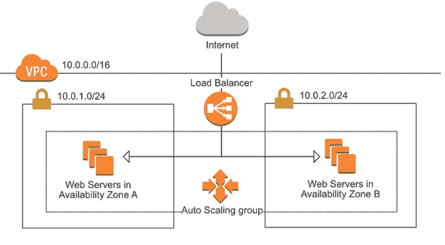

# 如何用 Terraform 管理自动伸缩组和负载均衡器？

> 原文：<https://medium.com/geekculture/how-to-manage-auto-scaling-group-and-load-balancer-with-terraform-9ece263060b5?source=collection_archive---------0----------------------->

# 什么是 Terraform？

Terraform 是一个开源的 i **基础设施代码(IAC)** 工具，允许**创建、管理** & **部署**生产就绪环境。Terraform 将云 API 编码成声明性的配置文件。Terraform 可以管理**现有服务提供商**和**定制内部解决方案。**

从 [**这里**](https://www.terraform.io/intro/index.html) 阅读更多关于地形的信息

# 先决条件:

*   基本了解[**AWS**](https://docs.aws.amazon.com/)&[**terra form**](https://www.terraform.io/intro/index.html)
*   预装了 [**地形**](https://learn.hashicorp.com/tutorials/terraform/install-cli) 的服务器
*   一个**访问密钥** & **秘密密钥**创建了 AWS
*   **SSH 密钥**

在本教程中，我将使用 terraform 创建各种资源，如 **VPC** 、 **EC2** 、 **SG** 等&将管理 **ASG** & **ELB** 。那么，让我们开始娱乐吧。



ELB + ASG

> 我们将使用单独的文件来创建所有的资源&一个单独的变量文件。最后我将讨论变量文件。

**步骤 1:-** 创建**提供者**块

*   创建`provider.tf`文件并将以下内容添加到其中

```
provider "aws" {
    region = "us-east-1"
    access_key = "{}"
    secret_key = "{}"
    version = "v2.70.0"
}
```

*   这里我用的是 **2.70.0** 版本的 **AWS** ，因为整个代码都是用 **terraform 11** 版本写的。

**第二步:-** 创建 **AWS VPC**

*   创建`vpc.tf`文件，并将下面的代码添加到其中

```
resource "aws_vpc" "demovpc" {
  cidr_block       = "${var.vpc_cidr}"
  instance_tenancy = "default"tags = {
    Name = "Demo VPC"
  }
}
```

**步骤 3:-** 创建 **AWS** 互联网网关

*   创建`igw.tf`文件，并添加以下代码

```
resource "aws_internet_gateway" "demogateway" {
  vpc_id = "${aws_vpc.demovpc.id}"
}
```

*   在这里，我正在新创建的 **VPC** 中创建**互联网网关**

**步骤 4:-** 创建 **AWS** 子网

*   **创建`subnet.tf`文件，并将下面的代码添加到其中**

```
# Creating 1st subnet 
resource "aws_subnet" "demosubnet" {
  vpc_id                  = "${aws_vpc.demovpc.id}"
  cidr_block             = "${var.subnet_cidr}"
  map_public_ip_on_launch = true
  availability_zone = "us-east-1a"tags = {
    Name = "Demo subnet"
  }
}# Creating 2nd subnet 
resource "aws_subnet" "demosubnet1" {
  vpc_id                  = "${aws_vpc.demovpc.id}"
  cidr_block             = "${var.subnet1_cidr}"
  map_public_ip_on_launch = true
  availability_zone = "us-east-1b"tags = {
    Name = "Demo subnet 1"
  }
}
```

*   **在这里，我创建了两个子网，它们都将作为公共子网**

****第五步:-** 创建 **AWS** **路由表****

*   **创建`route_table.tf`文件并将下面的代码添加到其中**

```
#Creating Route Table
resource "aws_route_table" "route" {
    vpc_id = "${aws_vpc.demovpc.id}"route {
        cidr_block = "0.0.0.0/0"
        gateway_id = "${aws_internet_gateway.demogateway.id}"
    }tags = {
        Name = "Route to internet"
    }
}resource "aws_route_table_association" "rt1" {
    subnet_id = "${aws_subnet.demosubnet.id}"
    route_table_id = "${aws_route_table.route.id}"
}resource "aws_route_table_association" "rt2" {
    subnet_id = "${aws_subnet.demosubnet1.id}"
    route_table_id = "${aws_route_table.route.id}"
}
```

*   **在这里，我创建了一个新的路由表，并将该路由表与新创建的子网相关联。两个新创建的子网都将作为公共子网。**

****步骤 6:-** 为**负载平衡器**创建 **AWS 安全组****

*   **创建`sg_elb.tf`文件，并将下面的代码添加到其中**

```
# Creating Security Group for ELB
resource "aws_security_group" "demosg1" {
  name        = "Demo Security Group"
  description = "Demo Module"
  vpc_id      = "${aws_vpc.demovpc.id}"# Inbound Rules
  # HTTP access from anywhere
  ingress {
    from_port   = 80
    to_port     = 80
    protocol    = "tcp"
    cidr_blocks = ["0.0.0.0/0"]
  } # HTTPS access from anywhere
  ingress {
    from_port   = 443
    to_port     = 443
    protocol    = "tcp"
    cidr_blocks = ["0.0.0.0/0"]
  } # SSH access from anywhere
  ingress {
    from_port   = 22
    to_port     = 22
    protocol    = "tcp"
    cidr_blocks = ["0.0.0.0/0"]
  }# Outbound Rules
  # Internet access to anywhere
  egress {
    from_port   = 0
    to_port     = 0
    protocol    = "-1"
    cidr_blocks = ["0.0.0.0/0"]
  }
}
```

*   **在这里，我为端口 22、80 和 443 创建入站规则，并为所有 IP 的所有端口打开出站连接。**

****步骤 7:-** 创建 **AWS** 负载均衡器**

****创建`elb.tf`文件，并添加以下代码****

```
**resource "aws_elb" "web_elb" {
  name = "web-elb"
  security_groups = [
    "${aws_security_group.demosg1.id}"
  ]
  subnets = [
    "${aws_subnet.demosubnet.id}",
    "${aws_subnet.demosubnet1.id}"
  ]cross_zone_load_balancing   = truehealth_check {
    healthy_threshold = 2
    unhealthy_threshold = 2
    timeout = 3
    interval = 30
    target = "HTTP:80/"
  }listener {
    lb_port = 80
    lb_protocol = "http"
    instance_port = "80"
    instance_protocol = "http"
  }}**
```

*   ****新创建的应用程序负载平衡器至少需要 2 个子网，因此我将这两个子网都连接起来****
*   ****我已经启用了跨区域负载平衡****
*   ****我已经定义了运行状况检查策略，因此我将始终拥有与我的负载平衡器相关联的运行状况良好的实例****

******步骤 8:-** 创建 **AWS 启动配置******

*   ****创建`launch_config.tf`文件，并将下面的代码添加到其中****

```
**resource "aws_launch_configuration" "web" {
  name_prefix = "web-"image_id = "ami-087c17d1fe0178315" 
  instance_type = "t2.micro"
  key_name = "tests"security_groups = [ "${aws_security_group.demosg.id}" ]
  associate_public_ip_address = true
  user_data = "${file("data.sh")}"lifecycle {
    create_before_destroy = true
  }
}**
```

*   ****这里我使用 **AWS Linux 2** 作为 AMI 实例，并使用**用户数据**来配置新创建的实例。我将在文章的后面讨论**用户数据**部分。****
*   ****该区域中已经存在密钥对****
*   ****在销毁旧的实例之前，我在这里使用`create_before_destroy`从新的启动配置创建新的实例。****

******步骤 9:-** 为 **EC2 实例**创建 **AWS 安全组******

*   ****创建`sg_ec2.tf`文件，并将下面的代码添加到其中****

```
**# Creating Security Group for ELB
resource "aws_security_group" "demosg1" {
  name        = "Demo Security Group"
  description = "Demo Module"
  vpc_id      = "${aws_vpc.demovpc.id}"# Inbound Rules
  # HTTP access from anywhere
  ingress {
    from_port   = 80
    to_port     = 80
    protocol    = "tcp"
    cidr_blocks = ["0.0.0.0/0"]
  }# HTTPS access from anywhere
  ingress {
    from_port   = 443
    to_port     = 443
    protocol    = "tcp"
    cidr_blocks = ["0.0.0.0/0"]
  }# SSH access from anywhere
  ingress {
    from_port   = 22
    to_port     = 22
    protocol    = "tcp"
    cidr_blocks = ["0.0.0.0/0"]
  }# Outbound Rules
  # Internet access to anywhere
  egress {
    from_port   = 0
    to_port     = 0
    protocol    = "-1"
    cidr_blocks = ["0.0.0.0/0"]
  }
}**
```

*   ****在这里，我为端口 **22，80 & 443** 创建入站规则，并为所有 IP 的所有端口打开出站连接。****

******步骤 10:-** 创建 **AWS 自动缩放组******

*   ****创建`asg.tf`文件并将下面的代码添加到其中****

```
**resource "aws_autoscaling_group" "web" {
  name = "${aws_launch_configuration.web.name}-asg" min_size             = 1
  desired_capacity     = 1
  max_size             = 2

  health_check_type    = "ELB"
  load_balancers = [
    "${aws_elb.web_elb.id}"
  ]launch_configuration = "${aws_launch_configuration.web.name}"enabled_metrics = [
    "GroupMinSize",
    "GroupMaxSize",
    "GroupDesiredCapacity",
    "GroupInServiceInstances",
    "GroupTotalInstances"
  ]metrics_granularity = "1Minute"vpc_zone_identifier  = [
    "${aws_subnet.demosubnet.id}",
    "${aws_subnet.demosubnet1.id}"
  ]# Required to redeploy without an outage.
  lifecycle {
    create_before_destroy = true
  }tag {
    key                 = "Name"
    value               = "web"
    propagate_at_launch = true
  }}**
```

*   ****将至少有 1 个实例来服务流量。****
*   ****最多将有 2 个实例为交通服务。****
*   ****自动缩放组将在 1 个实例中启动****
*   ****自动缩放组将从`ELB`中获得关于实例可用性的信息****
*   ****我已经为一些云观察指标设置了一个集合，以监控自动扩展组的状态。****
*   ****从这个自动缩放组启动的每个实例将有一个设置为`web`的标签`Name`。****

******步骤 11:-** 创建 **AWS 自动缩放策略******

*   ****创建`asg_policy.tf`文件并添加下面的代码。****

```
**resource "aws_autoscaling_policy" "web_policy_up" {
  name = "web_policy_up"
  scaling_adjustment = 1
  adjustment_type = "ChangeInCapacity"
  cooldown = 300
  autoscaling_group_name = "${aws_autoscaling_group.web.name}"
}resource "aws_cloudwatch_metric_alarm" "web_cpu_alarm_up" {
  alarm_name = "web_cpu_alarm_up"
  comparison_operator = "GreaterThanOrEqualToThreshold"
  evaluation_periods = "2"
  metric_name = "CPUUtilization"
  namespace = "AWS/EC2"
  period = "120"
  statistic = "Average"
  threshold = "70"dimensions = {
    AutoScalingGroupName = "${aws_autoscaling_group.web.name}"
  }alarm_description = "This metric monitor EC2 instance CPU utilization"
  alarm_actions = [ "${aws_autoscaling_policy.web_policy_up.arn}" ]
}resource "aws_autoscaling_policy" "web_policy_down" {
  name = "web_policy_down"
  scaling_adjustment = -1
  adjustment_type = "ChangeInCapacity"
  cooldown = 300
  autoscaling_group_name = "${aws_autoscaling_group.web.name}"
}resource "aws_cloudwatch_metric_alarm" "web_cpu_alarm_down" {
  alarm_name = "web_cpu_alarm_down"
  comparison_operator = "LessThanOrEqualToThreshold"
  evaluation_periods = "2"
  metric_name = "CPUUtilization"
  namespace = "AWS/EC2"
  period = "120"
  statistic = "Average"
  threshold = "30"dimensions = {
    AutoScalingGroupName = "${aws_autoscaling_group.web.name}"
  }alarm_description = "This metric monitor EC2 instance CPU utilization"
  alarm_actions = [ "${aws_autoscaling_policy.web_policy_down.arn}" ]
}**
```

*   ****`aws_autoscaling_policy`声明当`aws_cloudwatch_metric_alarm`触发时，AWS 应如何更改自动缩放组实例计数。****
*   ****`cooldown`选项将等待 300 秒，然后再次增加自动缩放组。****
*   ****`aws_cloudwatch_metric_alarm`是一个警报，如果我们的自动扩展组中所有实例的总 CPU 利用率在 120 秒内大于或等于`threshold`值 70%,将触发该警报。****
*   ****`aws_cloudwatch_metric_alarm`是一个警报，如果我们的自动缩放组中所有实例的总 CPU 利用率在 120 秒内小于或等于`threshold`值 30%,也会触发该警报。****

******步骤 12:-** 创建地形**变量**文件****

*   ****创建`vars.tf`文件，并将下面的代码添加到其中****

```
**# Defining Public Key
variable "public_key" {
  default = "tests.pub"
}# Defining Private Key
variable "private_key" {
  default = "tests.pem"
}# Definign Key Name for connection
variable "key_name" {
  default = "tests"
  description = "Name of AWS key pair"
}# Defining CIDR Block for VPC
variable "vpc_cidr" {
  default = "10.0.0.0/16"
}# Defining CIDR Block for Subnet
variable "subnet_cidr" {
  default = "10.0.1.0/24"
}# Defining CIDR Block for 2d Subnet
variable "subnet1_cidr" {
  default = "10.0.2.0/24"
}**
```

******步骤 13:-** 创建一个**用户数据**文件****

*   ****创建`data.sh`文件并将以下代码添加到其中****

```
**sudo yum update -y
sudo amazon-linux-extras install docker -y
sudo service docker start
sudo usermod -a -G docker ec2-user
sudo chkconfig docker on
sudo chmod 666 /var/run/docker.sock
docker pull dhruvin30/dhsoniweb:v1
docker run -d -p 80:80 dhruvin30/dhsoniweb:latest**
```

*   ****在这里，我正在安装 docker 并运行我的投资组合网站的 docker 图像****

****所以，现在我们的全部代码都准备好了。我们需要运行以下步骤来创建基础架构。****

*   ****`terraform init`初始化 AWS 提供者的工作目录和下载插件****
*   ****`terraform plan`是为我们的代码创建执行计划****
*   ****`terraform apply`是创建实际的基础设施。它将要求您提供**访问密钥**和**秘密密钥**，以便创建基础设施。因此，与其硬编码**访问密钥**和**秘密密钥，**不如在运行时应用。****

****terraform 应用完成后，您可以在 AWS 控制台上验证资源。Terraform 将创建以下资源。****

*   ******VPC******
*   ******自动缩放组******
*   ******发射配置******
*   ******自动缩放策略******
*   ******负载平衡器******
*   ******互联网网关******
*   ******路由表******
*   ******安全组******
*   ******子网******
*   ******云手表报警******

****基础设施准备就绪后，您可以通过导航`http://DNS-of-Load-Balancer` 来验证输出，您应该会看到下面的输出。****

********

****Output****

****至此，您已经了解了如何设置动态自动扩展组和负载平衡器，以便将流量分配到多个可用性区域中的实例。你可以在这里 **进一步探索地形 [**。**](https://terraform.io/)******

**你可以在我的 [**GitHub**](https://github.com/DhruvinSoni30/Terrafrom-ELB-ASG) 账号找到完整的代码。也可以随意查看我的其他库。**

**如果您发现此指南有帮助，请点击👏按钮，也可以随意发表评论。**

**关注更多类似的故事😊**