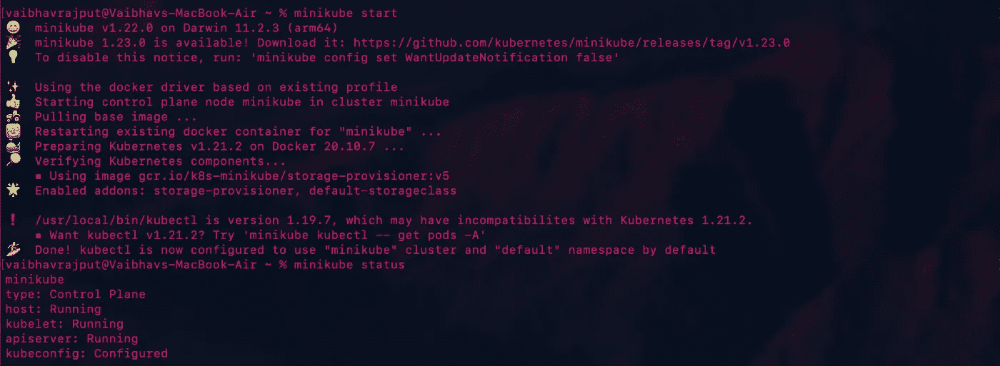
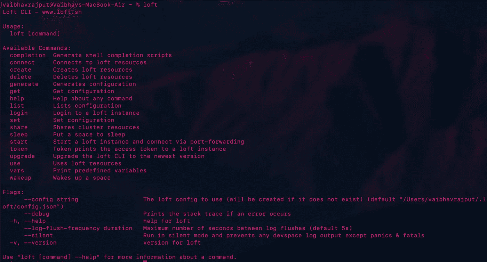
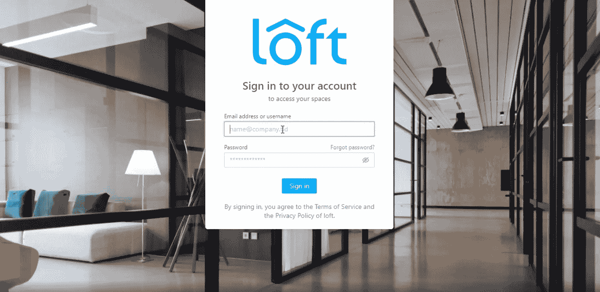
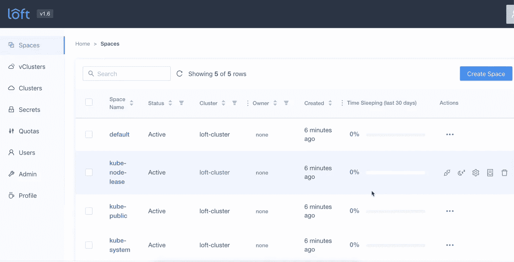
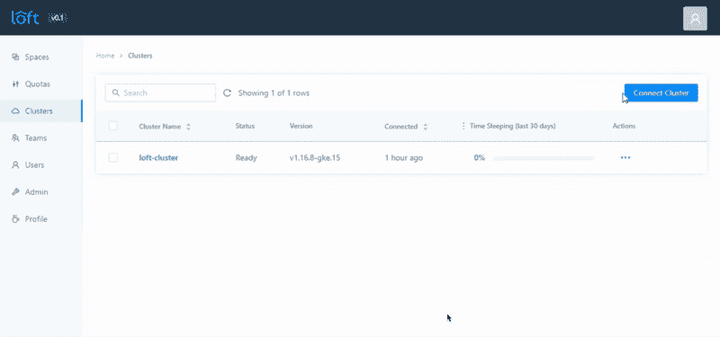
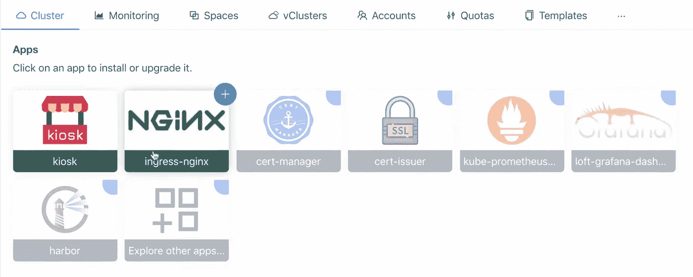
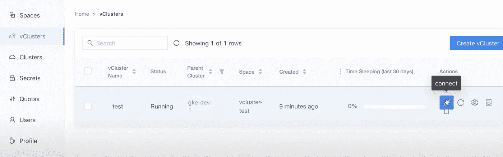

# 如何管理 Kubernetes 上的多租户？

> 原文：<https://medium.com/geekculture/how-to-manage-multitenancy-on-kubernetes-62ed5d95fcfc?source=collection_archive---------24----------------------->

在一个相当大的组织中，你如何管理 Kubernetes 集群？您是否为所有团队保留单独的集群？适用于所有环境？除了这些令人惊叹的功能，一旦你开始用 Kubernetes 成长，就会带来一些管理开销。随着基础设施的增长，您必须找到有效的方法来管理资源、用户和访问。

# 正确的方法？

为每个团队和每个环境管理不同的集群并不是最有效的方式。您将需要更多的专业人员来管理这些集群，承担所有这些主节点的更多成本，并且依赖管理员来为每个团队部署和设置集群。这就需要集中管理甚至是集中集群！

## 中央集群的问题？

这里有两个主要的复杂因素
**隔离**:这里最大的问题是隔离。一个项目的资源不应该妨碍其他项目
**访问**:团队应该只能访问他们的资源

## 单一解决方案

[Loft](https://loft.sh/) 可以帮助经济高效地解决这两个问题。在接下来的几分钟里，我们将看到如何在 Kubernetes 集群中创建隔离(我们讨论的不仅仅是名称空间),并在一个中心位置进行配置。一旦管理员完成配置，开发人员将配备一个自助服务门户来调配他们的集群、管理他们的应用等

# 设置

首先，我们需要我们的中央集群。对于这个演示，我使用一个部署在本地机器上的 minikube 集群



接下来，我们需要安装 Loft CLI。您可以根据您的操作系统在[快速入门指南](https://loft.sh/docs/quickstart)中找到这些步骤。对我来说，事情就是这样

```
curl -s -L "[https://github.com/loft-sh/loft/releases/latest](https://github.com/loft-sh/loft/releases/latest)" | sed -nE 's!.*"([^"]*loft-darwin-amd64)".* | xargs -n 1 curl -L -o loft && chmod +x loft;sudo mv loft /usr/local/bin;
```

安装后，只需像这样验证安装



现在我们已经准备好部署阁楼了。让我们从跑步开始

```
loft start
```

> 确保舵版本> = 3.2，因为在后台运行的命令在舵升级时使用`--create-namespace`标志


因为我正在运行 minikube，所以出现了这个提示，我选择了 **Yes** 并在下一个提示中进一步输入我的电子邮件 id，提示为您的管理员用户输入一个电子邮件地址

安装完成后，您将看到以下日志

```
########################## LOGIN ############################Username: admin
Password: 72258f0b-2e60–4441–8981–4809144df1b5Login via UI: [https://localhost:9898](https://localhost:9898)
Login via CLI: loft login --insecure [https://localhost:9898](https://localhost:9898)!!! You must accept the untrusted certificate in your browser !!!#################################################################Loft was successfully installed and port-forwarding has been started.
If you stop this command, run ‘loft start’ again to restart port-forwarding.Thanks for using loft!
```

# 我们去散步吧

在浏览器中输入 [https://localhost:9898](https://localhost:9898) 并通过“您的连接不是私有的”警告后，您将看到这个页面，在这里您可以使用管理员凭据登录。



然后快速填写一份关于你的个人资料的表格，填写你的姓名、角色、团队规模和组织。填写完毕后，点击“完成”,你就成功了！



# 将所有集群聚集在一起

我们的第一步将是连接 Loft 管理下的所有不同集群。为此，请转到左侧的**集群**选项卡。
在这里，您将看到一个名为 **loft-cluster** 的集群，这是您刚刚部署 loft 的集群。


点击右上角的**连接集群**按钮，输入集群的名称和 kube-config，如下所示。



然后，它会将 [Kiosk](https://github.com/loft-sh/kiosk) 安装到您的集群中，这是一个轻量级、可插拔和可定制的多租户解决方案。

除了 Kiosk，一旦你点击一个集群，UI 会给你一个额外的功能，一个非常方便的单击安装选项，可以安装很多其他应用程序。



# 创建虚拟集群

既然我们已经在一个管理下准备好了所有的多租户集群，那么是时候创建隔离了。

第一级隔离是通过虚拟集群(vClusters)完成的。这些虚拟集群实际上是在您的 Kubernetes 集群上运行的 K3s 集群。想了解 K3s 更多，可以看看[我早期的博客](https://rajputvaibhav.medium.com/k3s-hottest-new-entry-in-cncf-sandbox-to-change-how-you-look-at-k8s-51545e10f614)。

为此，请转到左侧面板中的 vCluster 选项，然后单击“Create vCluster”按钮。选择一个集群，给它起个名字，就可以开始了！
这还将在您的集群中创建一个名称空间，您可以在 UI 的 Spaces 部分查看该名称空间。

# 连接到 vCluster

一旦您的 vCluster 准备就绪，您就可以通过单击此选项并获得指定的命令来连接它



该命令将类似于以下内容

```
loft use vcluster <vcluster-name> --cluster <cluster-name> --space <space-name>
```

现在，去你的终端运行

```
loft login <loft-address> --username <username> --access-key <access-key>
```

在我的例子中，loft-address 是 [https://localhost:9898](https://localhost:9898) 。
用户名和访问密钥取决于您用来登录的用户。可以在左窗格的用户部分创建用户，一旦用户登录，他们可以在左窗格的配置文件部分创建他们的访问密钥。

> 注意:您可能需要在登录命令中使用`--insecure`标志，因为没有配置证书

现在运行您之前得到的`loft use vcluster`命令，您就成功了。现在，您可以在 vCluster 中运行`kubectl`命令。

# 离别赠言

Loft 是一个非常方便的解决方案，可以管理在单个集群上运行项目的多个团队，甚至可以管理来自多个发行版的集群。我在这里介绍了初始设置，但是这个工具还有更多内容。您可以安排集群以节省成本，限制分配给虚拟集群的配额，在集群之间共享机密等等。