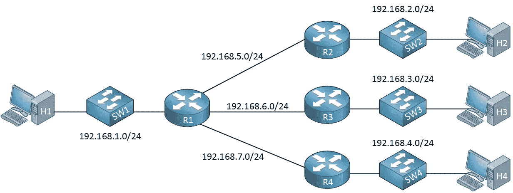
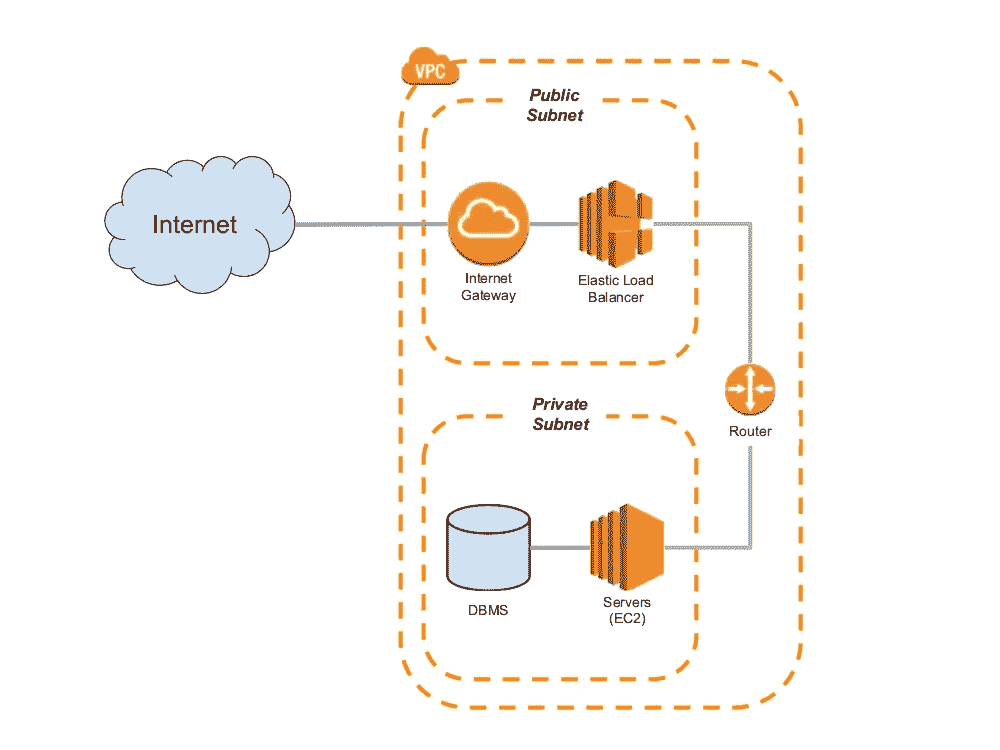

# 如何用 Terraform 管理 AWS 中的公有和私有子网？

> 原文：<https://medium.com/geekculture/how-to-manage-public-and-private-subnets-in-aws-with-terraform-69c272003c81?source=collection_archive---------4----------------------->

# 什么是 Terraform？

Terraform 是一个开源的基础设施代码(IAC)工具，允许创建、管理和部署生产就绪环境。Terraform 将云 API 编码成声明性的配置文件。Terraform 可以管理现有的服务提供商和定制的内部解决方案。

从 [**这里**](https://www.terraform.io/intro/index.html) 阅读更多关于地形的信息


Terraform

# 什么是子网？

子网是 IP 网络的逻辑细分。将一个网络划分成两个或更多的网络称为子网划分。一部分标识主机部分，另一部分标识网络部分。



Subnet

# 子网类型:

*   **公共子网:**
    公共子网是与路由表相关联的子网，该路由表具有到互联网网关的路由。这将 VPC 连接到互联网和其他自动气象站服务。默认情况下，在公共子网中启动的实例将分配 IP 地址。
*   **专用子网:** 专用子网中的实例通常是后端服务器，不需要接受来自互联网的传入流量，因此没有公共 IP 地址。但是，它们可以使用 NAT 网关或 NAT 实例向互联网发送请求。



Public/Private Subnet

在本文中，我将解释如何使用 terraform 创建和管理公共和私有子网。

# 先决条件:

*   **AWS**T42**terra form**的基础知识
*   AWS 帐户
*   **AWS 访问** & **密钥**

> 在这个项目中，我使用了一些变量，我将在本文后面讨论。

**第一步:-** 为 **VPC** 创建一个文件

*   创建`vpc.tf`文件并将下面的代码添加到其中

```
# Creating VPC
resource "aws_vpc" "demovpc" {
  cidr_block       = "${var.vpc_cidr}"
  instance_tenancy = "default"tags = {
    Name = "Demo VPC"
  }
}
```

**步骤 2:-** 为**公共子网**创建一个文件

*   创建`public_subnet.tf`文件，并将下面的代码添加到其中

```
# Creating Public Subnet for EC2 instance
resource "aws_subnet" "demosubnet" {
  vpc_id                  = "${aws_vpc.demovpc.id}"
  cidr_block             = "${var.subnet_cidr}"
  availability_zone = "us-east-1a"
  map_public_ip_on_launch = truetags = {
    Name = "Public Subnet"
  }
}
```

*   到目前为止，这个子网不会充当公共子网，我们需要创建`internet gateway`，还需要更新路由表，让我们开始吧。

**第三步:-** 为**互联网网关**创建一个文件

*   创建`igw.tf`文件，并将下面的代码添加到其中

```
# Creating Internet Gateway 
resource "aws_internet_gateway" "demogateway" {
  vpc_id = "${aws_vpc.demovpc.id}"
}
```

**步骤 4:-** 为**公共子网**的**路由表**创建一个文件

*   创建`route_table_public.tf`文件，并添加以下代码

```
# Creating Route Table for Public Subnet
resource "aws_route_table" "rt" {
    vpc_id = aws_vpc.demovpc.idroute {
        cidr_block = "0.0.0.0/0"
        gateway_id = aws_internet_gateway.demogateway.id
    }tags = {
        Name = "Public Subnet Route Table"
    }
}resource "aws_route_table_association" "rt_associate_public" {
    subnet_id = aws_subnet.demosubnet.id
    route_table_id = aws_route_table.rt.id
}
```

*   在上面的代码中，我创建了一个新的路由表，并将所有请求转发到`0.0.0.0/0` CIDR 块。
*   我还将这个路由表附加到前面创建的子网。因此，它将作为公共子网工作

**步骤 5:-** 为**安全组**创建一个文件

*   创建`sg.tf`文件并将下面的代码添加到其中

```
# Creating Security Group 
resource "aws_security_group" "demosg" {vpc_id      = "${aws_vpc.demovpc.id}"# Inbound Rules
  # HTTP access from anywhere
  ingress {
    from_port   = 80
    to_port     = 80
    protocol    = "tcp"
    cidr_blocks = ["0.0.0.0/0"]
  }# HTTPS access from anywhere
  ingress {
    from_port   = 443
    to_port     = 443
    protocol    = "tcp"
    cidr_blocks = ["0.0.0.0/0"]
  }# SSH access from anywhere
  ingress {
    from_port   = 22
    to_port     = 22
    protocol    = "tcp"
    cidr_blocks = ["0.0.0.0/0"]
  }# Outbound Rules
  # Internet access to anywhere
  egress {
    from_port   = 0
    to_port     = 0
    protocol    = "-1"
    cidr_blocks = ["0.0.0.0/0"]
  }
}
```

*   我已经为入站连接打开了 **80，443 & 22** 个端口，并为出站连接打开了所有端口

**第 6 步:-** 为**公共 EC2 实例**创建一个文件

*   创建`ec2_public.tf`文件，并将下面的代码添加到其中

```
# Creating EC2 instance in Public Subnet
resource "aws_instance" "demoinstance" {
  ami           = "ami-087c17d1fe0178315"
  instance_type = "t2.micro"
  key_name = "tests"
  vpc_security_group_ids = [ aws_security_group.allow_ssh.id ]
  subnet_id = aws_subnet.demoinstance.id
  associate_public_ip_address = truetags = {
    Name = "My Public Instance"
  }
}
```

**第七步:-** 为**公共**子网创建一个文件用于 **NAT 网关**

*   创建`public_subnet_NAT.tf`文件，并添加以下代码

```
# Creating Public subnet for NAT Gateway 
resource "aws_subnet" "demosubnet1" {
  vpc_id                  = "${aws_vpc.demovpc.id}"
  cidr_block             = "${var.subnet1_cidr}"
  availability_zone = "us-east-1b"tags = {
    Name = "Public Subnet for NAT Gateway"
  }
}
```

**第八步:-** 为 **EIP** 创建一个文件

*   没有弹性 IP 地址，您无法启动 **NAT 网关**，因此，让我们先创建它
*   创建`eip.tf`文件，并将下面的代码添加到其中

```
# Creating EIP
resource "aws_eip" "eip" {
  vpc = true
}
```

**第 9 步:-** 为 **NAT 网关**创建一个文件

*   创建`nat.tf`文件，并添加以下代码

```
# Creating NAT Gateway
resource "aws_nat_gateway" "gw" {
  allocation_id = aws_eip.eip.id
  subnet_id     = aws_subnet.demosubnet.id
}
```

**步骤 10:-** 为 **NAT 网关**的**路由表**创建一个文件

*   创建`route_table_private.tf`文件，并将下面的代码添加到其中

```
# Creating Route Table for NAT Gateway
resource "aws_route_table" "rt_NAT" {
    vpc_id = aws_vpc.demovpc.idroute {
        cidr_block = "0.0.0.0/0"
        nat_gateway_id = aws_nat_gateway.gw.id
    }tags = {
        Name = "Main Route Table for Private subnet"
    }
}resource "aws_route_table_association" "rt_associate_private" {
    subnet_id = aws_subnet.demosubnet1.id
    route_table_id = aws_route_table.rt_private.id
}
```

**步骤 11:-** 为**私有子网**创建一个文件

*   创建`private_subnet.tf`文件并将下面的代码添加到其中

```
# Creating Private subnet 
resource "aws_subnet" "demosubnet2" {
  vpc_id                  = "${aws_vpc.demovpc.id}"
  cidr_block             = "${var.subnet1_cidr}"
  availability_zone = "us-east-1b"tags = {
    Name = "Private Subnet"
  }
}
```

*   到目前为止，这个子网不会作为私有子网，我们需要做一些修改。

**步骤 12:-** 为**私有子网**的**路由表**创建一个文件

*   创建一个`route_table_private.tf`文件，并将下面的代码添加到其中。

```
# Creating Route table for Private Subnet
resource "aws_route_table" "rt_private" {
    vpc_id = aws_vpc.my_vpc.idtags = {
        Name = "Route Table for the Private Subnet"
    }
}resource "aws_route_table_association" "rt_associate_private_2" {
    subnet_id = aws_subnet.demosubnet2.id
    route_table_id = aws_route_table.rt_private.id
}
```

*   在上面的代码中，我创建了没有路由声明的路由表，并将其与我们的`private`子网相关联

**步骤 13:-** 为**私有子网**中的 **EC2 实例**创建一个文件

*   创建一个`ec2_private.tf`文件，并将下面的代码添加到其中

```
# Creating EC2 instance in Private Subnet
resource "aws_instance" "demoinstance1" {
  ami           = "ami-087c17d1fe0178315"
  instance_type = "t2.micro"
  key_name = "tests"
  vpc_security_group_ids = [ aws_security_group.allow_ssh.id ]
  subnet_id = aws_subnet.demosubnet2.idtags = {
    Name = "My Private Instance"
  }
}
```

**步骤 14:-** 创建一个**变量**文件

*   创建`vars.tf`文件，并将下面的代码添加到其中

```
# Defining CIDR Block for VPC
variable "vpc_cidr" {
  default = "10.0.0.0/16"
}# Defining CIDR Block for 1st Subnet
variable "subnet_cidr" {
  default = "10.0.1.0/24"
}# Defining CIDR Block for 2nd Subnet
variable "subnet1_cidr" {
  default = "10.0.2.0/24"
}# Defining CIDR Block for 3rd Subnet
variable "subnet2_cidr" {
  default = "10.0.3.0/24"
}
```

所以，现在我们的全部代码都准备好了。我们需要运行以下步骤来创建基础架构。

*   `terraform init`初始化提供者的工作目录和下载插件
*   `terraform plan`是为我们的代码创建执行计划
*   `terraform apply`是创造实际的基础设施。它会要求您提供**访问密钥**和**秘密密钥**，以便创建基础设施。因此，与其硬编码**访问密钥**和**秘密密钥，**不如在运行时应用。

**步骤 15:-** 验证 th **e 资源**

*   Terraform 将创建以下资源

1.  **VPC**
2.  **EC2 实例的公共子网& NAT 网关**
3.  **EC2 实例的专用子网**
4.  **公有&私有子网和 NAT 网关**路由表
5.  **互联网网关**
6.  **EIP**
7.  **NAT 网关**
8.  **安全组**
9.  **EC2 实例**

现在就这样，你已经学会了如何使用 Terraform 在 AWS 中创建各种资源。你可以在这里 进一步探索 Terraform[](https://terraform.io/)

**你可以在我的 [**GitHub**](https://github.com/DhruvinSoni30/Terraform-AWS-Subnets) 账号找到完整的代码。也可以随意查看我的其他库。**

**如果您发现此指南有帮助，请点击👏按钮，也可以随意发表评论。**

**关注更多类似的故事😊**