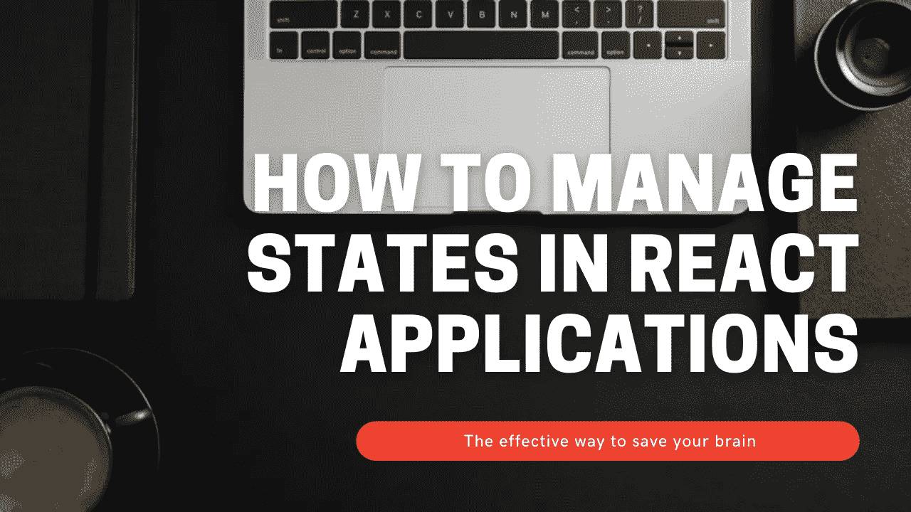
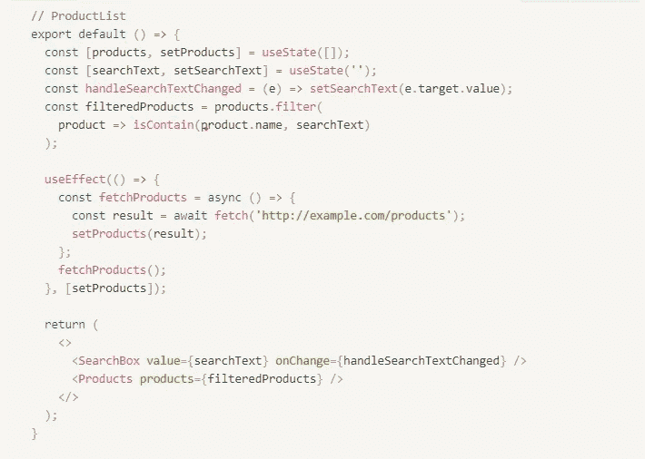
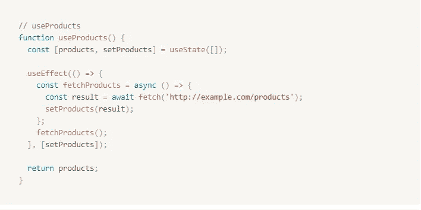
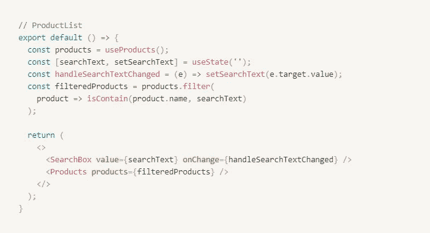
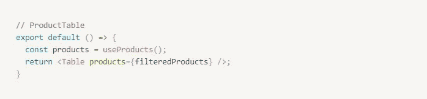
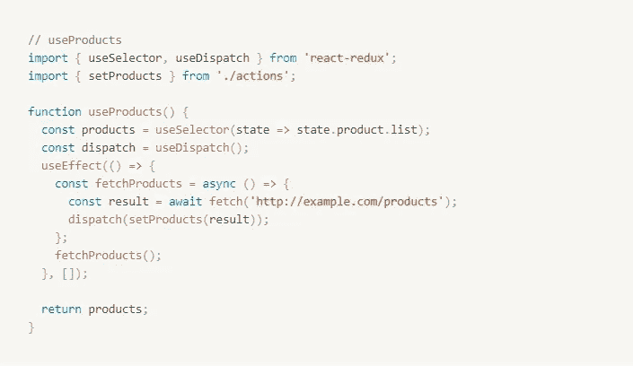

# 如何有效地管理 React 应用程序中的状态

> 原文：<https://medium.com/geekculture/how-to-manage-states-in-react-applications-effectively-d31b2f740496?source=collection_archive---------20----------------------->

Template created by [www.canva.com](http://www.canva.com)

*本文假设你已经对 React/Redux 有了基本的了解。顺便说一下，如果你对表示容器模式有所了解，你会在这篇文章中找到创新的想法。*

> 考虑一下:我们希望在一个表中创建一个搜索文本框，它更新该表的条目，并且对其他组件没有影响。要不要创造动作，还原器，把这种状态放入商店？

说实话，你不需要。当您在第一阶段开始构建您的应用程序时，本地组件状态可能会在几乎所有组件和模块中帮助我们。

在我作为“看门人”的大部分工作时间里，我经常在一些实现 Redux 的项目中看到的常见错误是将每个状态放入 Redux 存储中，然后为每个相关的状态创建 actions 和 reducers。于是，噩梦开始了——你的 Redux 店铺越来越大。在某些日子里，它大到每天都能让你大吃一惊，以至于你不得不怀疑为什么要在应用程序中实现 Redux。

当然，状态管理(如 Redux)可能很复杂，但这并不意味着当应用程序增长时，状态管理总是成为一个问题。它依赖于您在应用程序中实现 Redux 的方式。

所以，我给了一些下面的场景。它们是我们在构建组件甚至应用程序时应该经历的步骤。

# 场景 1:作为一名用户，我希望以列表形式查看产品，并拥有一个用于搜索产品的文本框。

这个场景中我们唯一需要的是**使用状态**和**使用效果**。这意味着在这种情况下使用本地组件状态就足够了。

# 场景 2:用户希望拥有一个 UI 不同但产品相同的产品表。

首先，如果我们尝试对`ProductTable`做与场景 1 相同的事情，我们会发现产品和`fetchProducts`将会重复。因此，我们可以通过创建一个用于管理产品的自定义钩子来解决上述问题。

然后，在接下来的步骤中，我们用我们的`useProducts`定制挂钩替换产品的`useState`和`useEffect`。

并且，我们可以简单地将`useProducts`作为`ProductTable`实现到我们的新组件中

按照上面的代码片段，如果我们把`ProductList`和`ProductTable`放在不同的页面，就没问题了。相反，当我们在同一个页面中实现上述两个组件时，`fetchProducts`将被执行两次。实际上，这是一个已知的问题，因为我们期望遵循组件间独立性的方法。

不过，我们完全可以通过在父页面中实现`useProducts`而不是每个组件，并将`products`作为每个组件的道具来传递来解决这个问题。

# 场景 3:我们的应用程序足够大，可以实现状态管理

当您发现自己一遍又一遍地在组件之间传递状态(正如上面提到的问题)或者一层又一层地冒泡子组件状态，以便父组件或更高级别的组件可以使用该状态时，您就知道是时候解决问题了。

如果需要，我们应该使用状态管理，但是请记住，我们可以一起使用本地状态和全局状态。布兰登在[的这篇](https://www.telerik.com/amp/3-essential-tips-for-managing-state-in-react-applications/WEx1ZE1sRUVUWkE5S0dNbEhBNXJyUkU3T1Q4PQ2)文章中提醒大家:

*使用本地状态是可以的，特别是如果它能帮助你保持全局状态的整洁和有序。*

# 结论

在这篇文章中，我们已经了解了在 React 应用程序中管理本地状态和全局状态的方法。此外，我给出了一些在 React 组件中实现状态时可能发生的基本场景的示例。

记住所有这些，希望你不仅可以保持一个干净和可读的状态管理，而且可以减少应用程序中复杂的逻辑处理。

## 参考资源:

[https://www . telerik . com/amp/3-essential-tips-for-managing-state-in-react-applications/wex 1 ze 1 sruvuke 5s 0 dnbehbbnxjyuku 3t 1 q 4 pq 2](https://www.telerik.com/amp/3-essential-tips-for-managing-state-in-react-applications/WEx1ZE1sRUVUWkE5S0dNbEhBNXJyUkU3T1Q4PQ2)

[https://medium . com/voobans-tech-stories/5-waste-renders-in-react-redux-73 B3 C5 d 86 f 50](/voobans-tech-stories/5-ways-to-stop-wasting-renders-in-react-redux-73b3c5d86f50)

[https://www . welcometothejungle . com/en/articles/atomic-design-front-end-developer](https://www.welcometothejungle.com/en/articles/atomic-design-front-end-developer)