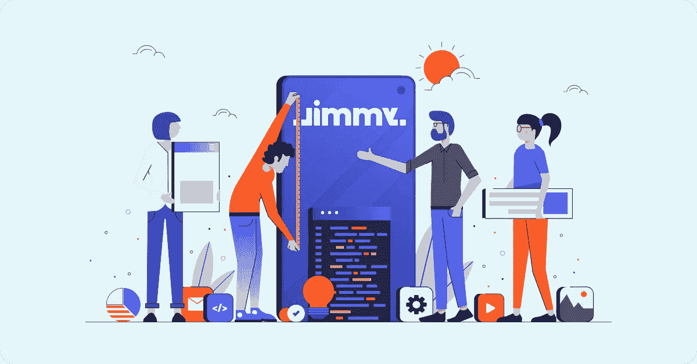

# 如何掌握一个项目的架构，而不是将你的决定建立在假设之上

> 原文：<https://medium.com/geekculture/how-to-master-a-projects-architecture-and-not-base-your-decisions-on-assumptions-ea32578dc8e8?source=collection_archive---------33----------------------->

架构是每个软件产品的基石。经过深思熟虑的体系结构允许您随时扩展和修改您的软件。一个僵化和误入歧途的人不会。那么，当你开始一个新项目时，你如何处理战略决策，你如何保持在正轨上？学习吉米的方法。

让我们从“敏捷”这个词开始——它对你意味着什么？想一分钟。对我们来说，这是一种适用于任何地方的思维方式，而不仅仅是在软件开发中。这是一种思维方式。这是关于经常小步前进，而不是一次一大步。你可能也听说过精益原则(丰田方式)。这是敏捷的补充。这两种方法配合得很好，因为它们强调质量、速度和消除浪费。

## 如何在一开始就做出正确的结构决策？从小处着手

刚起步的时候数据和信息超级重要。收集关于项目的所有信息，并寻找可能影响架构的环境。另一方面，不要试图解决每一个可能的未来场景，并过度思考。平衡是关键。此外，注意不要用你的假设来填补空白点，如果你这样做了，准备好确认或改变它们。假设经常被误认为是事实，即使它们背后没有真正的基础。

如果您已经有了架构蓝图，现在您用所有收集的数据来面对它们，它们还有意义吗？如果不是，但你还是想走这条路，为什么？

## 单片还是微服务架构？

这可能是你将要做出的最重要的决定之一——简而言之，目前你可能会考虑两种常见的方法。第一个是整体架构——对于今天快节奏的项目来说有点过时，但在许多情况下仍然是一个不错的选择。另一种是基于微服务的架构。这是一种潮流，如果执行得当，这是一种优势，但如果由不熟练的团队来完成，这可能是一场噩梦。你选择哪一个？

微服务旨在解决特定的问题，但像往常一样，它们会引入新的问题。在单片应用程序中，您可能不需要处理这些问题。

那么哪种方式更有意义呢？一开始，具有良好架构的单片应用程序要灵活得多，也更容易理解，这是一个很大的好处。另一方面，您可能需要在某个时候隔离系统的特定部分。为什么？可能是因为性能等因素，这是你第一个微服务可能介入的时刻。这完全没问题，但是过早地开发微服务或者仅仅依赖微服务可能会给你带来很多麻烦。

"如果你不能构建一个整体，你凭什么认为微服务就是答案？"西蒙·布朗

因此，总是建立一个非常小的，衡量和学习。

## 使分离

保持您的领域逻辑与外部不稳定的环境分离，有助于您专注于业务的核心，并减轻来自外部变化的脆弱性。

假设您发现了一个很棒的外部服务，您想集成它。当然，为什么不呢，但是要确保在您的域和外部服务之间设置一个精确的边界。这样做给了你灵活性，如果外部工具不再适合你，你可以替换它，而不会危及系统的其他部分。

另一个热门话题是框架。他们倾向于固执己见，渗透到你的代码库中。当然，你可能 100 %确定你永远不会迁移到一个不同的框架，但是仍然——保持你的架构从框架中解耦允许你测试领域和容易地更新框架。对于耦合架构，带来新结构的重大更新可能会非常麻烦，您希望避免这种情况。

更不要说外部仪器或多或少脱离了你的控制，甚至最著名的工具有时也会消失。是的，[它发生了](https://www.theregister.com/2016/03/23/npm_left_pad_chaos/)。

## 外购

我所说的外包并不一定是指将任务交给另一家开发公司([如果你想这么做，确保你选择了一家可靠的公司](https://www.fromjimmy.com/7_signs_of_a_reliable_development_agency))。我说的是利用现有的解决方案，这些解决方案可以帮你大忙，而且已经存在。

假设你需要实现一个功能，让你可以卖出一本书；这是一个可以增加你收入的功能，但是要卖出一本书，你需要处理复杂的增值税。这让你很不舒服。销售一本书是你的主要目标，但是如果不实施另一个复杂的解决方案，你就无法实现这个目标。

如果有已经实现了 VAT 逻辑的 API 服务，那该有多好？放心，有的是。通常情况下，当你处理一件事情的时候，别人已经解决了，这样你才能快速推动你的发展。集成其中一个服务，把它藏在一个接口后面(参见解耦),然后开始卖你的书。如果需要，一旦有了 VAT 逻辑，就介绍一下自己的实现。

## 衡量一切

我已经提到了数据和经验知识的重要性，而不仅仅是假设。收集数据是一个持续的过程，你手头的相关数据越多越好。至少跟踪软件最关键的方面，不要做得太多。您可以从响应时间、请求计数、错误率等指标开始，并监控 RAM、CPU 等资源。总是尝试利用你正在使用的主机平台。它可能会为你提供优秀的工具——例如，看看 Google StackDriver。

在启动应用程序之前，一定要对它们进行压力测试。怎么做呢？轻松—创建生产版本的副本，看看会发生什么。

把它推过悬崖就能找到悬崖。

由于有了这些数据，您可以识别您的边界，并且能够自信地设置监控，这将让您知道您是否正在接近极限。再次，利用你的主机提供商已经有的工具，你可能会发现一个宝藏！

## 观察、反应和适应

现在您的软件正在运行，您已经设置了监控和收集用户反馈。在这一过程中，你无疑会发现趋势，并可能触发一些警告，表明你正接近悬崖。这通常是反应的时间，但有时不是。先了解更广泛的背景，因为这很重要。不是有一个非常大的负载，因为一个营销活动正在运行吗？如果是这样，而另一个不会很快发生，那么它可能仍然不是一个优先事项。

更仔细地查看数据，隔离问题并解决它。同一问题可能有不同的原因——是否存在未优化的算法？还是 SQL 语句？小心 SQL ORM 库产生的内容。还是只是一个需要时间的苛求过程？如果是最后一种情况，对微服务来说可能是个好机会。

## 把假设变成假设

我们只是基于数据做出了我们的架构决策，这是理所应当的。但是，你应该总是被动地等待，直到环境像一个巨大的负荷把你推向新的解决方案吗？不完全是。采取小步骤，但不要因为你的假设而重建一半的应用程序。把假设变成假设，建立一个最低限度，测量，学习。还是不确定这两个有什么区别？[看看这个解释](https://www.skmurphy.com/blog/2014/01/27/difference-between-a-hypothesis-and-an-assumption/)。

## 不断评估，不要害怕重构

重构，这个让人不舒服的词。为什么？这些年来，我注意到这种不适来自于无法持续评估软件，这导致坚持旧的过时模式，这些模式迟早会达到它们的极限。这会导致更多的 bug，更慢的开发，当你不可避免地不得不完全停止开发并重写大部分代码时，这将是一条不归路，这可能需要几周或几个月的时间。

当然，你应该尽量避免这种情况。你是怎么做到的？通过不断的重构，这将保持你的代码库健康并允许优化。不要害怕重构，如果不是每天都在做，那就要害怕。无论你是开发人员还是经理，都要强调质量。值了。

## 务实，注重价值

就是这样。我们经历了几个实践，让您关注价值、保持速度、消除浪费，并根据数据做出决策。我想听听你的意见，不管你是建筑师、开发商还是经理。我相信你们可能会发现这些实践是相关的。

请记住，在所有事情的背后，只有一个核心理念——实用主义。不要浪费资源。关注价值。

寻求更多信息。
[雅各布](https://www.linkedin.com/in/jakubdrabik/)，CTO