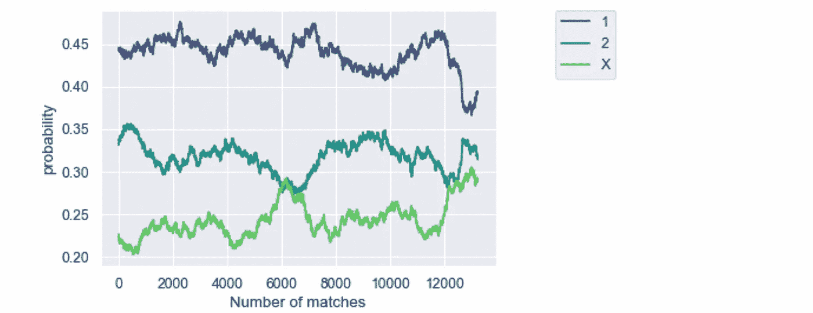
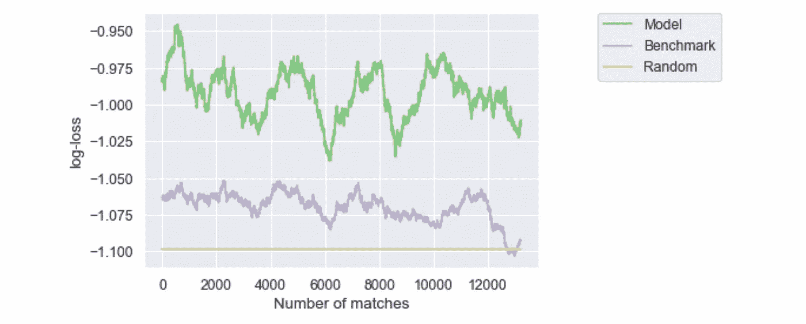
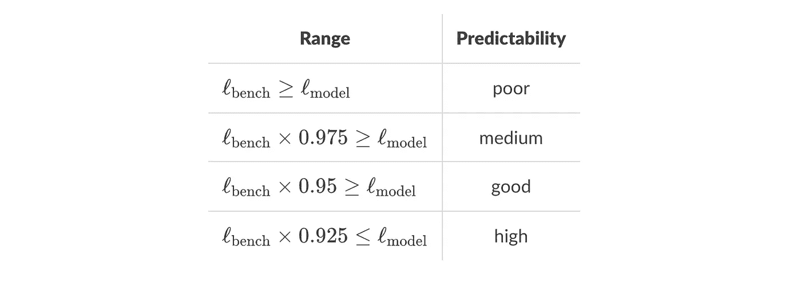

# 如何衡量足球预测模型质量

> 原文：<https://medium.com/geekculture/how-to-measure-football-prediction-model-quality-cac480a1e2f7?source=collection_archive---------5----------------------->

## 分析变得简单

## 联盟可预测性指数(LPI)在起作用

## 介绍

在预测建模中，最重要的步骤之一是测量模型质量。更重要的是，你需要有一个可以理解和概括的衡量标准。有很多指标可以用来训练模型、选择参数或进行交叉验证。其中，对于分类问题，我们可以提到准确度、 [F1 得分](https://en.wikipedia.org/wiki/F-score)，或者[对数损失](https://en.wikipedia.org/wiki/Cross_entropy)。

虽然它们相对容易使用，但要理解对数损失为-0.93 或准确度为 10%是否意味着模型是一个好的或坏的预测器并不总是容易的。

在本文中，我们证明了足球预测模型的性能数字不足以判断其质量。我们将引入**基准**的概念，这对于理解一个模型是否真正从数据中学习是必要的。

# 基准的必要性

我们已经介绍了[对数损失和准确度](/p/1e5e22310497)，这是足球预测中使用的分类模型的两个性能度量。

对数损失为您提供了模型产生的概率质量的度量。但是这种损失随着班级数量的增加而不同。因此，很难将模型性能与对数损失的规模联系起来。

准确度没有这个问题。事实上，很容易理解你 10%的预测是正确的。但这就说明你的模式好还是不好？如果你有一个两级问题，可能不是。如果你有 100 个类的问题呢？事实上，即使你知道班级的数量，你也无法回答这个问题。让我们解释一下为什么。

比方说，从你的窗户前经过的 90%的汽车是白色的，我们教一个深度神经网络模型来预测下一辆汽车的颜色。如果模型最终总是预测“汽车是白色的”,那么它的准确率将达到 90%。然而，这并不能使它成为一个很好的模型。此外，你可以透过窗户观察，观察到大多数汽车是白色的，并预测下一辆汽车将是白色的。**你会达到和深度神经网络一样的性能。**在这种情况下，你会得出模型不好的结论，因为你可以达到同样的性能:**你作为基准**。

> 拥有一个基准是断言模型质量的好方法。没有超过基准意味着模型是 porr，或者你试图预测的东西太随机，无法从数据中学习。

这是一个明显的夸张，但是它给你一个**基准模型**的概念:一个普通的模型，在这种情况下，你可以透过窗户观看。

# 足球模特的标杆

在足球中，我们可以预测很多事件:最终比分，半场比分，第一个进球的球队，进球数等等。为它们中的每一个设定一个基准将有助于对模型质量有一个共同的度量。

正如我们对汽车例子所做的那样，我们可以为每个市场建立一个基准。显然，你不会观看所有的比赛，并计算哪些比赛出现得更频繁。相反，我们可以使用数据，查看过去的匹配，并找出最常见的结果。这是一个简单的**历史模型。**

例如，在一个特定联赛的过去 100 场比赛中，我们观察到主队赢得 45%的时间，客场 30%，平局 35%。这将使我们的对数损失为-1.06。相比之下，随机对数损失为-1.098。

> 随机模型也是一个可能的基准，但它不公平。例如，我们知道主场球队赢的几率超过 33%,所以知识应该在基准中

## **举例**

让我们用一个模型和匹配结果得到一个例子。数据由 [sportmonks](https://www.sportmonks.com/) 提供。我们将他们的概率用于 1x2 市场。

我们收集了 2021 年 10 月到 2021 年 12 月之间的 15000 场比赛，分布在 643 个联赛中。匹配和对数丢失是按时间排序的。首先，我们使用每个日期 1000 个过去匹配的平均结果来计算基准概率。下一幅图展示了这些历史概率随时间的演变。

Evolution of the historical probabilities for 1, X and 2

例如，在 2021 年 12 月底，我们测得主队获胜的概率为 39.5%，失败的概率为 31.5%，平局的概率为 29%。随机基准应该是 33%。

然后使用预测模型概率和我们新的历史概率，我们计算每个匹配的对数损失。然后我们取 1000 次观察的滚动平均值。我们还添加了随机基准。下图显示了对数损失的演变。

Evolution of the log-loss for each model

我们观察到预测模型优于基准，这意味着它能够从数据中学习有用的信息。我们还注意到历史模型是比随机猜测更好的基准。

# 联盟预测指数

联盟可预测性指数(LPI)是一种衡量模型相对于历史基准的对数损失的方法，被 [sportmonks](https://www.sportmonks.com/) 用来评估他们的模型。**每天，对于每个联赛，**在过去的 100 场比赛中，计算每个赛事**的模型对数损失，或者更少，如果没有至少 50 场比赛的数据。**

基准对数损失是在相同数量的比赛上计算的，但不是使用联盟的平均市场结果。

然后，**模型的质量被分类为差、中、好或高**取决于其对数损失 level(ℓ)相对于基准的百分比量。下表显示了我们用于所有型号的数字。

Predictability index classification

例如，对于特定联盟，如果基准日志损失为-1.01，而我们的模型日志损失为-0.98，则可预测性指数将为**中**。如果我们的模型对数损失为-0.94，指数将为**良好**和**高**如果它高于-0.93425。

# 结论

在本文中，我们讨论了为什么在足球预测的情况下，仅仅有性能指标不足以评估模型的质量。事实上，使用一个普通的基准将有助于理解一个模型是否真的从数据中学习到有用的信息。

历史模型似乎是一个很好的基准，因为它将向你展示一个模型与联盟的平均结果相比在性能方面的表现。它是通用的，易于计算，并可扩展到任何市场。

或者，您可以使用另一个模型或您自己的基准来帮助您了解您的模型预测是否真的在执行。