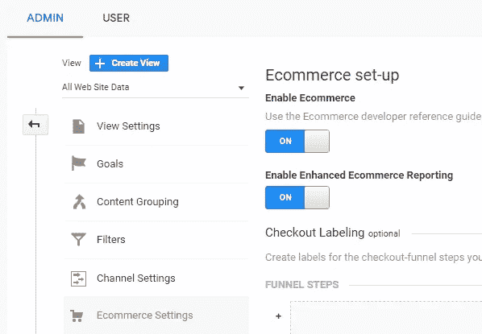
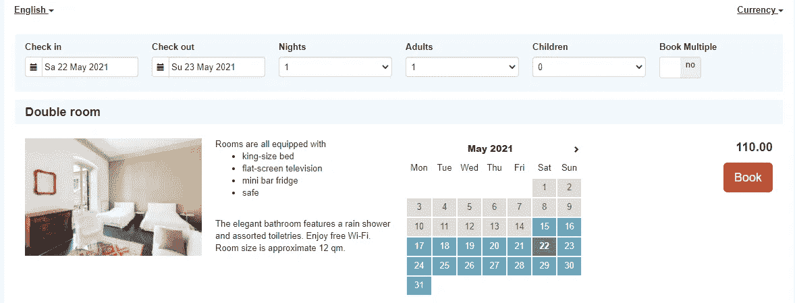
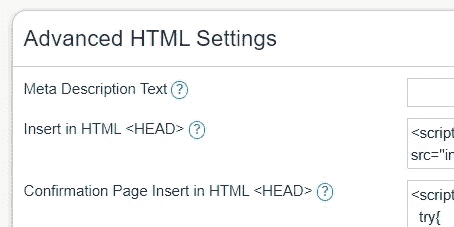
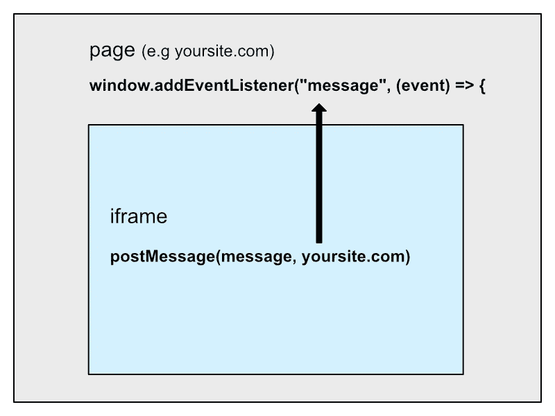
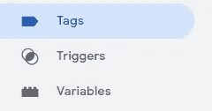
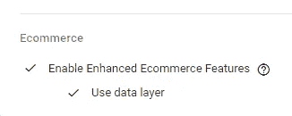
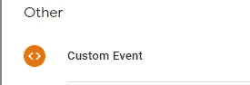
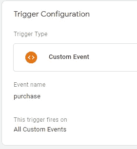
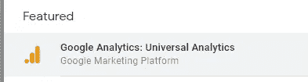
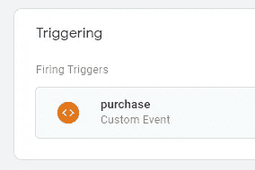

# 如何使用 iFrame 中的 gtag.js 衡量购买

> 原文：<https://medium.com/geekculture/how-to-measure-purchases-with-gtag-js-from-iframe-309932c19b6?source=collection_archive---------14----------------------->

## 将 beds24 iframe 中的数据发送到 Google Analytics


Photo by [Markus Winkler](https://unsplash.com/@markuswinkler?utm_source=medium&utm_medium=referral) on [Unsplash](https://unsplash.com?utm_source=medium&utm_medium=referral)

你可能会在你的网站上使用谷歌分析来跟踪你的访问者的一些信息——人口统计，他们的行为，他们使用什么技术等。

如果您在网站上使用第三方软件，让您的客户能够购买/预订某些东西，您可能需要跟踪更多信息—他们的购物行为是什么，他们购买了什么？

> 为了展示一个具体的例子，我将使用 [beds24](https://beds24.com/) ，这是一个财产管理和预订系统。您也可以将这里描述的内容应用于其他系统。**但是你必须能够访问 iframe。否则，您将无法从中发送必要的数据。**

我将通过以下四个简单的步骤简要说明如何做到这一点:

*   设置 Google 分析
*   从 iframe 发送数据(如 beds24 预订系统)
*   通过 gtag(通用分析)接收和发送数据
*   设置 Google 标签管理器

## 1.设置 Google 分析

我不会在这里进入更多的细节，但我假设你已经有你的谷歌分析帐户。为了收集某些电子商务信息，我们必须首先启用该功能。

导航到您的帐户、酒店和视图，然后选择[启用电子商务](https://support.google.com/analytics/answer/6032539)。



enable Ecommerce in Google Analytics

还要确保你的网站标题中包含了 gtag:

```
<head>
  <!-- Global site tag (gtag.js) - Google Analytics -->
  <script async src="https://www.googletagmanager.com/gtag/js?id=UA-XXX"></script>
  <script>
    window.dataLayer = window.dataLayer || [];
    function gtag(){dataLayer.push(arguments);}
    gtag('js', new Date());

    gtag('config', 'UA-XXX');
  </script>
</head>
```

我们还必须在谷歌标签管理器中创建一个容器，但我们将稍后再做。

## 2.从 iframe 发送数据

好吧，iframe 是什么？为了确保我们知道我们在谈论什么，这里有一个 MDN 的定义:

> **HTML 内嵌框架元素(** `**<iframe>**` **)** 表示嵌套的[浏览上下文](https://developer.mozilla.org/en-US/docs/Glossary/Browsing_context)，将另一个 HTML 页面嵌入到当前页面中。

因此，在我们的例子中，我们有一个网页，我们想插入另一个网页在那里(beds24.com)使用 iframe 元素。

```
<iframe src=”[https://www.beds24.com/booking2.php?propid=13437](https://www.beds24.com/booking2.php?propid=13437)” width=”100%” scrolling=”no”></iframe>
```

用户可以在 iframe 中浏览和预订属性。



比方说，我们想要捕获该资产的预订。这意味着在用户到达确认页面后触发一个事件。在 beds24 中，我们可以访问各个属性的 HTML 设置，并向元素插入一个脚本。我们可以看到还有一个确认页面:



beds24 HTML settings

> 注意:如果您不直接控制 iframe 代码，并且您使用不同的服务，那么请寻找类似的选项，以便将 Javascript 代码插入到页面中。

在该字段中，我们必须插入如下所示的 Javascript 代码。

```
<script>
  try{ 
      var postObject = {
        event: 'purchase',
        data: {
          "transaction_id": [BOOKID],
          "value": [PRICE],
          "currency": "EUR",
          "coupon": "[GUESTVOUCHER]",
          "items": [
            {
              "id": [PROPERTYID],
              "name": "[PROPERTYNAME]",
              "brand": "",
              "quantity": 1,
              "price": [PRICE]
            },
          ]
        }
      };    
      **parent.postMessage(postObject, '**[**https://example.com'**](https://lisbonprimeaparts.com/booking')**);**
  } catch(e) {
    window.console && window.console.log(e);
  }
</script>
```

这里重要的是 [*postMessage()* 方法](https://developer.mozilla.org/en-US/docs/Web/API/Window/postMessage)。它支持 iframe 和内嵌 iframe 的页面之间的通信。

> `**window.postMessage()**`方法安全地启用了`[Window](https://developer.mozilla.org/en-US/docs/Web/API/Window)`对象之间的跨原点通信；*例如，*在页面和它产生的弹出窗口之间，或者在页面和嵌入其中的 iframe 之间。



我们传递给该方法的第一个参数是 ***消息*** 。在上面的例子中，我们发送了一个 Javascript 对象，该对象的属性遵循[用于衡量购买的电子商务文档](https://developers.google.com/analytics/devguides/collection/gtagjs/enhanced-ecommerce#measure_purchases)中描述的结构(根据您的用例可能会有所不同)。好消息是，我们不必序列化数据，因为方法会处理这些。这些值是 [beds24 模板变量](https://wiki.beds24.com/index.php?title=Template_Variables)，如价格、资产 ID 等。

第二个参数是 ***targetOrigin*** ，所以基本上是父 URI。

## 3.接收数据并通过 gtag 发送

当用户完成预订时，消息被发送，现在我们必须监听它。在 iframe 之外，我们必须在父页面中插入另一个脚本。

```
<script>
  window.addEventListener("message", (event) *=>* {
    *if* (event.data && event.data.event === "purchase") {
      *var* data = event.data;
      dataLayer.push({ ecommerce: null }); gtag('event', 'purchase', {
        "transaction_id": data.data.transaction_id,
        "value": data.data.value,
        "currency": "EUR",
        "coupon": data.data.coupon,
        "items":data.data.items
      });
    }
  });
</script>
```

同样，如 [GA 文档](https://developers.google.com/analytics/devguides/collection/gtagjs/enhanced-ecommerce#measure_purchases)中所述，我们使用 gtag 和*‘购买’*事件来发送我们收到的数据。确保 gtag 已定义(参见步骤 1)。

## 4.设置 Google 标签管理器(GTM)

此时，我们仍然看不到 GA 中触发的任何事件。我们必须在谷歌标签管理器中定义它们。首先为你的网站创建一个容器。

然后我们必须定义变量、触发器和标签。



GTM menu

**变量**

转到用户定义的变量，点击新建，并选择谷歌分析设置


输入您的跟踪 ID，并在更多设置中启用电子商务。



**触发器**

例如，创建一个名为“购买”的新触发器，并选择自定义事件



事件名称是 purchase(正如我们在上面的代码示例中定义的那样),所以看起来像这样:



**标签**

最后，我们必须定义一个标签。创建一个新的“购买标签”，并在标签配置中选择谷歌分析:通用分析。



我们还必须选择一个触发器，这是我们之前定义的:



发布更改，刷新页面并进行预订。你应该能够看到谷歌分析中触发的新事件。

## 结论

我描述了如何使用 iframe 中的 gtag.js 来度量购买。作为一个例子，我使用了 beds24 预订和财产管理系统。只要您可以访问 iframe，您就可以将所描述的相同原则应用于其他系统，因为我们已经了解了父窗口和 iframe 之间的通信是如何工作的。

我们还学习了如何在 GA 中启用电子商务，然后我们按照 gtag 文档来衡量购买，尽管 Google Analytics 和 GTM 设置也会根据您的需求而有所不同。

我希望这篇文章对你有用，即使它不完全符合你的项目标准，但它给了你一些指导。感谢阅读！