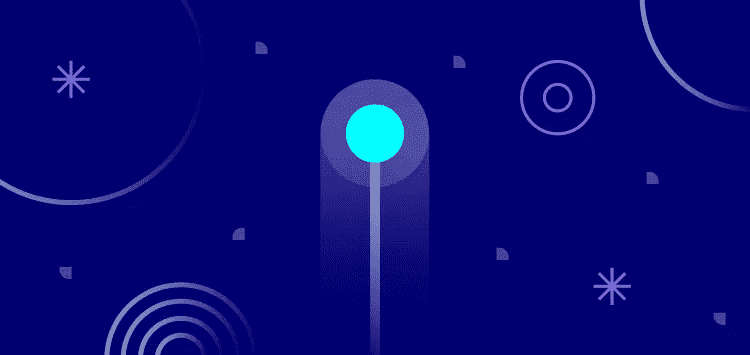
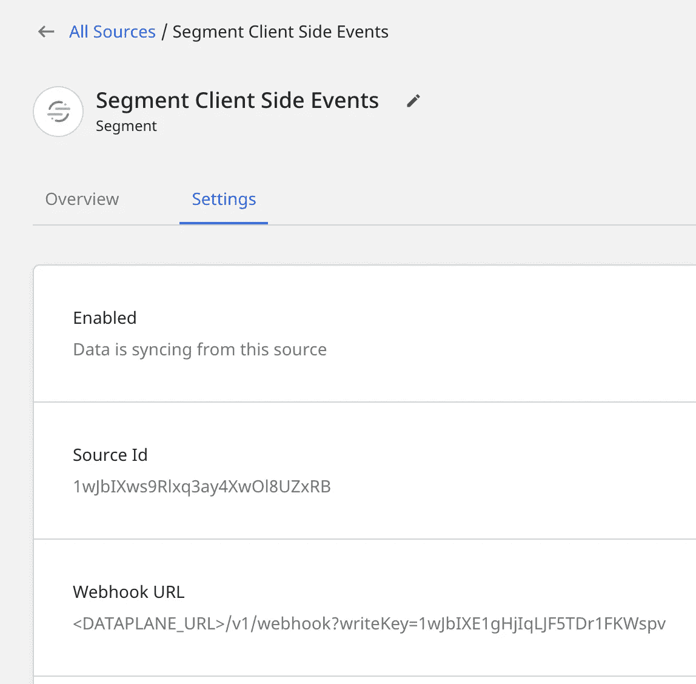
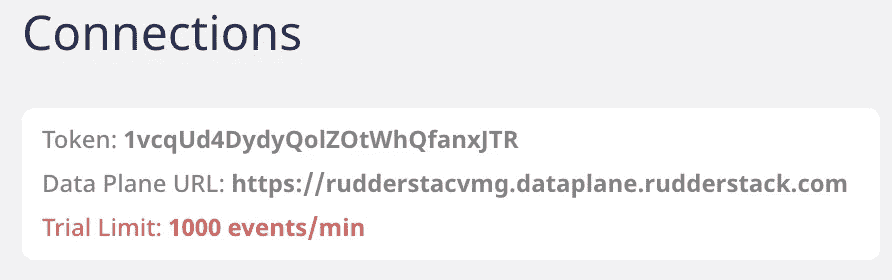

# 如何从分段迁移到方向舵堆栈

> 原文：<https://medium.com/geekculture/how-to-migrate-from-segment-to-rudderstack-142e3b45b0c3?source=collection_archive---------33----------------------->



# 为什么要从分段迁移到方向舵堆栈？

从表面上看，RudderStack 和 Segment 看起来非常相似。如果你已经经历了站起来的痛苦，你可能会后悔没有早点读这篇文章。但是，如果你还在犹豫为什么要从 Segment 转换到 RudderStack，这里有一些事情需要考虑:

# 基本面

RudderStack 是一个以开发人员为中心的 CDP，其特点是为使用您的数据仓库而构建的健壮的 API。底线是，我们不相信持有你的数据作为人质。要全面了解这些工具，请查看我们的[方向舵堆栈与分段功能对比](https://rudderstack.com/rudderstack-vs-segment)。

# 高级功能

我们为开发人员构建了 RudderStack，该产品包括许多高级功能，在我们开始讨论从细分市场切换有多容易之前，值得强调一下。

**转换:**您可以对实时事件流运行 JavaScript 函数，或者对静态数据运行 DBT 模型，然后将结果发送到整个堆栈。转换利用了标准的 Javascript 库，允许您用自己已经知道的健壮语言进行编码。

**数据治理 API:** 使用丰富的事件流元数据扩展 JSON 有效负载，并与现有的警报系统和 CI/CD 管道集成，然后将模式实施推回到系统中——所有这些都通过 API 完成。

**丰富的 Grafana 仪表板:**获得事件的实时视图，查看负载下的性能，并获得关于事件交付的丰富统计数据。

**平台灵活性:**您的地方还是我们的地方！除了我们的安全云选项之外，RudderStack 还提供专用的 VPC 以及开源(自己运行)版本。

# 价格

我们对 MTU 不收费。我们灵活的基于数量的定价是可预测的，旨在与您一起扩展。

# 仓库灵活性

这是你的数据。你可以在任何地方托管，我们会把数据带给你。

# 工程工作量最少且无数据丢失的交换机

既然我们已经说明了我们的情况，让我们带您了解一下从分段切换到方向舵堆栈的基础知识。如果你还没有，请在我们的网站上注册一个[免费托管实例。](https://app.rudderlabs.com/signup?type=freetrial)

# 步骤 1:设置方向舵堆栈

一旦您在 RudderStack 上设置了您的帐户，您就离迁移到 RudderStack 只有几步之遥了。我们在这里的目标是列出必要的步骤，用最小的改动将生成事件的插装代码从使用 Segment SDK 替换为 RudderStack SDK。

注意:你也可以查看我们关于如何在 RudderStack 中添加源和目的地的指南。

首先在舵栈[仪表盘](https://app.rudderlabs.com/signup?type=freetrial)上创建一个账户。与 Segment 类似，您将在这里创建源和目的地。这将帮助您创建必要的连接，以便事件数据从源流向目标。

RudderStack 需要一个数据平面来让事件流过。您可以在您的云计算环境中自行设置，也可以让我们在我们的 VPC 中托管。要自己设置，请查看[我们的安装指南](https://docs.rudderstack.com/administrators-guide/installing-and-setting-up-rudderstack)。

如果您喜欢让我们在 VPC 托管它，请在您的仪表板的连接页面上打开方向舵堆栈托管服务按钮开始使用它。‌

如果您需要更多支持或希望我们管理您的主机，请随时联系我们。

# 步骤 2:更新 SDK 实现

在这个例子中，我们将强调为您现有的网站添加 JavaScript SDK。对于 iOS 和 Android 示例代码，请参见我们关于从 Segment 迁移到 RudderStack 的文档:

```
<script>
	rudderanalytics = window.rudderanalytics = [];

	var methods = [
		"load",
		"page",
		"track",
		"identify",
		"reset"
	];
	for (var i=0; i<methods.length; i++) {
		var method = methods[i];
		rudderanalytics[method] = function(methodName) {
			return function() {
				rudderanalytics.push([methodName, ...arguments]);
			}
		} (method)
	}
	rudderanalytics.load(<YOUR_WRITE_KEY>, <DATA_PLANE_URI>);
	rudderanalytics.page();
</script>
<script src="https://cdn.rudderlabs.com/rudder-analytics.min.js"></script>
```

请注意对象的变化。与 Segment 的分析对象相比，我们使用 rudderanalytics 作为全局对象库。从现在开始，您可以按原样使用其余的代码，因为 RudderStack SDK 与 Segment 完全 API 兼容

剩下唯一要做的就是在 RudderStack 应用程序中创建你的目的地。对于一个快速的视频教程，请查看[在 5 分钟内使用方向舵堆栈发送数据](https://rudderstack.com/video-library/send-data-from-your-website-to-cloud-tools-in-less-than-5-minutes-with-rudderstack)

# 步骤 3:迁移(不迁移)您的仓库模式

从 Segment 切换到 RudderStack 的一个主要优点是能够将所有事件和用户数据存储在自己的仓库中。将数据仓库目的地从 Segment 迁移到 RudderStack 相当简单，因为 RudderStack 可以利用您已经创建的现有模式作为 Segment 中的存储目的地。这确保了在切换事件源时不会丢失任何历史数据。换句话说，您不必迁移数据！

根据您的源是以云模式还是以设备模式运行，以及您的源事件是从 web 客户端、服务器还是设备发送，我们具体如何处理迁移细分事件源涉及几个不同的选项。

**第一步:创建仓库目的地**

创建一个新的仓库目标，并将名称空间设置为与 Segment 正在写入的模式相同。RudderStack 然后将写入与 Segment 相同的一组表中。要获得特定仓库类型的帮助，请查看我们关于仓库目的地的文档。

**步骤 2:将服务器端源事件路由到方向舵堆栈**

我们建议首先从服务器端事件源开始。由于我们可以完全控制转换的时间，因此迁移这些源代码比在客户端上运行的源代码更简单，后者可能需要用户在触发方向舵绑定事件之前升级应用程序或清除缓存。

在 RudderStack 应用程序中，验证您的服务器端数据源是否连接到在步骤 1 中创建的数据仓库目的地。接下来，切换您的服务器端客户端以将您的事件数据路由到 RudderStack，不要担心，因为我们使用与 segment 相同的数据表，即使新的 RudderStack 事件正在流动，segment 中尚未处理的任何遗留事件也将继续加载到相同的表中。此外，因为分段服务器源事件只在云模式下运行，一旦切换到通过 RudderStack 发送数据，就没有必要继续运行分段连接。

**步骤 3:客户端事件—将段配置为舵栈源**



与服务器端事件不同，客户端事件可能在设备模式或云模式下运行，因此，您可能无法完全控制事件何时开始流经 RudderStack，尤其是对于 IOS 和 Android 客户端，这需要最终用户在更改发生之前升级他们的应用程序版本。为了适应这些情况，我们建议在 RudderStack 中创建一个段源，并将其指向您的数据仓库目的地。

然后在 Settings 选项卡上复制 Webhook URL，将`<DATAPLANE_URL>`替换为可以在 connections 屏幕顶部找到的数据层。



接下来，使用上面创建的 webhook url 在 Segment 中创建一个 Webhook 目的地。不需要额外的头值。将您的源连接到 webhook 目的地，RudderStack 将开始向您的仓库发送这些事件。

**此时，您将需要断开您的仓库目的地的分段。否则，将在您的数据仓库中创建重复的事件。**

# 步骤 4:从段回填匿名 id

当从网段迁移时，您可能已经有一些尚未识别的匿名流量。当 Segment 或 RudderStack 跟踪非标识用户事件时，两者都分配一个随机 UUID 作为 anonymousId。该 ID 用于跟踪未知用户，直到他们被识别，并允许我们将他们被识别前后的用户行为、旅程和首次接触归因缝合在一起。

为了避免重复这些先前分配的匿名用户，我们建议在 segment SDK 的 ready 回调中加载 RudderStack SDK 一段时间。通过在回调中加载 RudderStack，我们可以从段 cookie 中检索之前分配的 anonymousId，并在初始化 RudderStack SDK 时将相同的 anonymousId 分配给 RudderStack 用户。在我们将 SDK 重叠到足以确信我们的大部分 anonymousId 已经被回填之后，我们可以移除 Segment SDK 并开始只使用 RudderStack SDK。

用于并行加载 SDK 的代码片段如下所示:

```
<script type="text/javascript">
!function(){var e=window.rudderanalytics=window.rudderanalytics||[];e.methods=["load","page","track","identify","alias","group","ready","reset","getAnonymousId","setAnonymousId"],e.factory=function(t){return function(){var r=Array.prototype.slice.call(arguments);return r.unshift(t),e.push(r),e}};for(var t=0;t<e.methods.length;t++){var r=e.methods[t];e[r]=e.factory(r)}e.loadJS=function(e,t){var r=document.createElement("script");r.type="text/javascript",r.async=!0,r.src="https://cdn.rudderlabs.com/v1/rudder-analytics.min.js";var a=document.getElementsByTagName("script")[0];a.parentNode.insertBefore(r,a)}}()
!(function(){
// Create a queue, but don't obliterate an existing one!
var analtics = window.analytics = window.analytics || [];
// If the real analytics.js is already on the page return.
if (analytics.initialize) return;
// If the snippet was invoked already show an error.
if (analytics.invoked) {
if (window.console && console.error) {
console.error('Segment snippet included twice.');
}
return;
}
// Invoked flag, to make sure the snippet
// is never invoked twice.
analytics.invoked = true;
// A list of the methods in Analytics.js to stub.
analytics.methods = [
'trackSubmit',
'trackClick',
'trackLink',
'trackForm',
'pageview',
'identify',
'reset',
'group',
'track',
'ready',
'alias',
'debug',
'page',
'once',
'off',
'on',
'addSourceMiddleware',
'addIntegrationMiddleware',
'setAnonymousId',
'addDestinationMiddleware'
];
// Define a factory to create stubs. These are placeholders
// for methods in Analytics.js so that you never have to wait
// for it to load to actually record data. The `method` is
// stored as the first argument, so we can replay the data.
analytics.factory = function(method){
return function(){
var args = Array.prototype.slice.call(arguments);
args.unshift(method);
analytics.push(args);
return analytics;
};
};
// For each of our methods, generate a queueing stub.
for (var i = 0; i < analytics.methods.length; i++) {
var key = analytics.methods[i];
analytics[key] = analytics.factory(key);
}
// Define a method to load Analytics.js from our CDN,
// and that will be sure to only ever load it once.
analytics.load = function(key, options){
// Create an async script element based on your key.
var script = document.createElement('script');
script.type = 'text/javascript';
script.async = true;
script.src = 'https://cdn.segment.com/analytics.js/v1/'
+ key + '/analytics.min.js';
// Insert our script next to the first script element.
var first = document.getElementsByTagName('script')[0];
first.parentNode.insertBefore(script, first);
analytics._loadOptions = options;
};
// Add a version to keep track of what's in the wild.
analytics.SNIPPET_VERSION = '4.1.0';
// Load Analytics.js with your key, which will automatically
// load the tools you've enabled for your account. Boosh!
analytics.load("SEGMENT_WRITE_KEY");
// Make the first page call to load the integrations. If
// you'd like to manually name or tag the page, edit or
// move this call however you'd like.
analytics.page();
// analytics ready callback
analytics.ready(function() {
// INITIALIZE RUDDER SDK with setAnonymousId
window.rudderanalytics.unshift(["setAnonymousId", window.analytics.user().anonymousId()])
window.rudderanalytics.unshift(["load", "RudderStack_WRITE_KEY", "RudderStack_DATAPLANE_URL"])
window.rudderanalytics.page()
window.rudderanalytics.loadJS()
})})();
</script>
```

注意:在上面的例子中，您需要输入您的`SEGMENT_WRITE_KEY`、`RudderStack_WRITE_KEY`和`RudderStack_DATAPLANE_URL`。

# 高级选项

如果您利用了 Segment 的人物角色和用户特征特性，请继续关注本系列的第二部分和第三部分，在这两部分中，我们将详细介绍 RudderStack 如何支持身份解析、SQL 特征，以及如何使用 DBT 和 RudderStack 仓库操作来构建和分发定制受众！

# 准备好开始迁移了吗？

今天就免费注册来测试我们的事件流、ELT 和反向 ETL 管道。使用我们的 HTTP 源在不到 5 分钟的时间内发送数据，或者在您的网站或应用程序中安装我们 12 个 SDK 中的一个。[入门](https://app.rudderlabs.com/signup?type=freetrial)。

本博客最初发表于:
[https://rudder stack . com/blog/how-to-migrate-from-segment-to-rudder stack](https://rudderstack.com/blog/how-to-migrate-from-segment-to-rudderstack)