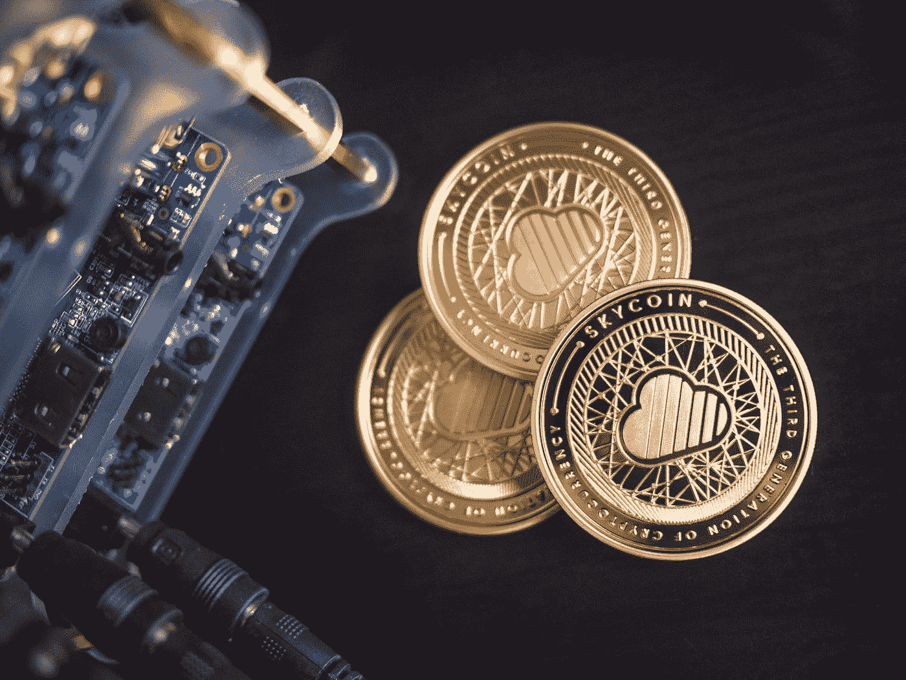

# 如何在树莓派上开采 Monero

> 原文：<https://medium.com/geekculture/how-to-mine-monero-on-the-raspberry-pi-fa9888916ed5?source=collection_archive---------0----------------------->

树莓派可以用来挖掘加密货币。但是能有多赚钱呢？

Photo by [Stanislaw Zarychta](https://unsplash.com/@stahooo?utm_source=medium&utm_medium=referral) on [Unsplash](https://unsplash.com?utm_source=medium&utm_medium=referral)

Raspberry Pi 可以用来开采加密货币，但是在 Pi 上开采能有多少利润呢？

在上一篇文章中，我尝试挖掘 Duino-Coin，结果是大约一年后我可以买一杯咖啡(但不是在星巴克):