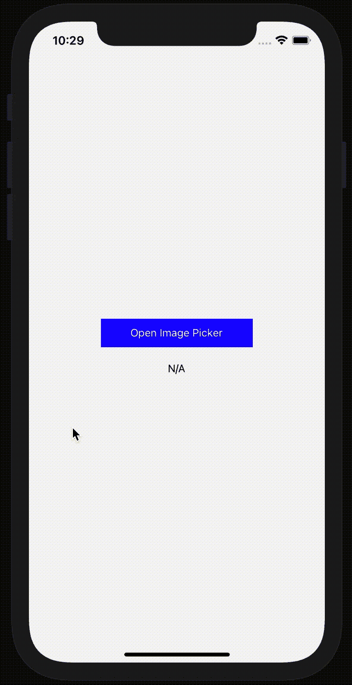

# 如何使用解毒来模仿反应原生图像拾取器

> 原文：<https://medium.com/geekculture/how-to-mock-react-native-image-picker-using-detox-9f7ced41b67f?source=collection_archive---------3----------------------->


当 React 原生项目开始增长时，建立端到端测试可能是明智的。你可以选择的解决方法之一是[排毒](https://github.com/wix/Detox)。

Detox 是测试你的应用程序 UI 的一个很好的工具，但是有些情况下你需要模拟你的应用程序的行为。这就是我们所说的模拟。

在我的例子中，我正在开发的应用程序使用了[react-native-image-picker](https://github.com/react-native-image-picker/react-native-image-picker)库，该库允许用户从他/她的手机中的文件中选取图像，或者用他/她的相机拍照。

通过点击应用程序的一个按钮，用户被重定向到他/她的手机的文件系统或图库来选择图像。然而，由于这种重定向到手机的系统，排毒不再有互动的可能性。呈现的电话视图(例如他/她的电话的图库)在应用程序的 UI 层次之外。



在我的情况下，我寻找一种方法来保持测试这一部分与排毒。似乎唯一可靠的方法是使用 react-native-image-picker 库的模拟。至少，模仿在项目中有用的功能。在花了几个小时研究这个主题后，我得出结论，关于这个主题的例子严重缺乏。这篇文章之后，至少会有一篇！

出于本文的目的，我创建了一个非常基本的 React 本机应用程序。
我已经设置了排毒配置，我想你已经在你的项目中设置好了。如果没有，我邀请你遵循这里的指示。你还应该有一个用 Xcode 构建的应用程序的调试版本。我的位于我的项目文件夹中，路径如下:**。/IOs/derived data/mockrnimagepickertox/Build/Products/Debug-iphone simulator/mockrnimagepickertox . app**

```
//app.jsimport React, {useState} from 'react';
import {
  SafeAreaView,
  StatusBar,
  TouchableOpacity,
  useColorScheme,
  Text,
  StyleSheet,
} from 'react-native';
import {Colors} from 'react-native/Libraries/NewAppScreen';
import launchImageLibrary from './ImagePickerProvider';const App = () => {
  const [fileName, setFileName] = useState('N/A');const isDarkMode = useColorScheme() === 'dark';
  const backgroundStyle = {
    backgroundColor: isDarkMode ? Colors.darker : Colors.lighter,
  };const options = {
    mediaType: 'photo',
    includeBase64: true,
  };return (
    <SafeAreaView style={[styles.container, backgroundStyle]}>
      <StatusBar barStyle={isDarkMode ? 'light-content' : 'dark-content'} /> <TouchableOpacity
        testID="button"
        style={styles.button}
        onPress={() =>
          launchImageLibrary(options, res => {
            setFileName(res.fileName ?? 'N/A');
          })
        }>
        <Text style={styles.buttonText}>Open Image Picker</Text>
      </TouchableOpacity>
      <Text style={styles.text}>{fileName}</Text>
    </SafeAreaView>
  );
};export default App;const styles = StyleSheet.create({
  container: {
    flex: 1,
    justifyContent: 'center',
    alignItems: 'center',
  },
  button: {
    backgroundColor: '#0000FF',
    justifyContent: 'center',
    alignItems: 'center',
    width: 200,
    padding: 10,
  },
  buttonText: {
    color: '#FFFFFF',
  },
  text: {
    marginTop: 20,
  },
});
```

正如你所看到的，我们没有直接从 react-native-image-picker 库中导入 **launchImageLibrary** 函数，而是从我们为此专门创建的提供程序中导入。在接下来的几行中你会明白为什么。

```
//ImagePickerProvider.jsimport {launchImageLibrary} from 'react-native-image-picker';
export default launchImageLibrary;
```

您将得到预期的结果(见上面的 gif)，即被执行的 react-native-image-picker 的 **launchImageLibrary** 函数。当您想要测试应用程序时，您将不能在这个内部函数被执行后执行操作，因为您将离开应用程序的 UI。这就是为什么我们定义了一个只在我们的 e2e 测试中使用的提供者:**image picker provider . e2e . js**

```
//ImagePickerProvider.e2e.jsconst mockImageData = 'YOUR_BASE_64_FILE';function launchImageLibrary(options, callback) {
  if (typeof options === 'function') {
    callback = options;
  } callback({data: mockImageData, fileName: 'Your base 64 file'});
}
export default launchImageLibrary;
```

这就是事情变得有趣的地方，因为在这个文件中，我们模拟了 **launchImageLibrary** 函数的行为。这个函数的预期响应将是一个 b64 字符串(数据)和一个文件名(文件名)。你可以根据你的需要添加这个回调的参数，显然保持精确到[库](https://github.com/react-native-image-picker/react-native-image-picker#the-response-object)的初始函数。

我们需要设置 React Native Metro 知道当我们运行 e2e 测试时，需要导入到 **app.js** 中的 **launchImageLibrary** 函数必须来自**image picker provider . e2e . js**(不是。js)。为此，只需在 **metro.config.js** 文件中添加以下元素。

```
//metro.config.jsconst defaultSourceExts = require('metro-config/src/defaults/defaults').sourceExts;module.exports = {
  resolver: {
    sourceExts: process.env.RN_SRC_EXT
      ? process.env.RN_SRC_EXT.split(',').concat(defaultSourceExts)
      : defaultSourceExts,
  },
  transformer: {
    getTransformOptions: async () => ({
      transform: {
        experimentalImportSupport: false,
        inlineRequires: true,
      },
    }),
  },
};
```

最后，当我们想要运行 e2e 排毒测试时，我们将使用以下命令启动 React Native Metro:

**RN _ SRC _ EXT = e2e . js react-native start**

**launchImageLibrary** 函数将根据需要由**image picker provider . e2e . js**提供。这张 gif 图向你展示了这次成功模仿的结果。

**资源:**

*   [排毒嘲讽指南](https://github.com/wix/Detox/blob/master/docs/Guide.Mocking.md)
*   [react-native-image-picker](https://github.com/react-native-image-picker/react-native-image-picker)库
*   [堆栈溢出线程](https://stackoverflow.com/a/55151119)

编码快乐！