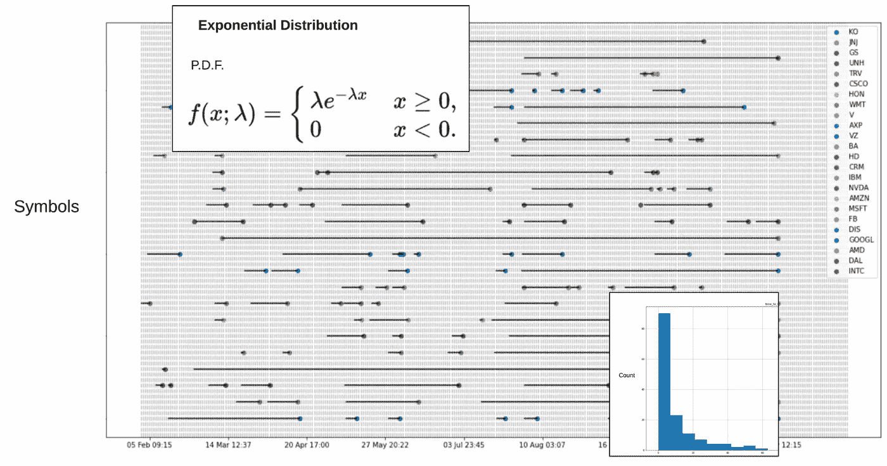

# 如何使用指数、伽玛和泊松分布对事件之间的时间建模

> 原文：<https://medium.com/geekculture/how-to-model-time-between-events-using-the-exponential-gamma-and-poisson-distributions-4b058a357a55?source=collection_archive---------12----------------------->

## 如何使用指数族在真实数据上对事件发生时间和“事件之间的时间”建模，以优化时间驱动投资的回报。

Screenshots from within the article.

# 介绍