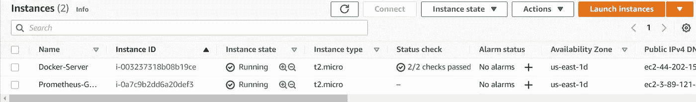
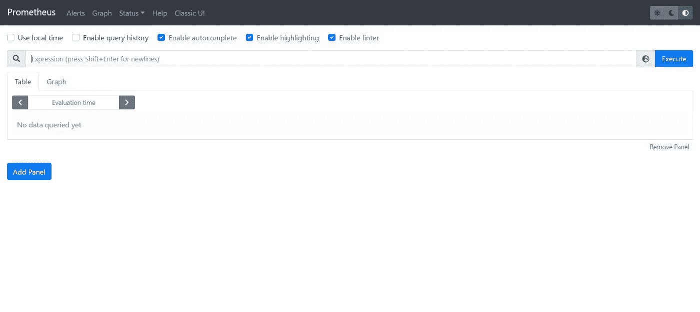
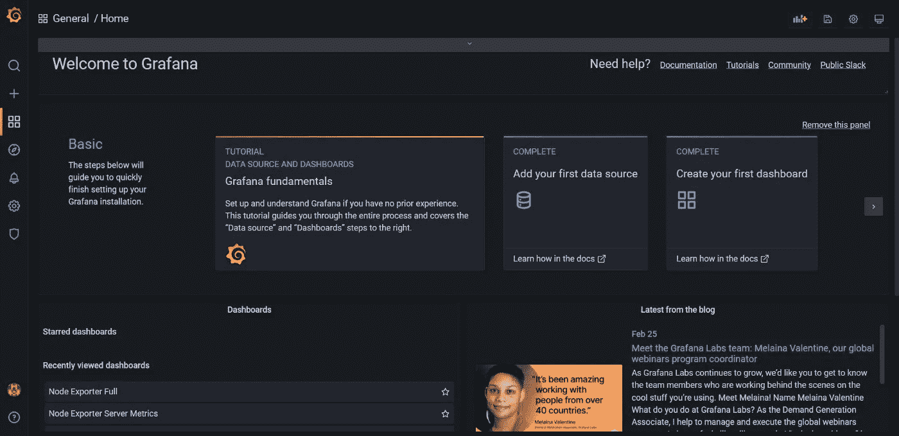
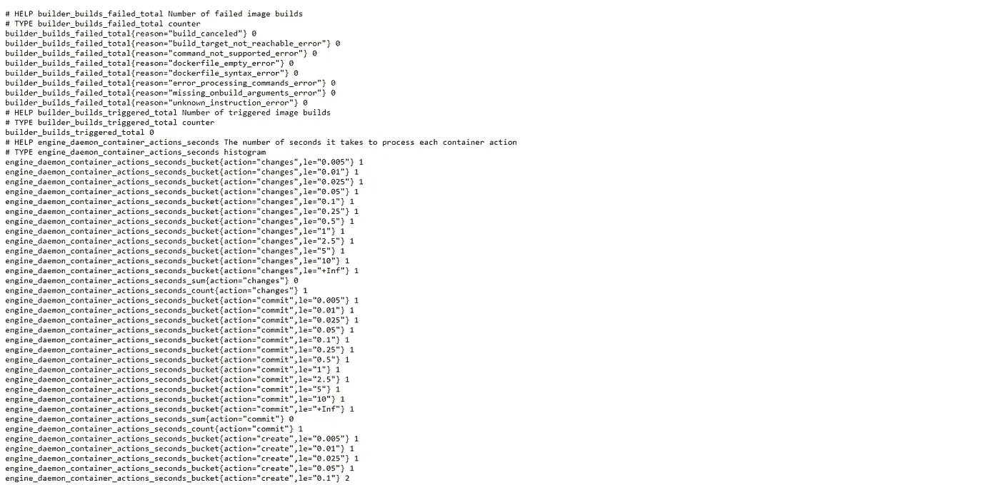
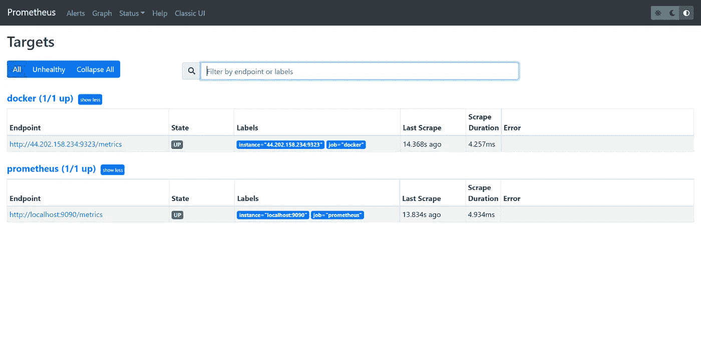
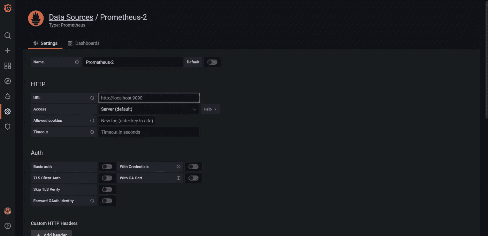
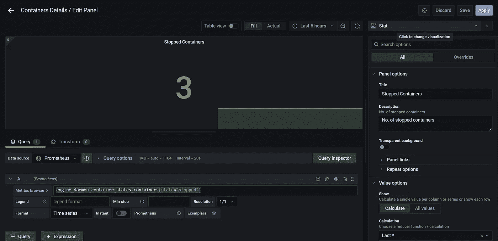
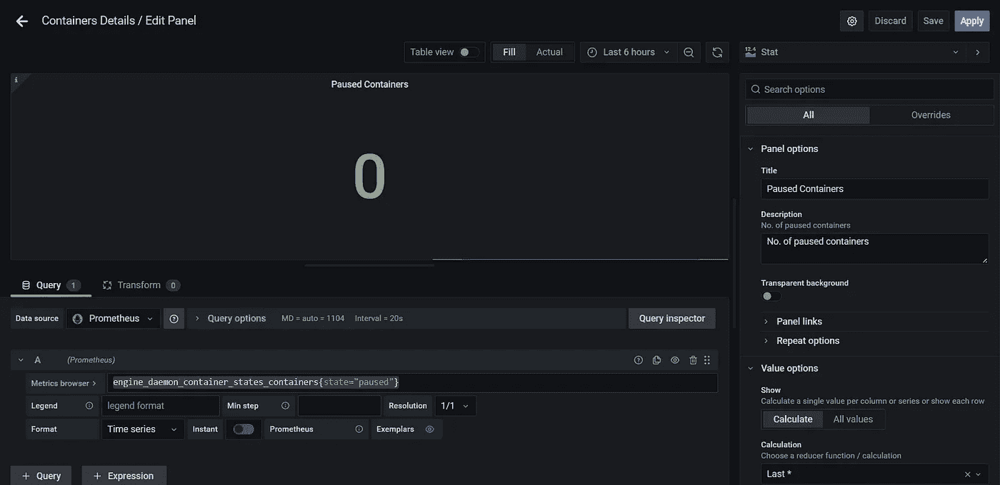
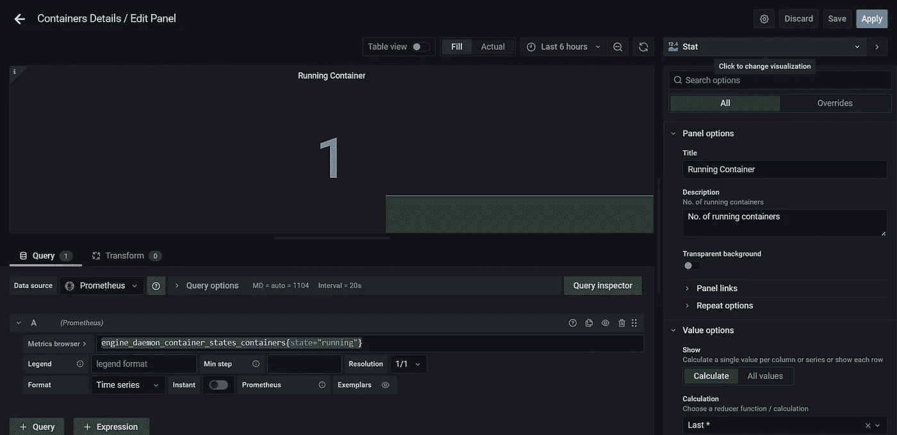
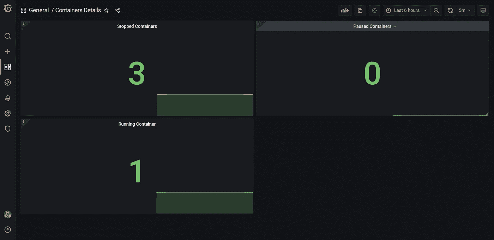

# 如何使用 Prometheus & Grafana 监控 Docker 指标？

> 原文：<https://medium.com/geekculture/how-to-monitor-docker-metrics-using-prometheus-grafana-707b970f1f06?source=collection_archive---------1----------------------->

**普罗米修斯是什么？** Prometheus 是一款开源监控工具，主要用于指标监控、事件监控、告警配置等。Prometheus 设计用于监控目标、服务器、数据库、独立虚拟机等。Prometheus 使用一种叫做**“PromQL”的强大查询语言。**


Prometheus Logo

**普罗米修斯配置文件和组件:**

*   **prometheus.yml:-** 这是 prometheus 的配置文件，我们可以在其中对 Prometheus 的配置进行所有更改。
*   **Promtool:-** 它是用于验证 Prometheus 配置的命令行实用工具。
*   **PromQL:-** 它是 Prometheus 使用的强查询语言。

**Grafana 是什么？Grafana 是一个免费的开源可视化工具，它为特定的数据源提供了各种仪表板、图表、图形和警告。Grafana 允许我们查询、可视化、探索指标并为数据源设置警报。我们还可以创建自己的动态仪表板进行可视化和监控。我们可以保存仪表板，并与其他成员共享。我们还可以导入外部仪表板。**


Grafana Logo

在本教程中，我们将使用 **Prometheus** 和 **Grafana** 监控各种 docker 指标


Docker metrics monitoring with Prometheus & Grafana

**先决条件:-**

*   **普罗米修斯** & **格拉夫纳**的基本概况
*   AWS 帐户
*   一个安装了 **Docker** 和一些**容器**的服务器

现在，让我们开始配置项目。

**步骤 1:-创建服务器**

*   在本教程中，我已经创建了 Ubuntu 20.04 AMI 的服务器
*   在 **AWS** 中创建 **Ubuntu 20.04** 服务器。在这个服务器中，我们将安装普罗米修斯
*   对于 **Prometheus & Grafana** 服务器，我们需要为 SSH 打开**9090**&**3000**port&port**22**



Servers

**步骤 2:-安装普罗米修斯**

*   从这个 [**链接**下载 Prometheus 并安装在服务器上。](https://prometheus.io/download/#node_exporter)
*   为了启动普罗米修斯，我们需要在普罗米修斯目录中运行`./prometheus`
*   我们可以在 **<公共 IP:9090 >** 查看**普罗米修斯**的 UI



Prometheus UI

**步骤 3:-安装 Grafana**

*   从这个 [**链接**](https://prometheus.io/download/#node_exporter) 下载 Grafana 并安装在我们安装 Prometheus 的同一台服务器上
*   为了启动 Grafana，我们需要从 Grafana 目录运行`./bin/grafana-server`命令
*   当你第一次打开 Grafana 的用户界面时，它会要求输入用户名和密码。默认用户名和密码是 **admin。**您可以稍后更改密码
*   我们可以在 **<公共 IP: 3000 >** 查看 Grafana 的 UI



Grafana UI

**步骤 4:-修改 daemon.json 文件**

*   为了让 Prometheus 收集 docker 的指标，我们需要在 docker 服务器的`/etc/docker/daemon.json`文件中添加下面的节。

```
{
  "metrics-addr" : "127.0.0.1:9323",
  "experimental" : true
}
```

*   **9323** 是普罗米修斯收集指标的端口
*   添加完上面的部分后，我们需要使用下面的命令重启 docker

```
systemctl restart docker
```

*   我们可以在 **<公共 IP:9393/metrics >** 查看不同的指标



Metrics

*   如果上面的设置不起作用，那么我们也可以在`daemon.json`文件中添加下面的部分。

```
{
  "metrics-addr" : "0.0.0.1:9323",
  "experimental" : true
}
```

**步骤 5:-修改普罗米修斯的配置文件**

*   Prometheus 管理名为 **prometheus.yml** 的配置文件，我们可以在其中定义各种配置，如**警报、scrape_configs** 等。
*   为了让 Prometheus 收集 Docker 节点的指标，我们需要在 **scrape_configs** 节下的 **prometheus.yml** 中定义以下代码

```
- job_name: "Docker Job"
  static_configs:
    - targets: ["<Public IP of Docker Node:9323"]
```

*   添加代码后，我们可以在 Prometheus 中将我们的节点作为目标进行检查。Prometheus 需要一些时间来收集所有指标并显示节点到 **Up** 的状态。



Targets

**步骤 6:-在 Grafana 中添加数据源**

*   现在，在 Grafana 中，我们需要添加 Prometheus 作为数据源
*   之后，在的 URL 部分我们需要输入 Prometheus 服务器的 IP 地址和 **9090** 端口



Data Sources

**第 7 步:-创建仪表板**

*   在 Grafana 中，我们可以根据需要创建各种仪表板。
*   因此，在本教程中，我们将创建一个包含 3 个面板的仪表板。
*   第一个面板将显示**运行容器**的数量，第二个面板将显示**暂停容器**的数量，最后一个面板将显示**停止容器**的数量。
*   点击**创建** - >添加**面板**
*   在“指标浏览器”部分，在下面添加查询。以下查询将获取**停止集装箱**的数量。

```
engine_daemon_container_states_containers{state="stopped"}
```

*   您可以将可视化更改为**状态**



Stopped Containers

*   点击**添加面板**添加第二个面板
*   在“指标浏览器”部分，在下面添加查询。以下查询将获取**暂停集装箱**的数量

```
engine_daemon_container_states_containers{state="paused"}
```



Paused containers

*   点击**添加面板**添加第二个面板
*   在“指标浏览器”部分，在下面添加查询。下面的查询将获取正在运行的容器**的数量**

```
engine_daemon_container_states_containers{state="running"}
```



Running Containers

*   单击“保存仪表板”按钮保存仪表板，并为其选择一个名称
*   仪表板的最终结果将如下所示:



Dashboard

*   您可以更改仪表板自动加载的时间频率。在我的例子中，我将它设置为 5m。

就是这样。您已经学习了如何使用 **Prometheus** 和 **Grafana** 监控 Docker 指标。

你可以通过访问下面的网址来探索更多关于普罗米修斯和格拉夫纳的信息。

*   [https://prometheus.io/docs/introduction/overview/](https://prometheus.io/docs/introduction/overview/)
*   [https://grafana.com/](https://grafana.com/)

如果您发现此指南有帮助，请点击👏按钮，也可以随意发表评论。

关注更多类似的故事😊