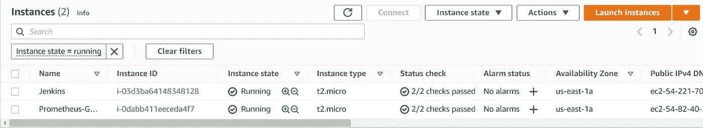
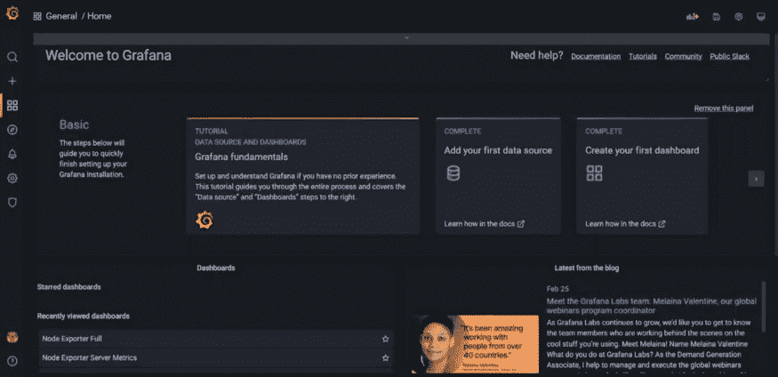
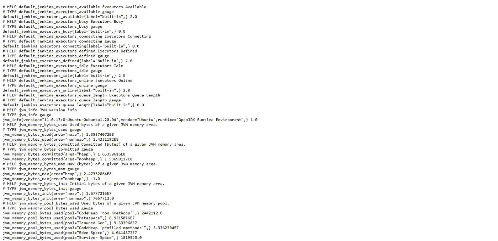
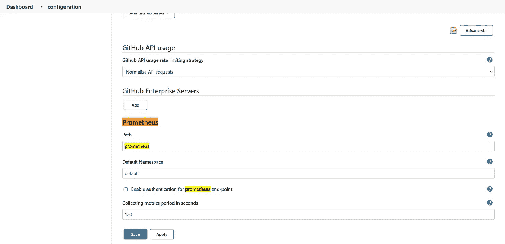
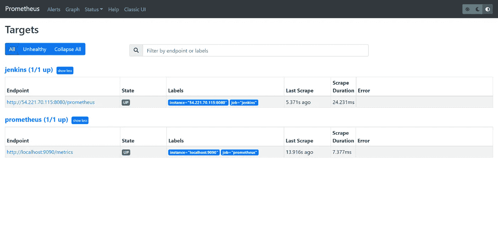
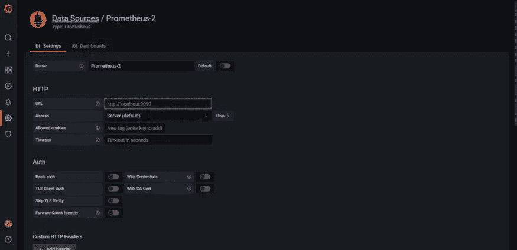
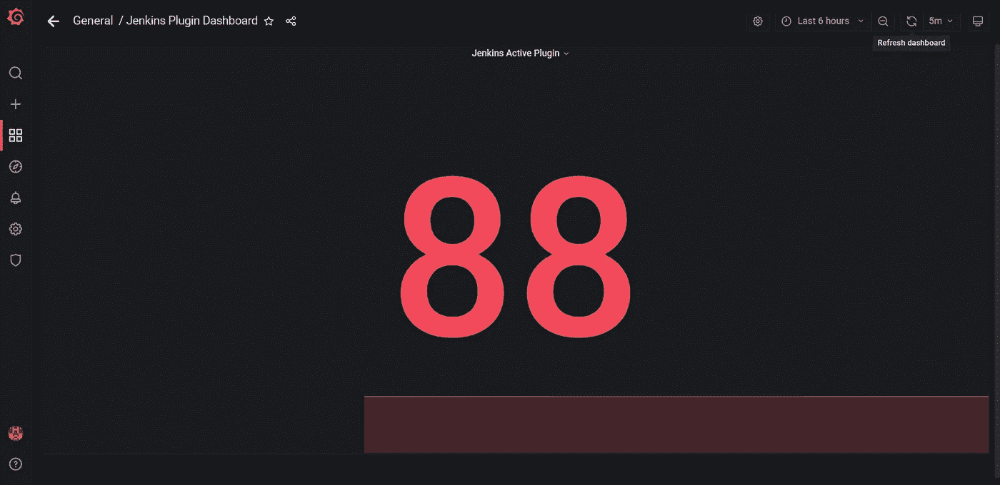
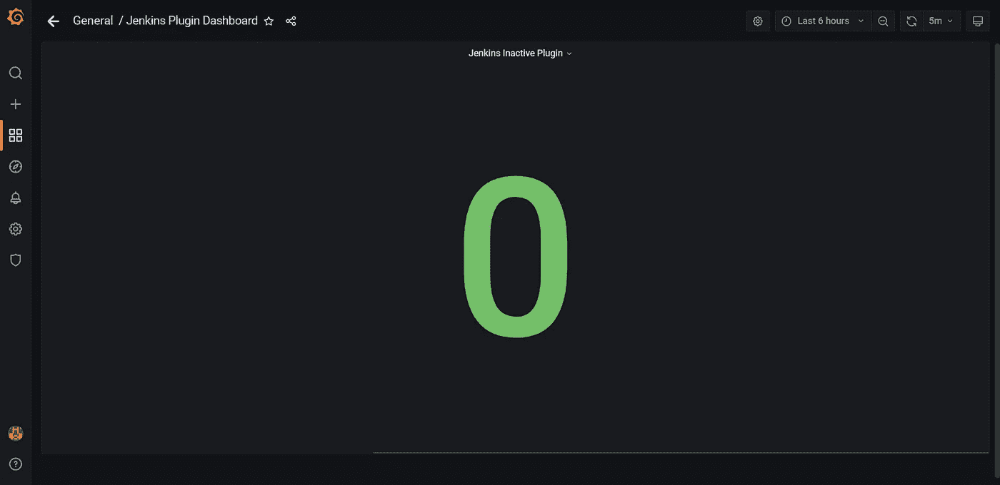
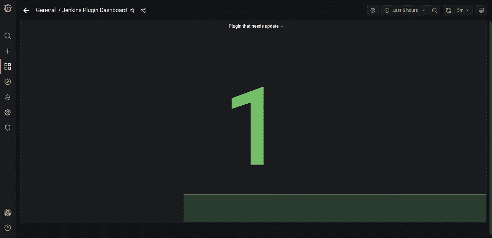
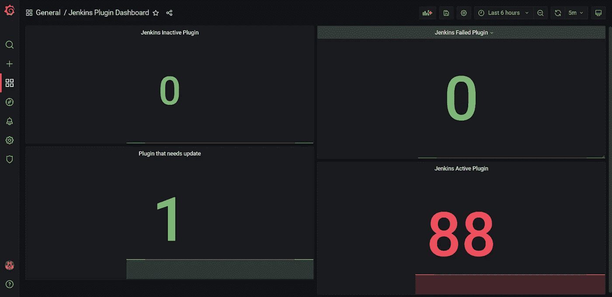

# 如何使用 Prometheus & Grafana 监控 Jenkins 指标？

> 原文：<https://medium.com/geekculture/how-to-monitor-jenkins-metrics-using-prometheus-grafana-5901a6bcb789?source=collection_archive---------1----------------------->

**普罗米修斯是什么？** Prometheus 是一款开源监控工具，主要用于指标监控、事件监控、告警配置等。Prometheus 设计用于监控目标、服务器、数据库、独立虚拟机等。Prometheus 使用一种叫做**“PromQL”的强大查询语言。**


Prometheus Logo

**普罗米修斯配置文件和组件:**

*   **prometheus.yml:-** 这是 prometheus 的配置文件，我们可以在其中对 Prometheus 的配置进行所有更改。
*   **Promtool:-** 它是用于验证 Prometheus 配置的命令行实用工具。
*   **PromQL:-** 它是 Prometheus 使用的强查询语言。

**Grafana 是什么？Grafana 是一个免费的开源可视化工具，它为特定的数据源提供了各种仪表板、图表、图形和警告。Grafana 允许我们查询、可视化、探索指标并为数据源设置警报。我们还可以创建自己的动态仪表板进行可视化和监控。我们可以保存仪表板，并与其他成员共享。我们还可以导入外部仪表板。**


Grafana Logo

在本教程中，我们将使用 **Prometheus** 和**Grafana**来监控各种 **Jenkins** 指标，并在 Grafana 中创建仪表板


Jenkins + Prometheus + Grafana

**先决条件:-**

*   **普罗米修斯** & **格拉夫纳**的基本概况
*   AWS 帐户
*   安装了**詹金斯**的服务器

**步骤 1:-创建服务器**

*   在本教程中，我已经创建了 Ubuntu 20.04 AMI 的服务器
*   在 **AWS** 中创建 **Ubuntu 20.04** 服务器。在这个服务器中，我们将安装普罗米修斯
*   对于 **Prometheus & Grafana** 服务器，我们需要为 SSH 打开**9090**&**3000**port&port**22**



Servers

**步骤 2:-安装普罗米修斯**

*   从这个 [**链接**下载 Prometheus 并安装在服务器上。](https://prometheus.io/download/#node_exporter)
*   为了启动普罗米修斯，我们需要在普罗米修斯目录中运行`./prometheus`
*   我们可以在 **<公共 IP:9090 >** 查看**普罗米修斯**的 UI


Prometheus UI

**步骤 3:-安装 Grafana**

*   从这个 [**链接**](https://prometheus.io/download/#node_exporter) 下载 Grafana 并安装在我们安装 Prometheus 的同一台服务器上
*   为了启动 Grafana，我们需要从 Grafana 目录运行`./bin/grafana-server`命令
*   当你第一次打开 Grafana 的用户界面时，它会要求输入用户名和密码。默认用户名和密码是 **admin。**您可以在以后更改密码
*   我们可以在 **<公共 IP: 3000 >** 查看 Grafana 的 UI



Grafana UI

**步骤 4:-在 Jenkins 中安装 Prometheus 插件**

*   我们需要在 Jenkins 中安装 Prometheus 的插件，这样 Prometheus 就可以收集 Jenkins 的所有指标
*   在 Jenkins 中，点击管理插件，搜索 **Prometheus metrics 插件**，然后点击安装


Prometheus Metrics Plugin

*   Jenkins 指标的默认路径是**<Public-IP:8080/Prometheus>**



Jenkins Metrics

*   我们还可以更改 Jenkins 指标的默认路径。点击**管理詹金斯- >配置系统- >搜索普罗米修斯**并更改路径。



Default Path

**步骤 5:-修改普罗米修斯的配置文件**

*   Prometheus 管理名为 **prometheus.yml** 的配置文件，我们可以在其中定义各种配置，如 **alerts、scrape_configs** 等。
*   为了让 Prometheus 收集 Docker 节点的指标，我们需要在 **scrape_configs** 节下的 **prometheus.yml** 中定义以下代码

```
- job_name: "Jenkins Job"
  static_configs:
    - targets: ["<Public IP of Jenkins Node:8080"]
```

*   添加代码后，我们可以在 Prometheus 中将我们的节点作为目标进行检查。Prometheus 需要一些时间来收集所有指标并显示节点到**到**的状态。



Targets

**步骤 6:-在 Grafana 中添加数据源**

*   现在，在 Grafana 中，我们需要添加 Prometheus 作为数据源
*   之后，在的 URL 部分我们需要输入 Prometheus 服务器的 IP 地址和 **9090** 端口



Data Source

**第 7 步:-创建仪表板**

*   在 Grafana 中，我们可以根据需要创建各种仪表板
*   因此，在本教程中，我们将创建一个包含 4 个面板的仪表板
*   第一个面板将显示**活动插件数量，**第二个面板将显示**需要更新的插件数量，**第三个面板将显示**非活动插件数量，**最后一个面板将显示**失败插件数量。**
*   点击**创建** - >添加**面板**
*   在“指标浏览器”部分，在下面添加查询。以下查询将获取**个活动插件**的数量

```
jenkins_plugins_active{}
```



Active Plugins

*   您可以将可视化更改为**状态**
*   点击**添加面板**添加第二个面板
*   在“指标浏览器”部分，在下面添加查询。以下查询将获取**非活动插件**的数量

```
jenkins_plugins_inactive{}
```



Inactive Plugins

*   点击**添加面板**添加第三个面板
*   在“指标浏览器”部分，在下面添加查询。以下查询将获取**失败插件**的数量

```
jenkins_plugins_failed{}
```


Failed Plugins

*   在“指标浏览器”部分，在下面添加查询。以下查询将获取需要更新的**插件的数量**

```
jenkins_plugins_withUpdate{}
```



Update required Plugins

*   单击“保存仪表板”按钮保存仪表板，并为其选择一个名称
*   仪表板的最终结果将如下所示:



Dashboard

*   您可以更改仪表板自动加载的时间频率。在我的例子中，我将它设置为 5m。
*   就是这样。你已经学会了如何使用 **Prometheus** 和 **Grafana** 监控 Jenkins 指标。

你可以通过访问下面的网址来探索更多关于普罗米修斯和 T21 的信息。

*   [https://prometheus.io/docs/introduction/overview/](https://prometheus.io/docs/introduction/overview/)
*   [https://grafana.com/](https://grafana.com/)

如果您发现此指南有帮助，请点击👏按钮，也可以随意发表评论。

关注更多类似的故事😊