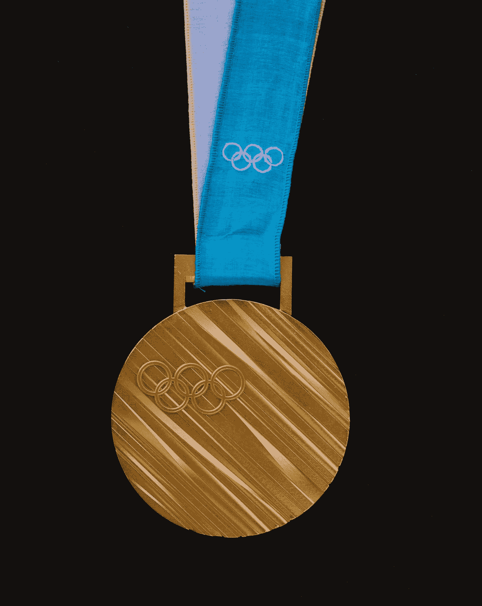

# 如何培养国家冠军

> 原文：<https://medium.com/geekculture/how-to-nurture-national-champions-7168215a00a1?source=collection_archive---------61----------------------->

Photo by Charles Deluvio on Unsplash

美国有很多东西。这就是美国的一部分:不团结。自殖民主义开始以来，我们一直是多样化的，争吵不休，脾气暴躁，为了不被孤立，我们几乎不能团结在一起。这个特点让我们既可爱又可气。

早期殖民者一次又一次地愚弄了美洲原住民，莫名其妙地伸出友谊之手，然后…