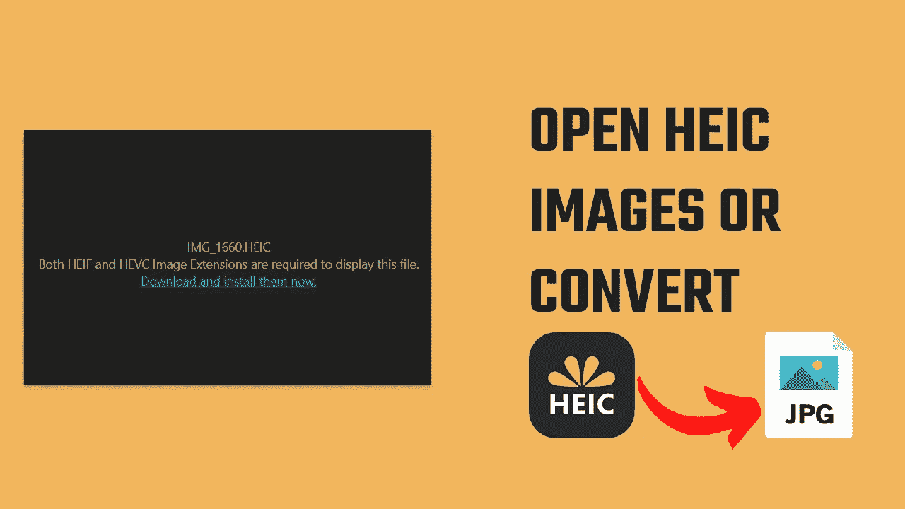

# 如何在 Windows 上打开 HEIC 图像文件并将其转换为 JPG 格式？

> 原文：<https://medium.com/geekculture/how-to-open-heic-image-files-convert-them-to-jpg-format-on-windows-4c5a981b02e2?source=collection_archive---------9----------------------->

微软以前的免费扩展不再可用

正如你所知，Windows 不能打开 HEIC 图像文件，相反，它要求我们下载一个扩展，这大约需要 1 美元来查看 HEIC 图像。当然，支付一美元可以解决一切，但在本文中，我们将讨论如何使用替代软件来查看…