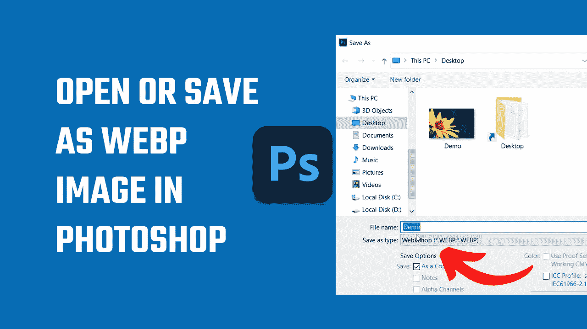

# 如何在 photoshop 中打开或保存为 webp 图片文件？2022

> 原文：<https://medium.com/geekculture/how-to-open-or-save-as-webp-image-files-in-photoshop-2022-f681dc5ad691?source=collection_archive---------2----------------------->

然后，您可以将其编辑或保存为 jpg、png 或任何其他格式。

默认情况下，photoshop 不接受 WebP 图像，也就是说，您不能在 Photoshop 上编辑或打开 WebP 图像。然而，通过使用一个简单免费的 Photoshop 插件，你将能够以 WebP 格式导入或保存图像。然后，您可以在 photoshop 中打开任何 WebP 图像，并将其保存为其他格式(jpg…