# 如何组织您的数据科学项目文件

> 原文：<https://medium.com/geekculture/how-to-organize-a-data-science-project-directory-aa4d7c9f6156?source=collection_archive---------8----------------------->

## 让它们看起来更好看，更容易导航和搜索

Photo by [Viktor Talashuk](https://unsplash.com/@viktortalashuk?utm_source=medium&utm_medium=referral) on [Unsplash](https://unsplash.com?utm_source=medium&utm_medium=referral)

对于数据科学的初学者来说，以有序的方式组织他们的项目文件可能很难。组织良好的数据科学项目目录不仅有助于搜索和浏览内容，还能增加读者的视觉吸引力。

本文将帮助您以有意义和有序的方式构建您的数据科学项目文件，并使它们在您的个人资料中更具代表性。这将有助于你的招聘人员和其他感兴趣的人访问你的内容，并容易理解你的项目。

不仅如此，这还会让它们在你的 GitHub repos 中也能看得见。

那么，事不宜迟，让我们开始吧。

# 创建项目目录

我们将从创建主项目目录开始。在这个目录中，我们将创建子目录以有序的方式存储我们的项目文件。

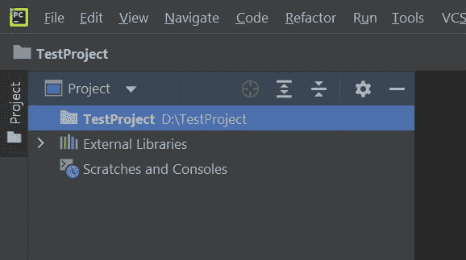

Creating project directory (image by [author](/@retinpkumar))

一旦进入您的项目目录，我们将开始创建我们的主要应用程序文件。最好总是从你的主应用程序文件开始，这样你就有了一个初始的参考点，如果需要的话，你可以用它来修改目录结构。

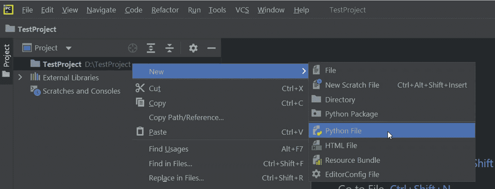

Creating new python file (image by [author](/@retinpkumar))

您可以给主应用程序文件取任何名称。(通常取决于您打算部署的平台)。但是，目前我们将把它命名为“app.py”

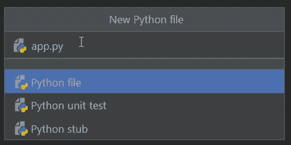

Creating main app file (image by [author](/@retinpkumar))

一旦你完成了主应用程序文件的创建，现在让我们继续创建子目录。

# 创建子目录

现在，我们必须在保存主文件“app.py”的主目录中创建子目录。

Creating sub-directories (image by [author](/@retinpkumar))

## 用于存放您的工具

让我们创建一个**“utils”**目录来存储我们的实用程序，包括定制模块、单元测试和日志模块。

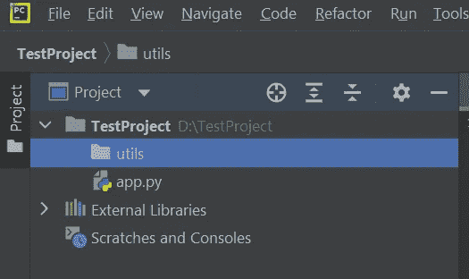

Creating utils folder (image by [author](/@retinpkumar))

正如我提到的，在创建了**“utils”**目录之后，现在创建如下单独的目录:

**1。创建一个“application_logger”来存储您的自定义“app_logger.py”模块。**

在 application_logger 中，您可以创建自定义的日志文件。

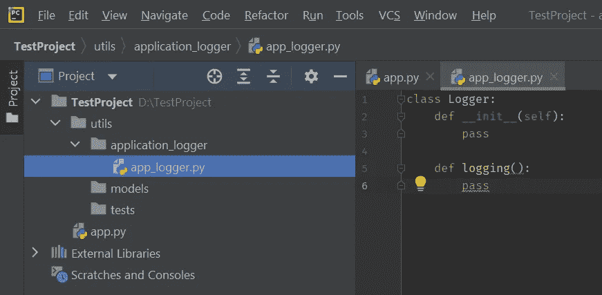

Creating an imaginary logger file (image by [author](/@retinpkumar))

**2。创建一个“模型”目录，用于存储有助于处理数据的定制模块。**

现在回到**【utils】**目录。

在**“models”**目录中，您可以保存自己的 python 模块，包含数据处理、主模型等功能。

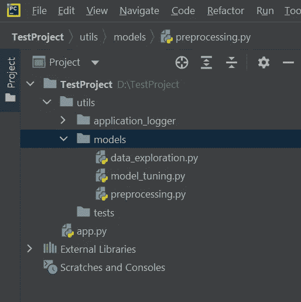

Creating a sub-directory for models (image by [author](/@retinpkumar))

**3。创建一个“tests”目录来存储您的定制单元测试模块。**

在**“tests”**目录中，创建一个 **test_app** 文件来存储您的单元测试。

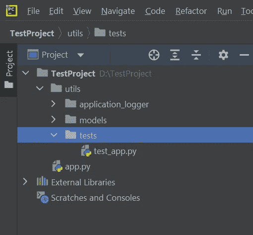

Creating a sub-directory for testing (image by [author](/@retinpkumar))

现在，您已经创建好了“**utils”**子目录，您的项目目录应该如下所示。

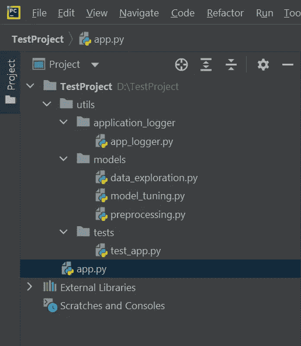

Creating utils completed (image by [author](/@retinpkumar))

## 用于存储您保存的文件

现在让我们创建一个目录来存储您保存的文件。

创建一个“**data”**目录，用于存储您的训练和测试数据。

根据您的训练和验证数据，现在应该是这样的。

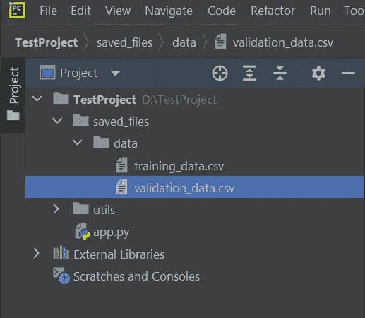

Creating directories for storing saved files (image by [author](/@retinpkumar))

现在回到“**保存的 _ 文件”**目录，并在其中创建子目录来存储你的**图像**和**图。**

另外，创建另一个名为**“log files”**的目录来存储您的日志文件。注意，“**log files”**目录中的文件只是示例文件。根据您的要求创建您自己的自定义日志文件。

完成后，它应该看起来像这样。

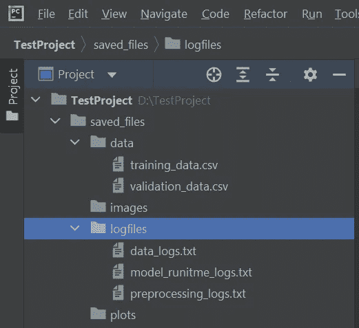

Creating logfiles sub-directory (image by [author](/@retinpkumar))

另外，不要忘记添加您的" **requirements.txt"** 文件。但是这个可以和你的主 app.py 文件放在一起。

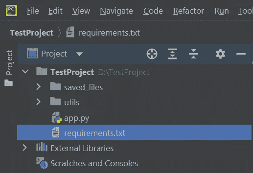

Creating requirements.txt (image by [author](/@retinpkumar))

现在我们已经完成了项目目录的组织，它看起来应该是这样的，尽管命名目录和文件可以根据您的喜好来完成。

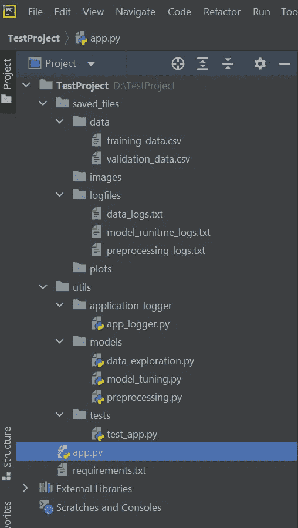

Final completed structure (image by [author](/@retinpkumar))

恭喜，如果你坚持到了最后...

既然你已经知道了如何有序地组织你的项目，你现在可以用一种结构优美的方式用你独特的项目想法给你的同事留下深刻印象。

希望你喜欢这篇文章。[关注我](/@retinpkumar)了解更多可行的内容，并随时提出您的宝贵反馈和建议。