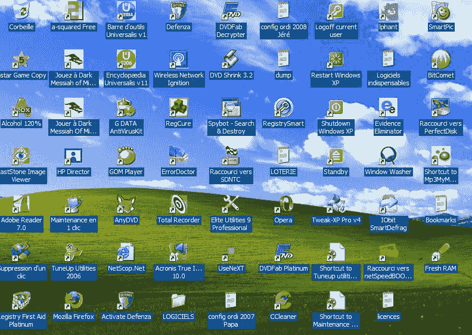
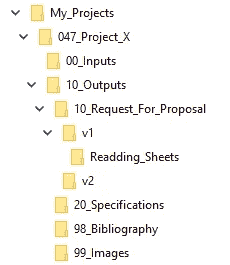
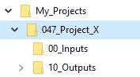
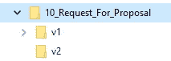

# 如何组织你的项目文档(命名约定，存储位置，顺序…没有软件，只有方法)

> 原文：<https://medium.com/geekculture/how-to-organize-your-project-documentation-naming-convention-storage-location-order-no-3d4e59a16a20?source=collection_archive---------30----------------------->

“是啊，看看规格就知道了……它们在共享驱动器上，或者在你的邮件里。并且文档的标题是…规范 _ v1.1 _ 草稿(3)。doc”。
哇哇听起来不太妙。不可靠的版本位于几个副本中的某个地方…要解决这个问题，你只需要几个管理规则和非常简单的方法。让我们一起来看看它们是什么…

## 词汇

在继续之前，让我们检查一下本文中提到的一些概念的定义:

**提案请求** (RFQ)
这是客户列出描述其需求的所有要求的文档。

**同行评审**
这是由具有相似技能的人进行的评审，他们能够验证技术内容。

# 永远不要从零开始

你很少第一次做某事。你上一次第一次做某事是什么时候？

所以尽可能避免从空白页开始你的文档。你是否已经为之前的项目写过这样的文档？或者更好的是，有没有一个文档可以重用其中的内容？

如果其中一个问题的答案是肯定的，那么找到这个档案，复制一份，这将是你的起点。它可能有段落，甚至完整的部分，你可以重复使用。或者这些内容，无论是否可重用，都将是启动您的文档的良好基础。

如果两个问题的答案都是否定的，不要担心，网上有很多模板(例如查看 [fyi](https://nira.com/templates/) )。我们 Naept 甚至在这里免费提供一些文档模板。

# 在哪里保存您的文档

这似乎是一个老生常谈的问题，但是我保证，如果你仔细考虑过，一个放置你所有文件的好地方可以为你节省很多时间，并缓解团队合作。

**规则#1** :永远不要把你的文档保存在你的电脑桌面上。
**规则二**:千万不要把你的文档保存在你的电脑桌面上。

没有比拥挤的电脑桌面更危险的战场了(除了一个真实的场外)。

同事可能对文档有贡献？
然后直接把它保存到他们可以到达的地方:一个共享文件夹，在云中，在 OneDrive、Sharepoint、Google Drive 上…

你有通常的文件夹树结构来分类你的文件吗？一些文件夹结构告诉我们在哪里存储项目的每一种文件？如果有，就用吧。如果没有，这里有一个

# 项目文档文件夹架构模板

*Project folder architecture*

这里有一个模板来管理一个特定项目的所有文件。在这个例子中，我将只关注项目文档。但是您可以通过添加其他文件夹来管理产品或用户文档，从而轻松扩展该模板。

# 项目文件夹

这里我以我的第 47 个项目“Project_X”为例。

规则#3 :将所有项目保存在同一个文件夹中。
(我会给你一大堆规则，但实际上你显然是想做什么就做什么。这些很适合我的工作习惯，让我更有效率。但是接受它们，适应它们，扭曲它们，让它们成为你自己的。)

个人分析，我所有的项目都位于 D:\Mes_Projets 中(因为我是法国人)。

**规则#4** :文件夹或文件标题中不能有空格、重音符号或特殊字符。我使用的一些应用程序无法读取它们，因此无法加载文件路径。在过去，我碰巧不得不在一些项目中重命名我的所有文件。#NoMore
我所有的旧“空格”现在都加了下划线。

规则#5 :索引所有的文件夹。这是另一个困扰，但我更喜欢我的文件夹按时间顺序排序，而不是按字母顺序。所以我总是在最后一个项目旁边创建一个新项目，我可以复制最新的架构。此外，我通常在一个项目到另一个项目中反复使用相同的文档，所以我知道在哪里可以找到最新的文档。

# 在项目文件夹中

*The content of the project folder*

在这里，对于任何类型的项目，我总是至少有两个子文件夹:

*   00_Inputs
    我存储启动项目所需的所有文档。这些都是来自项目之外的“源”或草稿文档。
*   10_Outputs
    这是我保存所有项目特别制作的文档的地方，这些文档将进出公司、给客户、给供应商等等。这是我存放建议书、规格说明书的地方…

我从十到十(00，10，20…)索引所有的子文件夹。这让我有空间在其他文件夹之间创建文件夹，以防万一。

# 在 10 _ 输出中

*The content of the folder entitled “10_Outputs”*

我们已经接近征求建议书了！

在这里，我为每个输出文档创建一个新文件夹。

在本例中，有一个用于建议请求，一个用于规格说明。实际上，还有更多的文档，比如概念需求、验证计划、功能测试、集成测试……但是它们的管理是一样的，所以我只用其中的两个来举例。

我通常会添加两个内容略有不同但对所有人都有用的文件夹:

*   98 _ 参考书目
    我在这里放入了可以在项目中提及的外部和参考文件，如标准、参考文章、数据表……与 00 _ 输入的差别很小，但确实存在。例如，项目核心需求的早期描述将位于 00_Inputs 中，但用于构建解决方案的特定设备的数据表以及在多个文档中调用的数据表将存储在 98 _ 书目中。
*   这是我收集所有可以在输出中使用和显示的数字、插图、图标和绘图来描述其内容的地方。由于我们可以从一个文档复制相同的图纸到另一个文档，最好将它们收集在同一个地方，而不是复制/粘贴到所有的文件夹中。

那些最后的文档的索引非常高(98 和 99)，所以它们停留在文件夹列表的末尾，而不在其中。所以我总能一眼找到他们。

# 在 10 _ 征求建议书

*Content of a document folder*

终于！这是你存放珍贵文件的地方！(在本例中，我们谈到了 RFQ，但这只是一个代表您的任何文档的诱饵)。

但不仅仅是！因此，你在这里储存你的工作文件:对于每个文件，你有一个独特的文件，你将在项目期间修改，纠正和改进。通常你会复制它来冻结它的每一次修改。

事实上，你的 RFQ，以及每一个输出文档，都应该是不断发展的:你要写一份初稿，交由同行评审，然后你要做一些修改。你会遇到第二次修改，然后发送给你的客户或供应商。最终他们会在第三次修订时考虑自己的意见。诸如此类。

你必须跟踪每一个修改，以获得项目真相的唯一来源，这就是为什么许多修改需要冻结为项目的图片。这就是我们所说的文档管理。
通常情况下，每次准备将工作文件传达给某人(内部审核者、客户……)时，都要制作一份副本。该副本代表“vX”修订版，在任何情况下都不得更改(因此最好做成 PDF 文件)。然后，您可以告诉审阅者要检查哪个版本，这样您就可以确切地知道他在读什么。

为了做到这一点，我建议为每个主要版本创建一个“vX”文件夹。主要修订是指从贵公司发送给客户、供应商、合作伙伴的修订……这个“vX”文件夹将包含所有导致主要修订的中间修订，例如，所有用于内部审核的冻结修订。这里有一个例子来解释它:

例如:
D:\ My _ Projects \ 047 _ Project _ X \ 10 _ Outputs \ 10 _ Request _ for _ proposal \
Request _ for _ proposal . doc(<-这是只有作者可以修改的工作文档)
v1 \
Request _ for _ proposal _ v 0.1 . doc(<-这是第一个小修订)
Request _ for _ proposal _ v 0.2 . doc(<-这是第二个小修订)】

# 如何命名？

现在我们知道在哪里保存它，我们能给它一个更有效的标题吗？

到目前为止，我们确实将其命名为“Request_for_proposal_v1.doc”。这似乎是相当正确的，老实说，90%的情况下都是令人满意的。

因此，一个简单的问题是:如果尽管你有优秀的文件夹架构，你有太多的文件夹，你不想浏览他们找到文档。还是可以让搜索引擎找到的。但是问题是，你所有项目的所有招标都有相同的名称！现在你必须打开每一个来找到正确的。这里有更多的建议可以尝试。

如何看待这个文件标题:NPT_PROJECTX_RFQ_v1.doc？
我们来分解一下:

*   “NPT”:在 Naept，这是代表公司名称的三元模型。所以，如果我把它寄给我们的供应商一个 RFQ，他马上就会知道它来自哪里。
*   “PROJECTX”:这个比较明显，是项目的名字。幸运的是，在示例中，项目名称已经很短了。但是如果太长，我们可以想出一个缩写，PX，PRX，ProjX。将项目名称放在所有文档的标题中，只需一次搜索就可以找到所有的项目文档！
*   “RFQ”的意思是……等等……征求建议书。它像那样短一些。你必须知道文件路径可以被限制在字符中，所以你最好使它们尽可能的短。
*   “v1”和最后的修订索引，但你已经知道了。

长话短说，这个新标题的意思是“*”这是 Naept 公司关于项目 X* 的第一次修改建议书。这个长句子现在只用 19 个字符编码，很容易被人类和搜索引擎理解。

让这个命名约定成为你自己的，不要忘记与阅读你的文档的人分享它，这样他们就不会迷路。

# 结论

瞧啊！

您现在拥有了一个完全结构化的项目存储库，其中包含结构化的命名文件。我们知道能够解决您的文档内容的结构化问题。

但是如果我告诉你，有一种更好的方法可以用免费开源软件来管理你的项目文档，那会怎么样呢？这将在以后的文章中讨论。敬请期待！

# 你呢？

你如何管理你的文件的存储？
你使用什么软件解决方案？你对自己的文件有具体的命名惯例吗？

📝为我们的[商业项目文档研究做出贡献](https://docs.google.com/forms/d/e/1FAIpQLSc_qdxv6Cmqtkk5SVe3SBOGktS4nX4vKe81DUQ_N_x0qrYVUA/viewform?usp=sf_link)。