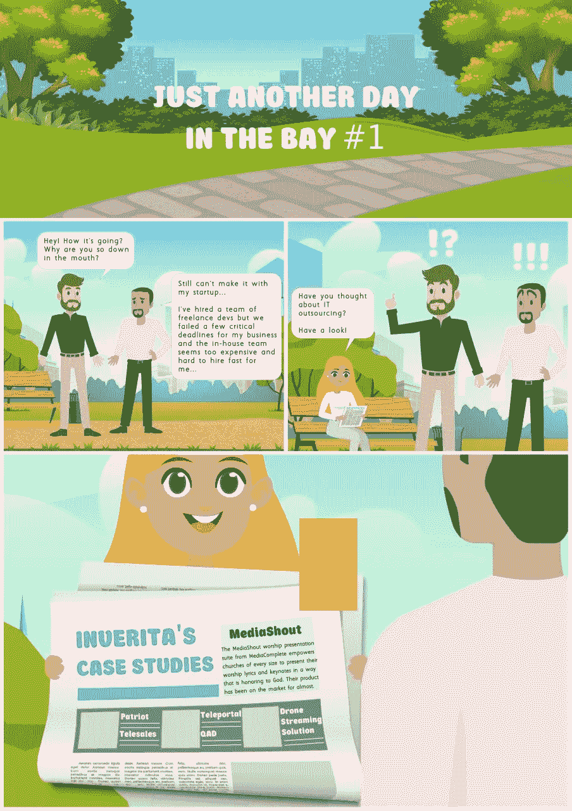

# 如何成功外包软件开发

> 原文：<https://medium.com/geekculture/how-to-outsource-software-development-successfully-746426b6b933?source=collection_archive---------6----------------------->

外包是新潮流。从乡下农民到城市企业家，每个人都穿牛仔裤。因为牛仔裤实用、舒适、时尚。牛仔裤让人平等。外包也是如此。来自纽约的 Ted 雇不起内部软件开发团队(因为他需要按照美国的费率标准支付费用，包括保险、公司津贴、办公设备费用等),他有…