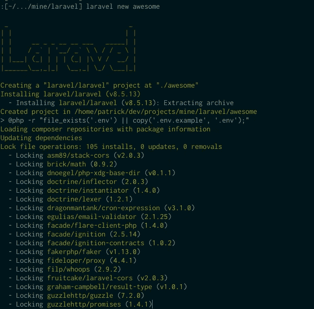

# 如何覆盖 Laravel 安装程序以允许自定义。env 默认值并运行额外的 Shell 命令

> 原文：<https://medium.com/geekculture/how-to-override-laravel-installer-to-allow-custom-env-defaults-and-run-extra-shell-commands-34d171d511c8?source=collection_archive---------19----------------------->

我不知道有多少次我有了一个兼职项目的想法。启动它，然后废弃它。其中很多是我的多动症，但我讨厌 Laravel 的安装程序和样板文件的一点是，我总是不得不编辑. env。

但是有一些事情在不同的项目中不会改变。