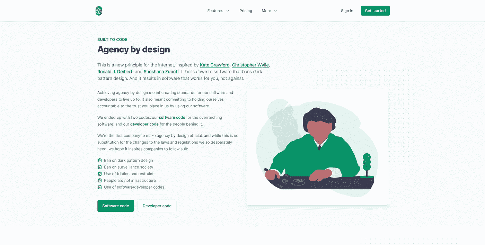

# How to(第 1 部分—修订版):使用 Phoenix 1.6+将注册流程切换到实时视图

> 原文：<https://medium.com/geekculture/how-to-part-1-revised-swap-registration-flow-to-a-live-view-with-phoenix-1-6-47c24d7d671a?source=collection_archive---------24----------------------->

Metamorphic Built to Code screen grab. © 2021 Moss Piglet. All rights reserved.

# 背景

另一个快速更新给所有关注我们系列[帖子](https://coretheory.medium.com)的人。

在[的原始帖子](/swlh/how-to-swap-registration-flow-to-a-live-view-with-phx-gen-auth-4966f80b412e)中，我们快速地将我们的“死”注册流程更新为“活”注册流程，使用的是 Phoenix 1.5+应用程序。

嗯，现在[凤凰 1.6](https://hexdocs.pm/phoenix/Phoenix.html) 正式发布了[可用](https://hex.pm/packages/phoenix)(太棒了)，所以我想把这个帖子和我们的[第二部分修订后的](/geekculture/how-to-part-2-revised-swap-registration-flow-to-a-live-view-with-phx-gen-auth-multi-step-47172904b00a)帖子一起更新。

如果你没有使用 Phoenix 1.6+，那么跳到我的[原始帖子](/swlh/how-to-swap-registration-flow-to-a-live-view-with-phx-gen-auth-4966f80b412e)来看看如何轻松地将你的注册流程切换到实时视图流程。

**请注意:如果你已经熟悉了** [**原文**](/swlh/how-to-swap-registration-flow-to-a-live-view-with-phx-gen-auth-4966f80b412e) **，那么这篇文章将会发挥最大的作用。**

说到这里，让我们开始吧:

# 先决条件

在这个快速教程中，我们假设如下:

*   你已经阅读/跟随了[的原帖](/swlh/how-to-swap-registration-flow-to-a-live-view-with-phx-gen-auth-4966f80b412e)
*   你已经有了一个带有 *live* 生成器的工作 Elixir/Phoenix 应用程序设置(或者添加适当的代码——参见[文档](https://hexdocs.pm/phoenix_live_view/installation.html#content))。
*   你跑过`mix phx.gen.auth Accounts Person people`(可以用其他名字代替，我只是更愿意把[变态](https://metamorphic.app)上的客户当人看)。
*   可选:您已经用 [Bamboo](https://github.com/thoughtbot/bamboo) 设置了电子邮件确认(Phoenix 1.6+实际上开箱时内置了 [Swoosh](https://github.com/swoosh/swoosh) ，因此如果您想使用 Bamboo，您可能需要运行`--no-mailer` [标志](https://hexdocs.pm/phoenix/Mix.Tasks.Phx.New.html)并单独配置)

好的，我们将在我们的[原始帖子](/swlh/how-to-swap-registration-flow-to-a-live-view-with-phx-gen-auth-4966f80b412e)的结尾开始，将我们已经工作的实时视图注册流程过渡到新的`~H` sigil，并简化一切。

我们走吧！

# 第一步

我们最后一次离开我们的`your_app_web/person_registration_live/new.ex`文件是这样的:

目前，这个文件正在调用`render/1`函数并渲染我们位于`your_app_web/templates/person_registration/new.html.leex`的单独的`.leex`文件。

我们将更新这个`render/1`函数，这样我们就不再需要单独的模板文件(让它与新的`.heex` 语法一起工作)，然后一旦我们确信一切都正常工作，就删除那个文件。

让我们继续:

就是这样！这里值得注意的是我们更新的`render/1`功能:

*   `~H`符号格式化(取代旧版本 Phoenix 和实时视图中的`~L`符号)
*   根据上面的注释，在我们的模板中调用表单函数的语法现在是`<.form let={f} for={@changeset} url="#" phx_change="validate" phx_save="submit">`并用`</.form>`语法关闭表单。这种语法更清楚地表明，您实际上是在调用一个名为“form”的函数。
*   `phx_hook="SavedForm"`是一个可选的例子，如果你不打算通过 [JavaScript 互用性文档](https://hexdocs.pm/phoenix_live_view/js-interop.html#client-hooks)实现任何 JavaScript 挂钩，你可以删除它。

一旦你确信一切都如你所愿，你就可以删除你的旧模板文件`your_app_web/templates/person_registration/new.html.leex`。

# 结论

你做到了！

如果你已经关注了我们的[原始帖子](/swlh/how-to-swap-registration-flow-to-a-live-view-with-phx-gen-auth-4966f80b412e)和现在的这篇，那么你已经成功地将你的注册流程切换到了 Phoenix 1.6+或 Live View 0.16+的实时视图流程。

现在，当你继续在[第二部分修订版](/geekculture/how-to-part-2-revised-swap-registration-flow-to-a-live-view-with-phx-gen-auth-multi-step-47172904b00a)中实现多步表单时，你可以加快速度，因为你已经熟悉了大多数`~H` sigil 语法。

同样，如果您仍然需要对`~L` 符号的支持(旧的 Phoenix 或 Live View 版本)，或者对此感到好奇，那么您仍然可以使用我们的[原始第 2 部分](/p/how-to-part-2-swap-registration-flow-to-a-live-view-with-phx-gen-auth-multi-step-form-25371540fce1)实现多步表单。

感谢跟随，我希望你享受你的凤凰 1.6+和药剂之旅。

永远接受改进和想法。

# 插头

Switch to Metamorphic! © 2021 Moss Piglet. All rights reserved.

如果你还没看的话，[变形](https://metamorphic.app)现已上线，并接受我们早期接入发布的注册。

谢谢大家，敬请期待！

❤·马克