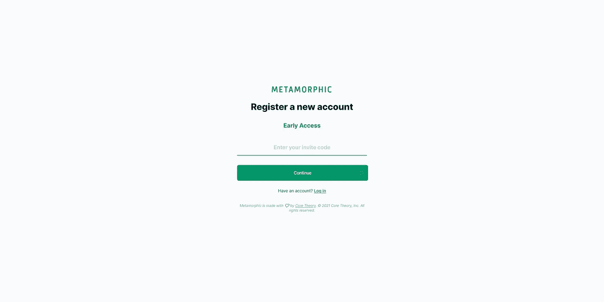

# How to(第 2 部分—修订版):使用 phx_gen_auth 将注册流程切换到实时视图—使用实时视图 0.16+的多步骤表单

> 原文：<https://medium.com/geekculture/how-to-part-2-revised-swap-registration-flow-to-a-live-view-with-phx-gen-auth-multi-step-47172904b00a?source=collection_archive---------13----------------------->



Metamorphic Early Access registration page. © 2021 Moss Piglet. All rights reserved.

# 背景

这次会很快，因为我现在在另一条海岸线上，已经过了睡觉时间。

但是，**凤凰城实时取景 0.16+** 不久前被放弃了(为凤凰城 1.6 做准备)，我想更新多步表单以利用[实时取景 0.16](https://github.com/phoenixframework/phoenix_live_view/blob/master/CHANGELOG.md) 中所有的精彩。

如果你没有使用 Live View 0.16 或 Phoenix 1.6+，那么跳到我的[原帖](/swlh/how-to-part-2-swap-registration-flow-to-a-live-view-with-phx-gen-auth-multi-step-form-25371540fce1)来看看如何用 Phoenix 和 Live View(分别是 1.5 和 0.15+)轻松制作多步表单。

在我们开始之前，让我们先了解一下实时视图 0.16:

# 实时取景 0.16 初级

这个[更新](https://github.com/phoenixframework/phoenix_live_view/blob/master/CHANGELOG.md)很简单，*很神奇。*

我注意到我的代码在不做任何改变的情况下性能得到了提高。但是，此外，**他们添加了一个新的 HTML 引擎**，它是从 Marlus Saraiva 的工作中找到的，使用了 [Surface](https://surface-ui.org/) 库(预计还会有更多)。

在 Live View 0.16+的所有伟大的新特性中，我们将主要利用`.heex`模板来为你的 HTML 实现令人难以置信的调试特性。

好了，事不宜迟，让我们开始吧！

# 先决条件

为了更容易理解，我们假设你已经阅读了[第 1 部分](/swlh/how-to-swap-registration-flow-to-a-live-view-with-phx-gen-auth-4966f80b412e)，在那里我们将“死视图”转换为实时视图进行注册。我们将从第二部的结尾开始。

也就是说，与旧版本[第 1 部分](/swlh/how-to-swap-registration-flow-to-a-live-view-with-phx-gen-auth-4966f80b412e)相同的基本先决条件适用于较小的更改(实时视图 0.16+):

*   你已经用 *live* 生成器建立了一个工作的 Elixir/Phoenix 应用程序(或者添加适当的代码——参见[文档](https://hexdocs.pm/phoenix_live_view/installation.html#content))。
*   您已经使用`mix phx.gen.auth Accounts Person people`(可以替换其他名称)安装并设置了 [phx_gen_auth](https://github.com/aaronrenner/phx_gen_auth) (版本 0.6+)。
*   你在用`phoenix_live_view 0.16+`。
*   您正在使用 [tailwindcss](https://tailwindcss.com/) 或了解您自己的 css 工具。
*   可选:您已经使用 [Bamboo](https://github.com/thoughtbot/bamboo) 设置了电子邮件确认。
*   注 1:默认情况下，Phoenix 1.6+将包含 phx.gen.auth 生成器
*   注 2:如果你已经阅读了最初的[第 2 部分](/swlh/how-to-part-2-swap-registration-flow-to-a-live-view-with-phx-gen-auth-multi-step-form-25371540fce1)，那么这将是一个快速更新。

# 步骤 0

好了，让我们来回顾一下最初[第二部分](/swlh/how-to-part-2-swap-registration-flow-to-a-live-view-with-phx-gen-auth-multi-step-form-25371540fce1)帖子中的`person_registration_live/new.ex`:

我们马上就要将我们的 HTML 直接添加到这个文件中，但在此之前，让我们看看我们最初的[第二部分](/swlh/how-to-part-2-swap-registration-flow-to-a-live-view-with-phx-gen-auth-multi-step-form-25371540fce1)帖子在我们即将被否决的`templates/person_registration/new.html.leex`中给我们留下了什么:

精彩！

以此为起点，我们将对实时视图 0.16+进行更新，并在新的 HTML 引擎中使用精彩的`~H`符号。

## 走小路

本快速指南将指导我们完成以下工作:

*   弃用我们的`templates/person_registration/new.html.leex`文件，合并成一个简单的注册页面实时视图文件
*   保持我们的路由器和第一部分的帖子一样
*   在我们的`person_registration_live/new.ex`文件中更新我们现有的`render/1`函数，以使用来自 Live View 0.16+的新 HTML 引擎的`~H`和`.heex`语法
*   (可选)使用正在运行的本地服务器会话快速确定下一行需要更新的 HTML 代码
*   简化我们的代码库，同时改善我们的开发人员体验和应用程序性能

让我们开始吃吧。

# 第一步

启动一个本地服务器会话，`iex -S mix phx.server`，打开浏览器，进入您将要编辑的注册页面(这是可选的，但在我看来，这样可以更容易地阅读错误消息)。

然后，跳转到您的`templates/person_registration/new.html.leex`文件(您的文件的命名或组织可能稍有不同),将那里的所有 HTML 复制/粘贴回您的`person_registration_live/new.ex`文件，在一个更新的`render/1`函数中，看起来像这样:

```
#person_registration_live/new.ex
...
  def render(assigns) do
    ~H"""
      <!-- copy/paste your html here -->
    """
  end
...# You updated your old render/1 function that used to point to your now deprecated templates/person_registration/new.html.leex file.
```

您现在可以重命名您的`templates/person_registration/new.html.leex`文件，以表明它现在已被弃用，并将很快被删除(*警告:只有在您测试了您的新代码正常工作后，才删除您的旧文件*)。

太棒了。我们现在已经将两个分散的*文件合并为一个*文件*。如果您正在运行本地服务器会话(这正是我们想要的)，那么您现在应该会在浏览器窗口中收到一些错误消息。*

接下来，我们将更新我们的 HTML(更具体地说，我们将把我们的`.leex`语法更新为新的`.heex`语法)。

# 第二步

好了，让我们开始更新吧(记住——这里所涉及的工作将根据 HTML 的大小和复杂性而有所不同):

1.  如果您还没有正在运行的本地服务器会话，那么启动一个(此时它很可能无法启动，但是现在您将在控制台和代码编辑器中得到您需要的错误消息)。
2.  一个错误接一个错误地更新你的 HTML 以遵循[变更日志](https://github.com/phoenixframework/phoenix_live_view/blob/master/CHANGELOG.md)中概述的格式(你也可以参考[实时视图文档](https://hexdocs.pm/phoenix_live_view/Phoenix.LiveView.Helpers.html#form/1))——这是我发现在你的浏览器窗口和代码编辑器旁边阅读错误消息比在控制台窗口更容易的地方。
3.  注意:如果您收到一个有点可疑的错误消息，很可能是需要将 HTML 模板标签从`<%= %>`语法切换到`{}`语法。
4.  注意:根据我的经验，关于缺少结束标签`</div>`或结束于标签*的错误信息，当系统期望标签*和标签*的时候，这是正确的(你可以在浏览器错误信息旁边的代码编辑器中使用错误行来清除恶意的 HTML，比如额外的标签`<div>`很难被发现)。*

这是一个小小的*细节*但是你会从另一个方面得到更好的结果，你甚至可以改进你的 HTML(新的 HTML 引擎不再让你写无效的 HTML)。

在这个例子中，这就是我们涂上`.heex`油漆后的样子:

这里值得注意的是:

*   `<.form let={f} for={@changeset} url="#" phx_change="validate phx_submit="save">`和`</.form>`标记。
*   将 HTML 标签属性中的`<%= %>`替换为`{}`。比如`<div class={unless @current_step == 1, do: "hidden"}> ... </div>`。

使用新的`~H` sigil `render/1`函数和`.heex`模板语法，您的最终`person_registration_live/new.ex`文件看起来会像这样:

就是这样！

你现在已经有了一个与 **凤凰网 Live View 0.16+** 协同工作的**多步表单(以及随之而来的所有其他精彩改进)——它可以告诉你你忘记了哪一行结束`</div>`或其他 HTML 标签*和*它可以防止你编写无效的 HTML。**

# 结论

嗯，就这样吧！

我们已经更新了我们的工作多步骤表单，以使用新的 **Phoenix Live View 0.16** +并成功地从[第 1 部分](/swlh/how-to-swap-registration-flow-to-a-live-view-with-phx-gen-auth-4966f80b412e)扩展了我们的注册流程。

您可以按照上面的逻辑轻松地添加更多的字段，并根据您的需要构建尽可能多或尽可能少的步骤。

如果你在你的表单步骤中遇到任何边缘情况，那么我建议查看我最初的[第二部分](/swlh/how-to-part-2-swap-registration-flow-to-a-live-view-with-phx-gen-auth-multi-step-form-25371540fce1)帖子中的附录。

升级的便利性再次证明了 Elixir/Phoenix 团队和社区成员所做的大量工作——谢谢！

一如既往地欢迎改进和想法，特别感谢 [Markus](https://www.markusbodner.com/til/2019/05/31/multi-step-form-using-phoenix-live-view/) 和 [Elixir Forum](https://elixirforum.com/) 的社区。

# 插头

如果你还没看的话，[变形](https://metamorphic.app)现已上线，并接受我们早期发布的注册。

看到人们注册并为更好的在线生活的可能性而兴奋，这真是太棒了——谢谢大家，敬请关注！

❤·马克