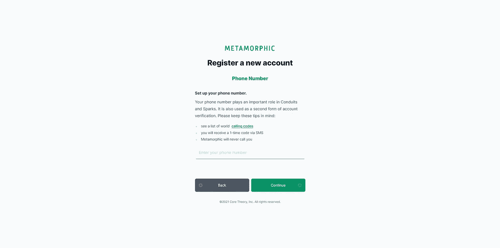

# 如何(第 3 部分):用 phx_gen_auth 将注册流程切换到 Phoenix Live 视图——添加电话号码

> 原文：<https://medium.com/geekculture/how-to-part-3-swap-registration-flow-to-a-phoenix-live-view-with-phx-gen-auth-add-a-phone-59bcc3c1993?source=collection_archive---------21----------------------->



Sneak peek at Metamorphic’s phone number registration courtesy Phoenix Live View. © 2021 Moss Piglet.

# 背景

我目前正在开发一个名为*变形*的社交网络应用，并一直在分享如何实现某些功能的简要指南，希望它能帮助其他人做类似的事情。

对于这一部分，我想在注册流程中包含一个电话号码(支持国际号码)。我还想避免过于复杂的解决方案，同时仍能提供流畅的体验(尽管你也许可以通过更复杂的选项[获得你正在寻找的体验类型](https://github.com/jackocnr/intl-tel-input))。

# 先决条件

为了使后续工作更容易，我们将假设您已经阅读了[第 1 部分](/swlh/how-to-swap-registration-flow-to-a-live-view-with-phx-gen-auth-4966f80b412e)和[第 2 部分](/swlh/how-to-part-2-swap-registration-flow-to-a-live-view-with-phx-gen-auth-multi-step-form-25371540fce1)，其中我们将“死视图”切换到实时视图进行注册，并分别实现了一个多步表单。

也就是说，与第 1 部分相同的基本先决条件适用于:

*   你有一个带有 *live* 生成器的工作 Elixir/Phoenix 应用程序设置(或者添加适当的代码——参见[文档](https://hexdocs.pm/phoenix_live_view/installation.html#content))。
*   您已经使用`mix phx.gen.auth Accounts Person people`(可以替换其他名称)安装并设置了 [phx_gen_auth](https://github.com/aaronrenner/phx_gen_auth) (版本 0.6.0)。
*   你在用`phoenix_live_view 0.15.4`。
*   你正在使用 [tailwindcss](https://tailwindcss.com/) 或者了解你自己的 css 工具。
*   可选:您已经设置了与 [Bamboo](https://github.com/thoughtbot/bamboo) 的电子邮件确认。

增加了一些新的先决条件:

*   你有各自的`phone_number`领域。
*   可选项:使用[coapt _ ecto](https://hex.pm/packages/cloak_ecto)可以实现静态透明加密。
*   可选:您已经安装了 [AlpineJS](https://github.com/alpinejs/alpine) 并正确配置了。

您的`phone_number`字段模式和迁移可能如下所示(加密是可选的):

```
# your_app.accounts.personalias YourApp.Encrypted...
field :phone_number, Encrypted.Binary, redact: true
...# your_app.repo.migrations.create_people_auth_tables.exs...
add :phone_number, :binary, null: false
...
```

同样，加密是可选的(尽管这是一个标准化的好习惯)。

# 我们开始吧

因此，在这一点上，我们已经有了一个工作的多步骤实时视图注册页面(根据[第 2 部分](/swlh/how-to-part-2-swap-registration-flow-to-a-live-view-with-phx-gen-auth-multi-step-form-25371540fce1))，我们现在需要添加一个电话号码步骤。

这意味着我们将向我们的应用程序添加一个新的依赖项，创建一个`phone_number.ex`模块，并在以下文件中工作:`your_app.accounts.person.ex`、`your_app_web/templates/person_registration/new.html.leex`、`your_app_web/live/person_registration_live.new.ex`和`apps/your_app_web/assets/js/app.js`。

如果您在一个伞状项目中工作，那么您只需要在您的文件路径上处理几个额外的目录(`app.js` 文件的文件路径是它在伞状项目中的一个例子)。

# 第一步

让我们从添加新的依赖关系开始， [ex_phone_number](https://github.com/socialpaymentsbv/ex_phone_number) :

```
# mix.exsdefp deps do
  [
    ...
    {:ex_phone_number, "~> 0.2"},
    ...
  ]
end
```

然后，运行`mix deps.get`进行安装。

# 第二步

现在让我们创建我们的`phone_number.ex`模块:

您会注意到，我们添加了一个`extensions`目录来保持我们的应用程序组织良好，并且在将来更容易维护。你可以做类似的事情，找到适合自己的组织结构，或者去野外。

# 第三步

既然我们已经准备好我们的电话号码“核心”，让我们更新我们的*模式*并实现我们的*注册变更集*的验证:

```
# your_app.accounts.person.ex...
alias YourApp.Encrypted # Optional encryptionschema "people" do
  ...
  field :phone_number, Encrypted.Binary, redact: true
  ...
enddef registration_changeset(person, attrs, opts \\ []) do
  person
  |> cast([... :phone_number, ...])
  |> validate_phone_number()
  ...
end
```

我们需要记住使用 [Ecto 中的`cast/4`函数将我们的新字段转换为 *person changeset* 。变更集](https://hexdocs.pm/ecto/Ecto.Changeset.html#cast/4)。

然后，我们需要实现我们新的`validate_phone_number/1`——我们更新的`your_app.accounts.person.ex`:

我们的`validate_phone_number/1`函数检查某人输入了一个电话号码，并且它不是一个过大的输入(最大字符长度为 25)。然后，我们的函数调用另一个私有函数`maybe_accept_phone_number/1`，它也将我们的*变更集*作为其唯一参数，并实现我们的`phone_number.ex`模块中的函数。

我们还在我们的 *with* 语句的末尾添加了一条方便的错误消息(为了可读性而格式化)。

好的，在半路上！

# 第四步

让我们更新表单中的步骤数，使我们的`:phone_number`成为第 3 步(同样，您可以相应地更改):

This might be located in your equivalent “your_app_web/live/person_registration_live/new.ex”.

太好了！没有什么太复杂的，让我们继续我们的`person_registration/new.html.leex`模板。

# 第五步

让我们更新我们的`person_registration/new.html.leex`模板，以包括以下内容:

同样，我已经去掉了很多，但关键的要点是:

*   `<%= if @current_step > 1 and @current_step < 5 do %>`来自[零件 2](/swlh/how-to-part-2-swap-registration-flow-to-a-live-view-with-phx-gen-auth-multi-step-form-25371540fce1) 的*工艺补充*。通过将附加条件添加到我们的`if`检查中，我们在最终的表单步骤中删除了*“返回”*按钮，这解决了*“提交”*按钮的一个问题。这是我经历的一个边缘案例，因为表单需要更多的步骤和复杂性(包括一个很棒的密码生成器)。你可以试着不做这个改动，把*【后退】*按钮留在最后一步，不一定会遇到麻烦。
*   `<%= if @current_step === 5 do %>`记得相应地更新你的最后一步(你的应用程序的表单可能有或多或少的步骤)。

步骤 6 的可选要点是:

*   `id: "person-phone-number"`这是我们*客户端钩子*所必需的。从[文档](https://hexdocs.pm/phoenix_live_view/js-interop.html#client-hooks):*注*:使用`phx-hook`时，必须始终设置唯一的 DOM ID”。
*   `phx_hook: "PhoneNumber"`这对于 [JavaScript 与 Phoenix Live View 的互操作性](https://hexdocs.pm/phoenix_live_view/js-interop.html#client-hooks)是必要的。

我们还添加了`<%= error_tag f, :phone_number %>`来为使用表单的人提供有用的反馈。

# 步骤 6(可选)

这最后一步是可选的，因为我们用`phone_number.ex`函数实现的实时视图功能实际上会为我们格式化和验证电话号码。

然而，目前它要求用户输入*“+国家代码”*和他们电话号码的其余部分。这不是一个交易破坏者，我们不会在提供更顺畅的流程方面遇到太多麻烦，但我们可以轻松地消除人们键入他们的电话号码的 *"+"* (他们仍然需要输入他们的国家代码)。

如果您决定放弃这一步，那么您需要从您的电话号码字段中删除`phx_hook: "PhoneNumber"`位，否则 Phoenix 将继续孤独地搜索一个不存在的*钩子*。

话虽如此，让我们更新我们的`app.js`文件并完成:

嘣！现在，只要有人在我们的电话号码字段中键入“1 222 222 3333”或“41044 668 18 00”或任何其他带有国家代码的电话号码，它就会在通过服务器端实时视图流程发送之前添加 *"+"* 。

与必须手动输入*“+”*相比，这是一个小小的改进，但是，为了这么一点点努力，我觉得这是值得的。

它还可以作为一个很好的起点，将更复杂的 JavaScript 实现到您的流程中，从而真正为人们定制体验(可能与 Jack O'Connor 的 [wild package 结合使用](https://github.com/jackocnr/intl-tel-input))。

如果您的应用程序中根本没有使用 AlpineJS，那么您的`app.js`可能看起来更像:

```
let liveSocket = new LiveSocket("/live", Socket, {hooks: Hooks, ...})
```

你可以通过阅读[官方文档](https://hexdocs.pm/phoenix_live_view/js-interop.html#client-hooks)了解更多关于*客户端钩子*与 Phoenix Live View 和 JavaScript 互操作性的信息。

# 结论

就是这样！我们已经使用 Phoenix Live View 在我们的多步骤表单中添加了一个有效的国际电话号码字段，并成功地从[第 1 部分](/swlh/how-to-swap-registration-flow-to-a-live-view-with-phx-gen-auth-4966f80b412e)和[第 2 部分](/swlh/how-to-part-2-swap-registration-flow-to-a-live-view-with-phx-gen-auth-multi-step-form-25371540fce1)扩展了我们的注册流程。

希望这有助于任何人实现一个电话号码领域与凤凰现场查看。

永远接受改进和想法。

❤·马克