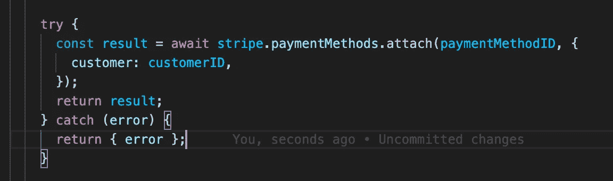
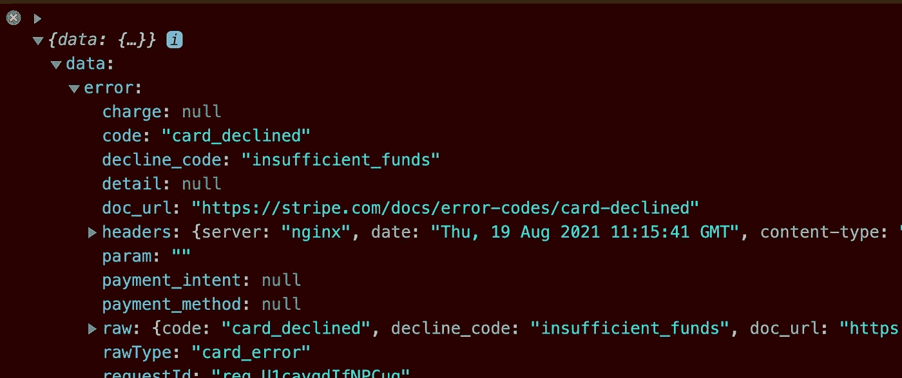
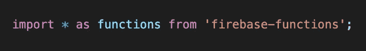
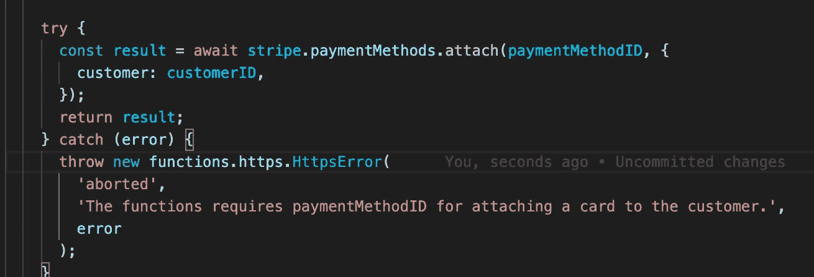
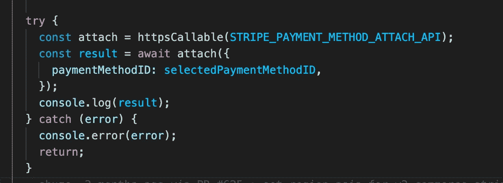
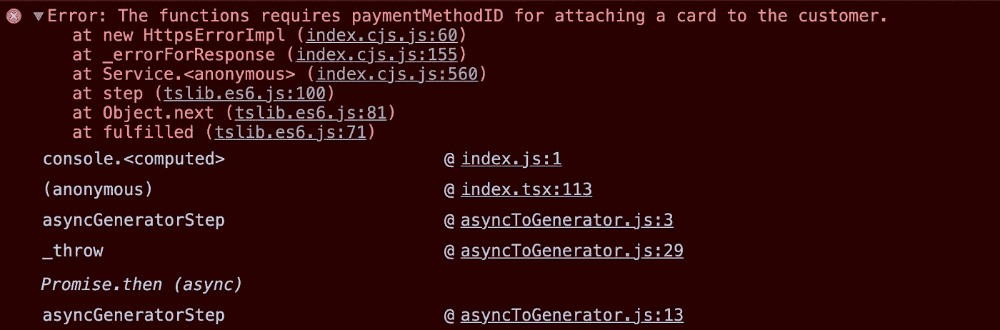
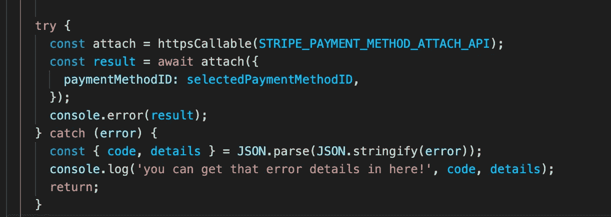
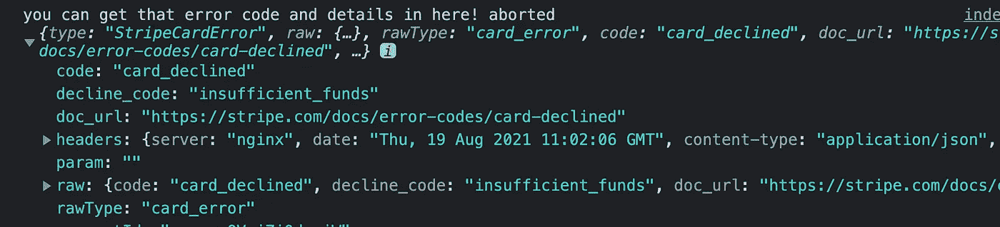

# 如何用 Firebase 云函数将错误很好地传递到前端

> 原文：<https://medium.com/geekculture/how-to-pass-errors-nicely-to-front-end-with-firebase-cloud-functions-6f224072eae4?source=collection_archive---------5----------------------->


Photo by [Tyler Nix](https://unsplash.com/@jtylernix?utm_source=medium&utm_medium=referral) on [Unsplash](https://unsplash.com?utm_source=medium&utm_medium=referral)

## 本文**将向您展示如何**通过后端向前端传递 https 错误。

如何将错误从 Firebase 云函数传递到前端？

在本文中，我将介绍一个在基于云函数的项目中传递错误对象的技巧。它不会显著地改变你处理错误的方式，但是它不仅仅是好。

# 例子

在这个例子中，我们在后端设置了一个 API 方法，而前端通过一个`httpsCallable`函数与之通信。如果不熟悉，请参考这个[文档](https://firebase.google.com/docs/functions/callable?hl=ja)。

在这个 try-catch 中，如果出现错误，函数会直接将错误传递给前端，而不是抛出它。



由于错误对象被直接传递到前端，结果将是包含错误对象的数据对象。此处的错误描述了 API 文档中指定的原因。



除此之外，如果你没有使用任何 API，只是做一些承诺调用，那么一些错误可能会发生。你如何处理前端的这些错误？一个可能的解决方案是构建定制的错误代码来告诉前端错误的类型，比如`invalid-argument`或`aborted`

因此可以将自定义错误代码注入到错误对象中。以上面的例子为例，它看起来像这样:

```
return { error, code: "invalid-argument" }
```

使用云函数，有内置的错误代码，随时可以从库中使用。您可以在 try-catch 中抛出`HttpsError`而不是普通错误，在大多数情况下，您只需选择错误代码并抛出错误。您不需要编写自己的自定义代码。

在这里，您将声明函数:



并且您可以访问许多错误代码。


如果您的项目可以使用错误代码列表，云函数的这一实用工具将显著节省您的时间。

除了错误代码，您还可以添加消息和详细信息。



这是从前端访问错误的方式。



实际上什么都没有改变，但是如果你运行你的程序，你将会看到一个报错信息。



当我们仔细查看细节时，您可能想知道错误代码和细节去了哪里。该消息仅在控制台中可见。

让我分享一下我最近发现的一个技巧。



当您通过编写`JSON.parse(JSON.stringify(error))`解析 json 中的错误时，您会看到一个很酷的结果。



现在一个对象出现在控制台中。它包含错误代码、消息和错误详细信息。现在，您可以更好、更恰当地处理错误。

# 结论

正如我们所见，云函数提供了一个方便的工具，它提供了内置的定制错误代码。不只是从后端返回一个错误，利用 https error 函数将帮助您创建一种干净的方式将错误传递到前端，而不会创建错误代码。

[***使用此链接阅读***](https://imryohei.medium.com/membership) ***我在 Medium 上的所有帖子和其他上千个帖子，您的会员费直接支持我和您阅读的其他作者。你也可以在媒体上看到所有的故事。***