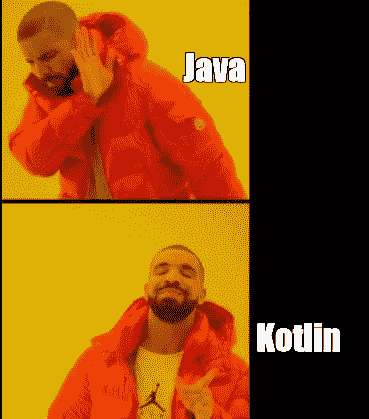
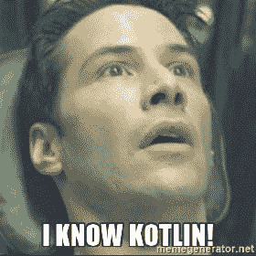

# 如何在从 Cordova 到 KOTLIN 应用程序的应用程序切换中传递参数

> 原文：<https://medium.com/geekculture/how-to-pass-params-on-app-switch-from-cordova-to-kotlin-app-37e1442bcec2?source=collection_archive---------10----------------------->

所以最近我有一个任务，在应用程序切换期间，我需要通过 intent 将一些参数从一个应用程序推送到另一个应用程序，而 KOTLIN 应用程序应该根据参数是否通过来获取这些参数并执行一些特定的操作。



我花了一些时间研究和寻找合适的插件，最终能够做到这一点。我想把我的学习浓缩到这篇文章中，这样其他想做同样事情的人可能就不用太费劲了。

## **Cordova App 实现— *来源***

你需要在这里使用一些插件来传递数据。出于我的目的，我继续使用[链接](https://www.npmjs.com/package/cordova-plugin-app-launcher)

```
cordova-plugin-app-launcher
```


现在使用这个插件有多种方式来触发目标应用程序。

> 此插件允许您检查是否安装了可以处理特定 uri 的应用程序，并通过 iOS 和 Android 上的 uri 启动应用程序。此外，您可以使用其包 id 打开 Android 应用程序。
> 
> (iOS、Android)检查是否安装了任何可以通过指定 uri 启动的应用程序。(iOS、Android)通过指定的 uri 启动应用程序。
> 
> (Android)检查应用程序是否通过其包 id 安装。
> 
> (Android)检查是否为动作名称安装了应用程序。
> 
> (Android)通过包 id 启动应用程序。
> 
> (Android)为动作名称启动应用程序。
> 
> (Android)启动一个包含附加功能的应用程序。
> 
> (Android)完成后从已启动的应用程序返回结果。

我选择了通过包 id 打开目标应用程序并通过 intent 传递参数的方式。

```
window.plugins.launcher.**canLaunch**({ packageName },() => { window.plugins.launcher.**launch**(
  { **packageName**: packageName, **extras**: intentParams },
  () => { console.log(`Switched to ${appName} app`) },
  () => {
      UICommunication.showErrorAlert(`An error occurred while launching ${appName} app. Please try again.`);}
    );
  },
  () => {
    // app not found.
    UICommunication.showErrorAlert(`${appName} app is not installed on device.`);
   }
);
```

正如你在上面的例子中看到的，我在这里传递了一些意图参数。这些是我想作为额外参数传递给 KOTLIN 应用程序的参数。

您可以创建如下所示的意图参数。

```
let intentParams = [];
intentParams.push({
  name: "deliveryNumber",          //key for this value
  value: '123456,                  //actual value
  dataType: "String",              //data type
});
intentParams.push({
  name: "doorNumber",              //key for this value
  value: '111',                    //actual value
  dataType: "String",              //data type 
});
```

现在，您能够在要通过 intent 传递的参数上创建多个类型。下面是插件支持的列表。

```
extras: [
		{"name":"myByte", "value":1, "dataType":"Byte"},
		{"name":"myByteArray", "value":[1,0,2,3], "dataType":"ByteArray"},
		{"name":"myShort", "value":5, "dataType":"Short"},
		{"name":"myShortArray", "value":[1,2,3,4], "dataType":"ShortArray"},
		{"name":"myInt", "value":2000, "dataType":"Int"},
		{"name":"myIntArray", "value":[12,34,56], "dataType":"IntArray"},
		{"name":"myIntArrayList", "value":[123,456,789], "dataType":"IntArrayList"},
		{"name":"myLong", "value":123456789101112, "dataType":"Long"},
		{"name":"myLongArray", "value":[123456789101112,121110987654321], "dataType":"LongArray"},
		{"name":"myFloat", "value":12.34, "dataType":"Float"},
		{"name":"myFloatArray", "value":[12.34,56.78], "dataType":"FloatArray"},
		{"name":"myDouble", "value":12.3456789, "dataType":"Double"},
		{"name":"myDoubleArray", "value":[12.3456789, 98.7654321], "dataType":"DoubleArray"},
		{"name":"myBoolean", "value":false, "dataType":"Boolean"},
		{"name":"myBooleanArray", "value":[true,false,true], "dataType":"BooleanArray"},
		{"name":"myString", "value":"this is a test", "dataType":"String"},
		{"name":"myStringArray", "value":["this","is", "a", "test"], "dataType":"StringArray"},
		{"name":"myStringArrayList", "value":["this","is","a","test"], "dataType":"StringArrayList"},
		{"name":"myChar", "value":"T", "dataType":"Char"},
		{"name":"myCharArray", "value":"this is a test", "dataType":"CharArray"},
		{"name":"myCharSequence", "value":"this is a test", "dataType":"CharSequence"},
		{"name":"myCharSequenceArray", "value":["this","is a", "test"], "dataType":"CharSequenceArray"},
		{"name":"myCharSequenceArrayList", "value":["this","is a", "test"], "dataType":"CharSequenceArrayList"},
		{"name":"myParcelable", "value":"http://foo", "dataType":"Parcelable", "paType":"Uri"},
		{"name":"myParcelableArray", "value":["http://foo","http://bar"], "dataType":"ParcelableArray", "paType":"Uri"},
		{"name":"myParcelableArrayList", "value":["http://foo","http://bar"], "dataType":"ParcelableArrayList", "paType":"Uri"},
		{"name":"mySparseParcelableArray", "value":{"10":"http://foo", "-25":"http://bar"}, "dataType":"SparseParcelableArray", "paType":"Uri"},
	]
```

一旦你这样做了，你将触发目标应用程序(在我的例子中是 KOTLIN 应用程序),并传递以下参数。现在让我们看看如何在 KOTLIN 应用程序中接收它们。

## KOTLIN 应用实施— *目的地*

现在在 KOTLin 应用中，你可以进入你的`MainActivity.kt`文件。

在这里，您可以访问如下所示的`onCreate()`方法中的意图参数。

```
val delNbr = *intent*.getStringExtra("deliveryNumber")
//OR
val delNbr = intent.getSerializableExtra("deliveryNumber")
```

您确实需要知道从 intent 访问它们的确切密钥，否则您可以将整个 intent 作为一个包，并尝试从中提取它们。

一旦获得了 intent 值，您可以将它传递给所需的组件，也可以保存它并从任何需要的地方访问它。

> N **ote** —插件不允许你传递对象，即一个键内有多个值，因此你需要小心你通过 intent 传递了多少个值。理想情况下，它应该是最小的。



## 结论

希望这有助于你理解一种通过意图参数将参数从 cordova 应用程序传递到 KOTLIN 应用程序的方法。

请查看我的其他文章，并关注更多关于 Javascript、React JS 和 KOTLIN 的内容

[](/geekculture/parcelize-in-kotlin-how-and-why-you-need-it-f33fa0212eed) [## 在科特林打包。你如何以及为什么需要它？

### 由于对 KOTLIN 和 Java 不太熟悉，我总是觉得 parcelize 很有趣。希望你能了解更多关于…

medium.com](/geekculture/parcelize-in-kotlin-how-and-why-you-need-it-f33fa0212eed) [](https://javascript.plainenglish.io/require-vs-import-in-js-82a7a47671f) [## 比较 JavaScript 中的 require()和 import()

### 探索 JavaScript 中 require()和 import()方法的特性。

javascript.plainenglish.io](https://javascript.plainenglish.io/require-vs-import-in-js-82a7a47671f) [](https://javascript.plainenglish.io/code-splitting-in-react-all-you-need-to-know-392b0dfeb1fa) [## React 中的代码拆分—您需要知道的一切

### React 中代码拆分的深入探讨。

javascript.plainenglish.io](https://javascript.plainenglish.io/code-splitting-in-react-all-you-need-to-know-392b0dfeb1fa)