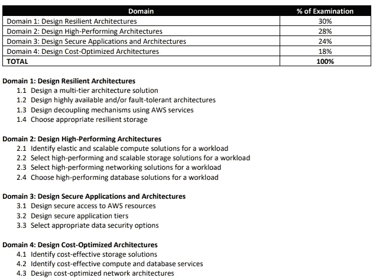

# 如何通过 AWS 解决方案架构师助理考试

> 原文：<https://medium.com/geekculture/how-to-pass-the-aws-solutions-architect-associate-exam-71e68badf0e1?source=collection_archive---------14----------------------->

## 仅在 1-2 个月内

当我第一次接触云计算时，我被要求在大约 1 到 2 个月的准备时间内准备并通过 AWS 解决方案架构师助理(SAA)考试。

当时，我不知道云计算是什么，它对我来说是一个全新的概念。因此，我想分享一些我参加并通过考试的技巧和方法，希望其他人不要害怕自己尝试。

人们普遍认为 AWS SAA 考试是一个非常有价值的认证，因此非常难。虽然考试很有挑战性，但也不是不可能，甚至不用花一分钱就可以完成。

# 考试详情

*   考试花费 150 美元
*   有 65 道选择题，需要在 130 分钟内完成
*   它每 3 年到期一次(但是 AWS 为您的重新认证提供 50%的折扣券！)
*   错误答案不扣分
*   及格分数是 1000 分中的 720 分

## 内容大纲

## AWS 推荐的知识

*   一年在 AWS 上设计可用的、经济的、容错的和可扩展的分布式系统的实践经验
*   使用计算、网络、存储和数据库 AWS 服务的实践经验。
*   AWS 部署和管理服务的实践经验。能够识别和定义基于 AWS 的应用程序的技术要求。
*   能够识别哪些 AWS 服务满足给定的技术要求。
*   了解在 AWS 平台上构建安全可靠的应用程序的推荐最佳实践。
*   了解在 AWS 云中构建的基本架构原则。
*   了解 AWS 全球基础设施。
*   了解与 AWS 相关的网络技术。
*   了解 AWS 提供的安全功能和工具，以及它们与传统服务的关系

# 考试资源

这些是一些可用的考试资源。我只使用免费的，因为我不想花钱，但我包括一些付费的，你可以探索。

## 自由的

*   AWS SAA 考试练习题——来自 AWS 网站，10 道样题，让你知道会遇到什么
*   AWS 白皮书—优先查找服务白皮书和架构良好的白皮书，如果您愿意，也可以浏览其他白皮书
*   [AWS 示例架构](https://aws.amazon.com/architecture/) —更好地介绍和理解 AWS 解决方案如何协同工作
*   [AWS 参考架构图](https://aws.amazon.com/architecture/reference-architecture-diagrams/?solutions-all.sort-by=item.additionalFields.sortDate&solutions-all.sort-order=desc&whitepapers-main.sort-by=item.additionalFields.sortDate&whitepapers-main.sort-order=desc&awsf.whitepapers-tech-category=*all&awsf.whitepapers-industries=*all) —更多
*   [Knowledge Hut AWS SAA 实践测试](https://www.knowledgehut.com/practice-tests/aws-solutions-architect-associate) —良好的资源

## 有报酬的

*   Whizlabs 练习 SAA 试题
*   阿德里安·坎特里尔·SAA 视频培训
*   关于 Udemy 的夏羽·马雷克·SAA 课程
*   夏羽·马雷克·SAA 在 Udemy 上的模拟考试

# 建议

我建议你开始建立一个时间表，每天花一个小时学习认证。花一些时间熟悉内容和参考体系结构。然后开始测试自己，通过模拟考试找出你的知识差距。

考试的时候，不要把时间浪费在不知道怎么做的题上，可以标出来以后再来。此外，确保仔细阅读问题，因为它们通常包含分散注意力的信息或旨在误导您的冲突信息。

如果您对输入的答案不确定，请标记并返回。如果你给大脑一些时间，让它远离特定的问题，你的大脑可能会想出一个答案。

祝你好运！