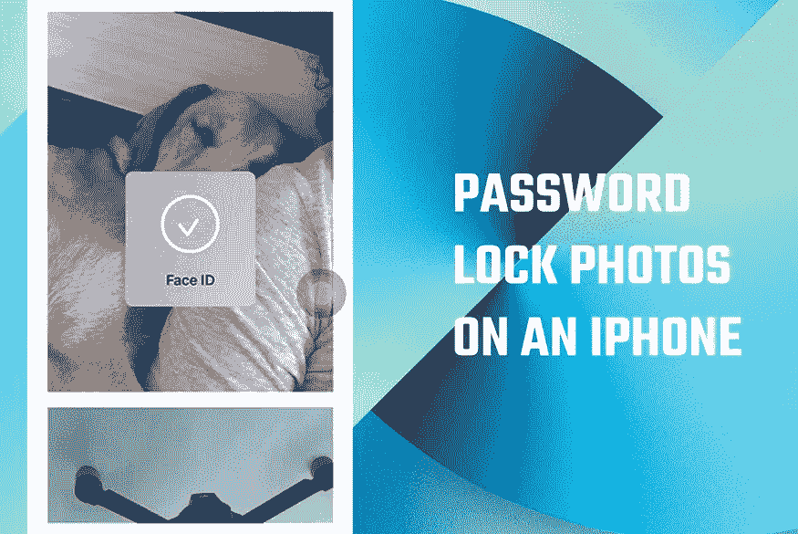

# 如何对 iPhone 上的照片进行密码保护？

> 原文：<https://medium.com/geekculture/how-to-password-protect-your-photos-on-an-iphone-4c762d3d242c?source=collection_archive---------5----------------------->

拥有一些个人照片，但无法保存在 iPhone 相册中？那么这篇文章非常适合你。在这里，我们解释了如何在不使用任何第三方应用程序的情况下用密码保护您的照片。是的，照片也将从默认相册中隐藏(事实上是删除)。隐私是最重要的！