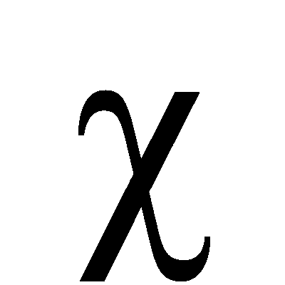

# 如何在 R 和 Python 中执行卡方检验

> 原文：<https://medium.com/geekculture/how-to-perform-the-chi-squared-test-in-both-r-and-python-4399095e1c78?source=collection_archive---------7----------------------->

卡方统计是一种测试，用于测量模型与实际观察数据的对比情况。用于计算卡方统计的数据必须是随机的、原始的、互斥的、从独立变量中提取并从足够大的样本中提取。

卡方检验通常用于检验假设。卡方统计比较任何…