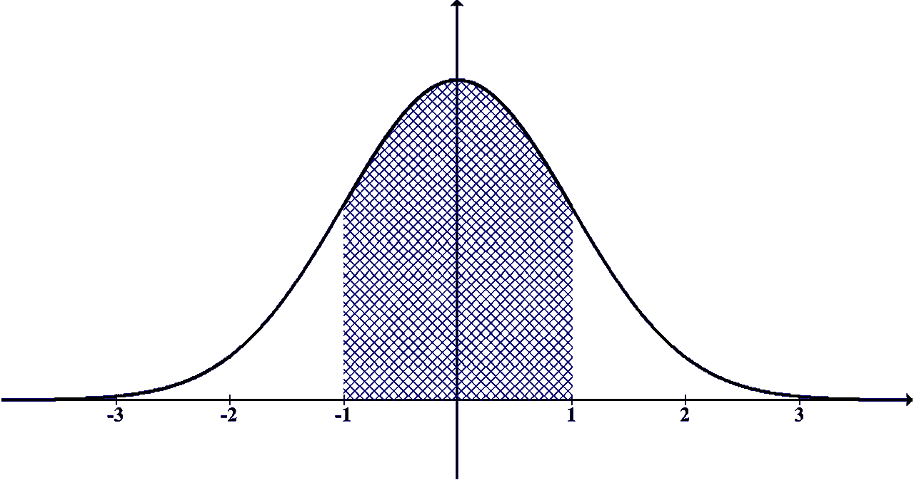

# 如何在 Python 中执行夏皮罗-维尔克测试

> 原文：<https://medium.com/geekculture/how-to-perform-the-shapiro-wilk-test-in-python-a8ab52e4b463?source=collection_archive---------7----------------------->

在频数统计领域，夏皮罗-维尔克检验是一种正态性检验。该测试通常用于 50 个元素或更少的小样本。

夏皮罗-维尔克检验的零假设是总体呈正态分布。因此，另一个假设是，总体不是正态分布的。