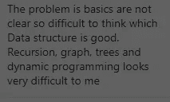
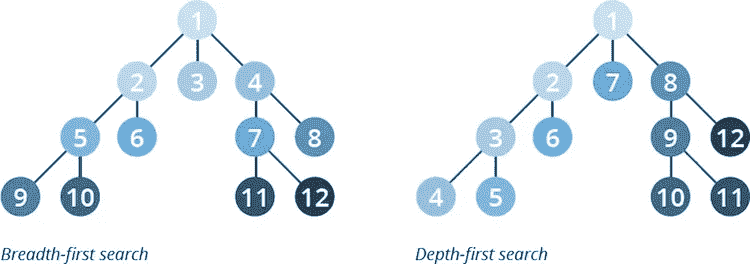
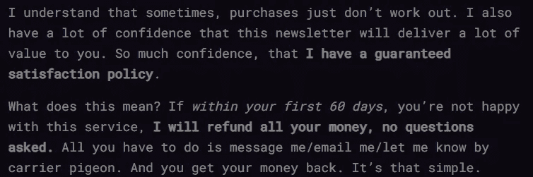
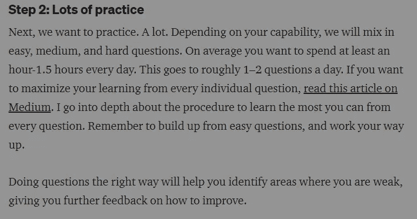
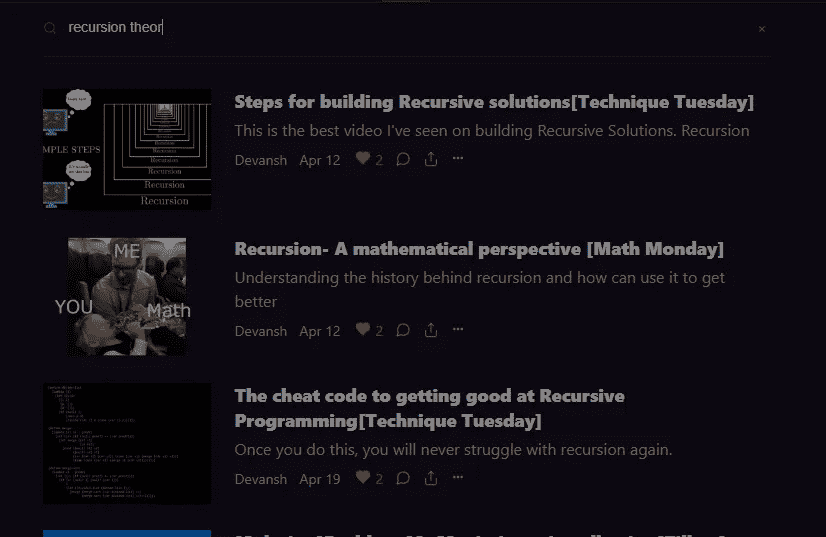

# 如何为你的 FAANG 访谈选择正确的图遍历算法

> 原文：<https://medium.com/geekculture/how-to-pick-the-correct-graph-traversal-algorithms-for-your-faang-interviews-1c260294395d?source=collection_archive---------3----------------------->

## 在编码面试中，你们中的许多人都在为这一部分而奋斗

为了帮助我了解您[请填写此调查(匿名)](https://forms.gle/7MfQmKhEhyBTMDUD7)

多亏了我的时事通讯([代码面试变得简单](https://codinginterviewsmadesimple.substack.com/))和 Medium 上的文章，我已经能够联系到许多试图通过 Leetcode 风格 FAANG/其他技术面试的人。当我和他们谈论他们具体的道路、抱负和背景时，有一件事总是让我印象深刻- **许多人都在与图表作斗争。**

This is a common problem that a lot of my students face. Don’t worry, this can be fixed.

这是有道理的。图形是一种非常复杂和高级的数据结构。发现它们可能是一场噩梦，即使你能识别出图表，解决它也完全是另一回事。且不说那么多图遍历算法从根本上来说都是大同小异的。即使你有多年的软件工程经验，知道如何选择正确的软件也是非常棘手的。然而，有了正确的知识和技术，事情对你来说会变得容易得多。就像和我一起工作的许多人一样。

这就是我来帮你的原因。在我的文章中，[在你的编码面试中找出图表](/p/354c49732b4e)我介绍了我与学生分享的框架，让他们能够识别隐藏在编码面试问题中的图表。我在一些最难的编码面试问题上验证了这种方法，只是为了向您展示该框架工作得有多好。这篇文章是下一个合乎逻辑的进展。在这里，我将介绍如何为你的采访选择正确的图遍历算法。

These two will feature a lot in this post.

在我们进入这个话题之前，让我们先了解一下对于你的面试来说什么是重要的算法。当然，具体细节会根据您的需求/要求而变化。像我这样的人工智能人员可能需要了解修剪。一个网络兄弟需要掌握网络流量。然而，不管你选择什么专业，还是有一些算法很有可能出现在你的面试中。顺便说一句，如果你喜欢这类内容，一定要看看我的每日简讯[编码采访变得简单。我正在为高级会员运行 14 天的免费试用。所以你可以在不冒任何风险的情况下尝试一下。](https://codinginterviewsmadesimple.substack.com/subscribe?coupon=fe3f374b)

I am the only service in the domain offering such refunds. AlgoExpert, Leetcode, and others don’t. [More information](https://codinginterviewsmadesimple.substack.com/p/faqs-and-about-this-newsletter?s=w) [here](https://codinginterviewsmadesimple.substack.com/p/faqs-and-about-this-newsletter?s=w)

# 重要的算法

我非常相信 80-20 原则。原则是你 80%的成果来自 20%的工作。这个原则对于图遍历算法来说更加极端。信不信由你，只要学会 5 个算法就几乎可以保证成功。就是这样。以下是它们的重要性顺序。

1.  BFS/DFS-这是你必须知道的两个。这些是图遍历中最基本的算法。许多问题也可以归结为 BFS/DFS 算法。这两个也是其他更复杂的图形算法的基础，所以你必须非常熟悉它们
2.  拓扑排序——这经常会出现。你实际上可以从 DFS 中推导出这个，但是如果你事先知道就更好了。这样，您可以更快地建立连接。
3.  Djikstra 的算法和 A*-这些是 BFS 的变体，被开发来在涉及加权图的问题中寻找最短路径。尽管一开始看起来有些吓人，但是一旦你掌握了 BFS，这些就变得相对简单了。如果你对人工智能(尤其是自动驾驶汽车)感兴趣，那么这些算法就变得至关重要。

这些是你在面试中需要的概念。如你所见，BFS/DFS 显然是其中最重要的。因此，在继续学习其他之前，先集中精力掌握它们。

# 框架

是时候进入你们期待已久的世界了。如果你在网上找，你会遇到令人生畏的讨论，比如“分支因子”。这就是编码面试变得比现实生活实现中的许多细微差别更简单的地方。以下是一些快速提示:

1.  寻找最短路径:对于最短路径问题，BFS(对于未加权的图)或 A*(对于加权的图)将是你的最佳选择。DFS 不保证最短路径， [Djikstra 的一般比 A*](https://stackoverflow.com/questions/13031462/difference-and-advantages-between-dijkstra-a-star#:~:text=A*%20is%20just%20like%20Dijkstra,just%20explore%20all%20possible%20paths.) 差(学习它有助于理解 A*，这也是它在列表中的原因)。
2.  访问完整的图:对于我们必须考虑整个图的问题(外来字典，检测一个循环等)。)，那么 DFS 就成了你最好的朋友。它需要更少的内存。

[接下来](https://stackoverflow.com/questions/3332947/when-is-it-practical-to-use-depth-first-search-dfs-vs-breadth-first-search-bf)是一个非常大的讨论。如果你想去*更深的地方*(看我在那里做了什么？)成图，查看一下。以上清单对我们其他人来说已经足够了。浏览一下 Leetcode 上的问题。一旦你了解了这种模式，你会震惊地发现有多少人很容易陷入这种模式。如果你没有看到，就把它们放在评论/留言里，我会解释给你听。但是你会发现这个框架将帮助你在几乎每种情况下容易地识别正确的算法。

显然，要达到这个阶段，你需要学会把一个问题识别为一个图问题，并把它表示出来。这是需要练习的。你需要理论知识，以及如何应对这些情况的知识。对于前者，确保你在周一的数学课上检查。我们在本新闻稿中介绍的解决方案将帮助您将知识转化为成果。[通过在此订阅获得解决方案和其他优质内容，全年可享受 20%的优惠。](https://codinginterviewsmadesimple.substack.com/subscribe?coupon=1e0532f2)

现在你知道了这个系统，使用上面提到的计划，把它付诸实践，好好利用它。记住也要研究其他的数据结构和问题(最多 30%的问题应该来自一个主题)。只专注于一个主题是错误的，除非有人告诉你这样做。请确保每周四定期查看这份时事通讯，因为我会详细解答顶级科技公司提出的问题。

本文到此为止。请记住，即使您能够找到图形并找出正确的遍历算法，您仍然需要能够编写出您的解决方案。这将来自于实践你的实现和熟悉图算法的递归。查看这里的帖子，开始学习吧。

You can search for specific topics/ideas in Coding Interviews Made Simple. Whatever you need, we got it.

对于你的面试/职业来说，软件工程、数学和计算机科学的基础是至关重要的。它将帮助您概念化、构建和优化您的解决方案。我的每日时事通讯，[Coding interview make simpled](https://codinginterviewsmadesimple.substack.com/)涵盖了算法设计、数学、最近的技术事件、软件工程等主题，让你成为更好的开发人员。 [**我目前正在进行全年八折优惠，所以一定要去看看。**](https://codinginterviewsmadesimple.substack.com/subscribe?coupon=1e0532f2)

我创建了[编码面试，使用通过指导多人进入顶级科技公司而发现的新技术，使面试变得简单](https://codinginterviewsmadesimple.substack.com/p/faqs-and-about-this-newsletter?r=4tnbw&s=w&utm_campaign=post&utm_medium=web)。时事通讯旨在帮助你成功，避免你在 Leetcode 上浪费时间。我有一个 100%满意的政策，所以你可以尝试一下，没有任何风险。[您可以阅读常见问题解答，并在此了解更多信息](https://codinginterviewsmadesimple.substack.com/p/faqs-and-about-this-newsletter?r=4tnbw&s=w&utm_campaign=post&utm_medium=web)

如果你也有任何有趣的工作/项目/想法给我，请随时联系我。总是很乐意听你说完。

以下是我的 Venmo 和 Paypal 对我工作的金钱支持。任何数额都值得赞赏，并有很大帮助。捐赠解锁独家内容，如论文分析、特殊代码、咨询和特定辅导:

https://account.venmo.com/u/FNU-Devansh

贝宝:[paypal.me/ISeeThings](https://www.paypal.com/paypalme/ISeeThings)

# 向我伸出手

使用下面的链接查看我的其他内容，了解更多关于辅导的信息，或者只是打个招呼。另外，查看免费的罗宾汉推荐链接。我们都得到一个免费的股票(你不用放任何钱)，对你没有任何风险。**所以不使用它只是损失免费的钱。**

查看我在 Medium 上的其他文章。https://rb.gy/zn1aiu

我的 YouTube:[https://rb.gy/88iwdd](https://rb.gy/88iwdd)

在 LinkedIn 上联系我。我们来连线:[https://rb.gy/m5ok2y](https://rb.gy/f7ltuj)

我的 insta gram:[https://rb.gy/gmvuy9](https://rb.gy/gmvuy9)

我的推特:【https://twitter.com/Machine01776819 

如果你正在准备编码/技术面试:【https://codinginterviewsmadesimple.substack.com/ 

获得罗宾汉的免费股票:[https://join.robinhood.com/fnud75](https://join.robinhood.com/fnud75/)